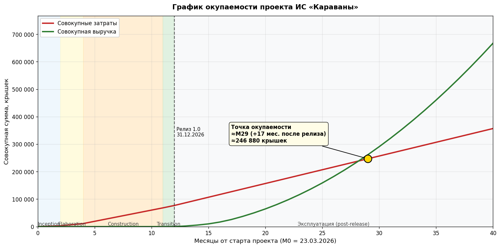

# Business Case (Бизнес-обоснование)

## 1. Introduction (Введение)

*[Введение представляет собой обзор на весь документ в целом и включает в себя следующие разделы — назначение, область применения, определения и аббревиатуры, ссылки и обзор.]*

### 1.1 Purpose (Назначение)

*[Укажите назначение данного документа.]*

Документ обосновывает экономическую и операционную целесообразность разработки и запуска информационной системы «Караваны». Он предназначен для заказчика, инвесторов и руководителя проекта в качестве основания для принятия решения о финансировании работ и определения границ инвестиций. Документ фиксирует продуктовые цели, контекст рынка, ожидаемые затраты, прибыль и ключевые ограничения.

### 1.2 Scope (Область применения)

*[Приведите краткое описание области применения данного документа, к какому(им) проекту(ам) он относится, кем будет использоваться и т.д.]*

Документ относится к проекту ИС «Караваны» — платформе управления караванными перевозками для караванных компаний Мохавской Пустоши и сопредельных территорий. Бизнес-обоснование используется командой проекта (продуктовый менеджер, архитектор, разработчики) на этапе инициации, заказчиком — при принятии решения о финансировании, и сопровождает проект как ориентир при контроле KPI.

### 1.3 Definitions, Acronyms and Abbreviations (Определения и аббревиатуры)

*[Укажите значение терминов и аббревиатур, которые употребляются в данном документе. Возможно указание ссылки на Глоссарий проекта.]*

Определения и аббревиатуры приведены в [Глоссарии проекта](Glossary_Karavany_FNV.md). Специфичные для документа сокращения:

- **MRR** — Monthly Recurring Revenue, ежемесячная повторяющаяся выручка от подписочной модели
- **WCL** — Wasteland Caravan License, проприетарная лицензия продукта (см. [SRS, раздел 3.7](SRS.md))

### 1.4 References (Ссылки)

*[Перечислите списком названия документов, на которые ссылаетесь в данном, укажите их источники.]*

1. **Vision** — [Vision.md](Vision.md). Концепция продукта, аудитория, ключевые сценарии, монетизация.
2. **SRS** — [SRS.md](SRS.md). Спецификация функциональных и нефункциональных требований.
3. **UseCases** — [UseCases.md](UseCases.md). Список прецедентов и акторы.
4. **CoreUseCases** — [CoreUseCases.md](CoreUseCases.md). Архитектурно значимые прецеденты с детальными потоками.
5. **Glossary** — [Glossary_Karavany_FNV.md](Glossary_Karavany_FNV.md). Глоссарий предметной области.

### 1.5 Overview (Обзор документа)

*[Приведите краткое описание остальных разделов документа.]*

Дальнейшие разделы документа:

- **2. Product Description** — краткое описание продукта и решаемых задач.
- **3. Business Context** — рынок, целевая аудитория, модель распространения.
- **4. Product Objectives** — цели продукта, измеримые KPI, риски и план их митигации.
- **5. Financial Forecast** — оценка затрат, потенциальной прибыли и окупаемости.
- **6. Constraints** — ограничения, влияющие на стоимость и сроки.

## 2. Product Description (Описание продукта)

*[Кратко опишите разрабатываемый продукт, поясните, какие задачи он решает и почему его стоит разрабатывать. Будет уместна ссылка на Концепцию проекта.]*

**ИС «Караваны»** — мультитенантная цифровая платформа для управления караванными перевозками в условиях Мохавской Пустоши. Система автоматизирует полный жизненный цикл рейса: создание заявки, планирование маршрута, расчёт risk_score и ETA, назначение команды, формирование манифеста и резервирование припасов, сопровождение каравана в пути с фиксацией контрольных точек и инцидентов, сверку груза при доставке, формирование итогового финансового отчёта.

Продукт состоит из двух клиентов:
- **Web-клиент для стационарных терминалов** (диспетчер, кладовщик, суперпользователь) — реализуется на React 18, доступен через браузер.
- **PWA для полевых устройств** (караван-мастер, капитан охраны, полевой медик) — работает на Pip-Boy или смартфоне, поддерживает офлайн-режим с автоматической синхронизацией.

**Зачем разрабатывать.** Текущие операционные практики караванных компаний построены на бумажных журналах, устных договорённостях и разрозненных локальных списках. Это приводит к спорным ситуациям при доставке (потеря груза, расхождение манифеста), медленному планированию (4–6 часов на подготовку рейса), невозможности оперативно реагировать на инциденты, отсутствию прослеживаемости. Цифровая платформа закрывает все эти боли и одновременно создаёт защищаемый рынок подписочной модели среди компаний Пустоши.

Подробнее — см. [Vision.md](Vision.md).

## 3. Business Context (Бизнес-контекст)

*[Определите бизнес-контекст продукта — в какой сфере он будет применяться (банки, сети, малый бизнес и т.д.), на каком рынке продаваться, кто его потенциальные пользователи? Укажите, является ли продукт контрактной разработки или коммерческим решением.]*

**Сфера применения.** Логистика и грузоперевозки в постапокалиптической среде: караванные компании, перевозящие товары между поселениями Мохавской Пустоши и сопредельных территорий (НКР, Свободные земли, окрестности Нью-Вегаса).

**Рынок.** Региональный B2B-рынок караванных операторов в зоне влияния Стрипа и НКР. Оценка количества крупных и средних караванных компаний — 15–25 операторов. Дополнительный сегмент — государственные снабженческие подразделения НКР и Республиканской армии.

**Целевая аудитория.**
- **Основные клиенты**: коммерческие караванные компании (Crimson Caravan Company, Караваны Кэссиди, Gun Runners, Van Graffs и др.) — оплачивают подписку, выдают своим сотрудникам учётные записи.
- **Конечные пользователи**: диспетчеры, караван-мастера, кладовщики, капитаны охраны, полевые медики.
- **Регуляторы / партнёры**: НКР Checkpoint & Tax Terminal, Wasteland Intel — внешние системы, с которыми ИС интегрируется.

**Модель распространения.** Коммерческий SaaS-продукт по подписке. Уровни подписки: Basic / Standard / Pro (см. Vision, раздел 4.4). Распространяется по проприетарной лицензии WCL v1.0 (см. [SRS 3.7](SRS.md)). Продукт продаётся нескольким караванным компаниям одновременно с изолированными пространствами данных в рамках одной платформы.

## 4. Product Objectives (Цели продукта)

*[Укажите цели разработки продукта, напишите предварительный план их достижения и предварительную оценку рисков.]*

### 4.1 Цели проекта (со стороны команды и инвестора)

| # | Цель                                                                       | KPI / метрика успеха |
|---|----------------------------------------------------------------------------|----------------------|
| O-1 | Выпустить пилотную версию релиза `v1.0.0` в срок                           | 31.12.2026 (см. [SDP 4.2.3](SDP.md)) |
| O-2 | Удовлетворить выявленный спрос на цифровизацию караванной логистики Мохаве | ≥1 пилотная организация на UAT в Transition (см. [SDP 4.2.2 I19–I20](SDP.md)) |
| O-3 | Удержать совокупный бюджет проекта в плановых рамках                       | ≤87 137 крышек по факту закрытия пилота (см. [SDP 4.2.6](SDP.md)) |
| O-4 | Получить первую коммерческую выручку по подписочной модели                 | Первый платный контракт по подписке в течение 3 месяцев после релиза `v1.0.0` |
| O-5 | Достичь полной окупаемости проекта                                         | Кумулятивная выручка ≥ суммы инвестиций и эксплуатации в течение 18 месяцев после релиза `v1.0.0` |
| O-6 | Сформировать защищаемую рыночную нишу                                      | Доля присутствия — ≥5 платящих караванных компаний к концу +12 мес. после релиза |

### 4.2 Ценность для клиента (обоснование спроса)

Эти параметры — не цели команды, а ожидаемые эффекты у клиента, на которых строится коммерческое предложение и расчёт окупаемости (соответствует Vision и [SDP 2.1](SDP.md)):

- Сокращение среднего времени планирования рейса с **30 до 15 минут** (диспетчер).
- Сокращение времени оформления документов и манифеста с **60 до 25 минут** (диспетчер + кладовщик).
- Снижение доли потерь / недостач по манифесту с **10% до 6%** в течение 2 месяцев пилотной эксплуатации.
- Полная прослеживаемость рейса через CheckpointLog и журнал аудита.
- Быстрое реагирование на инциденты за счёт интеграции UC-19 → UC-20 (RecoveryRequest).

### 4.2 Предварительный план достижения

План соответствует фазовой модели RUP, описанной в [SDP 4.2.1](SDP.md). Общая длительность — 41 неделя (23.03.2026 — 31.12.2026).

1. **Inception** (23.03.2026 — 05.04.2026, 1 итерация) — фиксация границ проекта, baseline требований верхнего уровня, оценка рисков, согласование объёма MVP. Веха LCO.
2. **Elaboration** (06.04.2026 — 03.05.2026, 2 итерации) — архитектурная база, доменная модель, API-контракты, стратегия offline sync, skeleton UI и UX-прототипы. Веха LCA.
3. **Construction** (04.05.2026 — 29.11.2026, 15 итераций) — итеративная реализация сценариев, сервисов и интеграций, инкрементальные релизы от `v0.3.0-alpha.0` до `v1.0.0-rc.1` (см. [SDP 4.2.3](SDP.md)). Веха IOC.
4. **Transition** (30.11.2026 — 31.12.2026, 2 итерации) — пилотное развёртывание, UAT, обучение, финальная регрессия, выпуск релиза `v1.0.0`. Веха PR.

После релиза `v1.0.0` — выход на рынок: коммерческие договоры с пилотными клиентами и масштабирование клиентской базы.

### 4.3 Риски

Полный риск-регистр проекта с количественной шкалой, индикаторами наступления, стратегиями снижения и планами реагирования ведётся в отдельном документе [RiskList.md](RiskList.md) — он является единственным источником истины по рискам. Ниже приведена сводная таблица для оценки воздействия рисков на бизнес-обоснование (окупаемость, сроки, бюджет, рыночная привлекательность).

| ID | Риск | Вероятность | Влияние | Влияние на бизнес-обоснование |
|----|------|-------------|---------|-------------------------------|
| [R1](RiskList.md) | Недоступность или нестабильность внешних API Wasteland Intel / NCR Checkpoint | Средняя | Высокое | Снижение качества данных и точности risk_score → потеря клиентского доверия, претензии по неверным финансовым отчётам |
| [R2](RiskList.md) | Нападение на караван из-за недооценки угроз маршрута | Высокая | Высокое | Прямые финансовые потери, штрафы по SLA, удар по репутации и темпам продаж |
| [R3](RiskList.md) | Потеря, подмена или расхождение груз-манифеста | Средняя | Высокое | Финансовые претензии клиента, риск отказа от подписки |
| [R4](RiskList.md) | Задержка на КПП или отказ в прохождении маршрута | Средняя | Высокое | Срывы SLA, рост расходов клиента, снижение привлекательности подписки |
| [R5](RiskList.md) | Несвоевременная реакция на критический инцидент в рейсе | Средняя | Высокое | Полная потеря рейса; снижение готовности крупных клиентов к расширенной подписке |
| [R6](RiskList.md) | Рост объёма требований и выход MVP за рамки плана | Средняя | Высокое | Смещение даты релиза 1.0 (O-1), удар по окупаемости (O-5) |
| [R7](RiskList.md) | Перегрузка или недоступность ключевого участника команды разработки | Средняя | Высокое | Срыв сроков, превышение бюджета, угроза целям O-1 и O-3 |
| [R8](RiskList.md) | Низкое принятие системы пользователями из-за сложности внедрения | Средняя | Среднее | Неполные данные в системе → снижение коммерческой ценности → отток клиентов |
| [R9](RiskList.md) | Низкая коммерческая привлекательность из-за высокой стоимости внедрения | Средняя | Высокое | Сужение целевой аудитории до крупных операторов, удар по цели O-6 (≥5 платящих компаний) |
| [R10](RiskList.md) | Неверная оценка бюджета проекта | Средняя | Высокое | Превышение лимита 87 137 крышек, удар по ROI и срокам окупаемости (O-3, O-5) |

**Бюджетное покрытие рисков**: в общий бюджет проекта заложен резерв 10 257 крышек (≈15% от базовой разработки), предназначенный для покрытия отклонений по рискам без пересмотра scope. Подробнее — см. [SDP 4.2.6](SDP.md) и сценарий превышения резерва в [RiskList R10](RiskList.md).

## 5. Financial Forecast (Финансовый прогноз)

*[График окупаемости разработки продукта и его оценка.]*

Все денежные суммы — в крышках (стандартная валюта Мохаве). Цифры синхронизированы с [SDP 4.2.4](SDP.md) и [SDP 4.2.6](SDP.md) — это единый расчётный источник по сметам и срокам.

### 5.1 Затраты на разработку (по фазам RUP)

Трудозатраты и стоимость рассчитаны в SDP по принципу `стоимость роли = часы × ставка роли` для команды из 3 человек (Гордей, Сергей, Артём). Полное распределение часов по ролям приведено в [SDP 4.2.4.2](SDP.md).

| Фаза | Длительность | Трудозатраты | Стоимость реализации |
|------|--------------|--------------|----------------------|
| Inception | 23.03.2026 — 05.04.2026 (1 итерация) | 156 ч. | 3 032 |
| Elaboration | 06.04.2026 — 03.05.2026 (2 итерации) | 422 ч. | 8 076 |
| Construction | 04.05.2026 — 29.11.2026 (15 итераций) | 2 886 ч. | 51 624 |
| Transition | 30.11.2026 — 31.12.2026 (2 итерации) | 366 ч. | 5 648 |
| **Итого разработка** | **41 неделя** | **3 830 ч.** | **68 380** |

### 5.2 Полный бюджет проекта

| Статья бюджета | Сумма, крышек | Комментарий |
|----------------|---------------|-------------|
| Базовая разработка | 68 380 | Трудозатраты трёх исполнителей по RUP-ролям ([SDP 4.2.4](SDP.md)) |
| Окружения и инфраструктурная подготовка | 5 500 | Серверный контур, сборка, наблюдаемость, backup/restore, тестовые стенды |
| Пилотное внедрение и обучение | 3 000 | Подготовка пилота, UAT-сессии, обучение ключевых пользователей |
| Резерв по рискам (≈15% от разработки) | 10 257 | Покрытие технологических, интеграционных и ресурсных отклонений без пересмотра базового scope |
| **ИТОГО** | **87 137** | Плановый бюджет проекта до релиза `v1.0.0` и закрытия пилота |

### 5.3 Эксплуатационные расходы после релиза

Эти затраты возникают после 31.12.2026 (релиз `v1.0.0`) и в текущий проектный бюджет не входят. Они влияют на расчёт окупаемости.

| Статья | Сумма, крышек/мес. |
|--------|--------------------|
| Хостинг и инфраструктура (PostgreSQL, MongoDB, серверы, наблюдаемость) | 1 500 |
| Сопровождение и поддержка (≈¼ ставки от команды) | 6 000 |
| Продажи и обслуживание клиентов | 2 500 |
| **Итого эксплуатация** | **10 000** |

### 5.4 Потенциальная прибыль (подписочная модель)

Уровни подписки (источник — Vision, раздел 4.4):

- **Базовый**: 100 крышек/мес. на точку доступа (создание заявок, простой манифест, ручная фиксация статусов)
- **Стандартный**: ~500 крышек/мес. на точку доступа (полный жизненный цикл рейса, команда, SupplyReservation, инциденты)
- **Расширенный**: ~1 200 крышек/мес. на точку доступа (интеграция Wasteland Intel и КПП НКР, risk_score, RecoveryRequest, полный аудит)

Прогноз клиентской базы и MRR после релиза `v1.0.0`. Предполагается, что у клиента в среднем 4 активные точки доступа.

| Месяц после релиза | Базовый (клиентов / точек) | Стандартный (клиентов / точек) | Расширенный (клиентов / точек) | MRR, крышек |
|--------------------|----------------------------|--------------------------------|--------------------------------|-------------|
| +1 | 1 / 2 | 1 / 4 | 0 / 0 | 2 200 |
| +3 | 2 / 4 | 2 / 8 | 0 / 0 | 4 400 |
| +6 | 3 / 6 | 3 / 12 | 1 / 4 | 11 400 |
| +12 | 4 / 8 | 5 / 20 | 2 / 8 | 20 400 |
| +18 | 5 / 10 | 7 / 28 | 3 / 12 | 29 400 |
| +24 | 6 / 12 | 9 / 36 | 4 / 16 | 38 400 |

### 5.5 Окупаемость

График сопоставляет совокупные затраты (кривая Inception → Elaboration → Construction → Transition → эксплуатация) с совокупной выручкой (нарастающий итог по MRR после релиза). Точка пересечения = окупаемость проекта.

_Источник цифр и параметров расчёта — [scripts/render_payback.py](scripts/render_payback.py); при изменении данных перегенерируется автоматически._

**Ключевые выводы:**

- Совокупные инвестиции до релиза `v1.0.0` (M12): **87 137 крышек** (см. 5.2).
- Эксплуатационные расходы после релиза: **10 000 крышек/мес.** (см. 5.3).
- Чистый денежный поток (MRR − эксплуатация) выходит в плюс на **+10 месяце** после релиза (MRR превышает 10 000 крышек/мес.).
- Точка полной окупаемости — **M29 от старта проекта** = **+17 месяцев после релиза** (середина 2028 года), накопленные затраты ≈246 880 крышек.
- ROI на горизонте 4 лет от старта (к концу 2030 г., M45+) — ориентировочно **80–100%** (накопленная выручка ≈700 000 крышек при накопленных затратах ≈360 000).
- Оценка по шкале документа (окупаемость более 1 года): **2**.

## 6. Constraints (Ограничения)

*[Укажите ограничения, которые могут повлиять на стоимость и оценку рисков.]*

| ID | Ограничение | Источник | Влияние |
|----|-------------|----------|---------|
| C-1 | Обязательная интеграция с Wasteland Intel API | [FR-6](SRS.md), [FR-7](SRS.md) | Зависимость от стабильности внешнего сервиса; нужен fallback |
| C-2 | Обязательная интеграция с NCR Checkpoint & Tax Terminal | [UC-18](UseCases.md), [SDP 2.2](SDP.md) | Координация графика релизов с внешним поставщиком |
| C-3 | Фиксированный технологический стек: Java 21, React 18, PostgreSQL 16, MongoDB 7 | [DC-2](SRS.md)..[DC-5](SRS.md) | Ограничен выбор библиотек, необходимы специалисты по этому стеку |
| C-4 | Архитектура — Layered (Controller→Service→Repository) для бэкенда | [DC-6](SRS.md) | Стандартный паттерн упрощает найм, но ограничивает применение микросервисов на ранней стадии |
| C-5 | Использование готовых UI-библиотек (shadcn/ui или MUI) + Recharts | [DC-8](SRS.md) | Уменьшает время разработки дашборда, но накладывает зависимость от внешних библиотек |
| C-6 | Поддержка офлайн-режима полевых устройств с синхронизацией ≤1 мин | [RL-1](SRS.md), [RL-3](SRS.md) | Усложняет архитектуру: локальная очередь событий, конфликт-резолюция |
| C-7 | Мультитенантность с изоляцией данных между организациями | [FR-24](SRS.md) | Все запросы фильтруются по organization_id; усложняет тестирование |
| C-8 | Соответствие лицензии WCL v1.0 (проприетарная, закрытый код) | [SRS 3.7](SRS.md) | Закрывает возможность open-source модели; нужны коммерчески совместимые зависимости |
| C-9 | Дизайн UI должен учитывать визуальную эстетику Пустоши (зелёный моно на чёрном, низкое разрешение полевых устройств) | [SRS 2.3](SRS.md) | Готовые темы UI-библиотек требуют адаптации |
| C-10 | Время отклика стационарных терминалов ≤1 сек, поддержка 200 одновременных пользователей и 10 000 событий/день | [PF-1](SRS.md)..[PF-4](SRS.md) | Накладывает требования к индексам БД, кэшированию, мониторингу производительности |
