# Архитектурно значимые прецеденты — ИС «Караваны»

Документ содержит детальное описание прецедентов, оказывающих ключевое влияние на архитектурные решения: интеграции с внешними системами, офлайн-синхронизация, мультитенантность, state machine статусов рейса, обработка инцидентов.

Полный список прецедентов см. в [UseCases.md](UseCases.md).

| # | Прецедент | Архитектурный аспект |
|---|-----------|----------------------|
| UC-1  | Создать заявку на перевозку                    | Ядро системы: связывает маршрут, risk_score, команду, груз, интеграция с Wasteland Intel |
| UC-7  | Рассчитать risk_score                          | Интеграция с внешней системой, обработка недоступности и устаревших данных |
| UC-16 | Зафиксировать прохождение этапа рейса          | Офлайн-синхронизация полевого устройства, state machine статусов, CheckpointLog |
| UC-19 | Сообщить об инциденте в рейсе                  | Офлайн-фиксация, обобщение полевых акторов, автопереход статуса, триггер RecoveryRequest |
| UC-32 | Создать организацию                            | Мультитенантность, изоляция данных, создание диспетчера в рамках организации |

---

## UC-1. Создать заявку на перевозку

| Прецедент: Создать заявку на перевозку |
|:---|
| **ID:** UC-1 |
| **Краткое описание:** Диспетчер создаёт новую заявку на перевозку, выбирая шаблон маршрута или заполняя данные вручную. |
| **Главные актёры:** Диспетчер караванов |
| **Второстепенные актёры:** Wasteland Intel (для расчёта risk_score) |
| **Предусловия:** 1. Диспетчер аутентифицирован в системе. 2. В системе существует хотя бы один маршрут (шаблон) или диспетчер готов задать маршрут вручную. |
| **Основной поток:** 1. Диспетчер открывает форму создания заявки. 2. Диспетчер заполняет основные данные: пункт отправления, пункт назначения, желаемая дата отправки, описание груза. 3. Диспетчер выбирает маршрут из списка шаблонов. 4. Система запрашивает данные об угрозах из Wasteland Intel и рассчитывает risk_score маршрута. 5. Система рассчитывает ETA на основе маршрута и текущей обстановки. 6. Диспетчер указывает оценочную ценность груза (в крышках). 7. Система пересчитывает risk_score с учётом ценности груза и формирует рекомендацию по минимальному составу охраны и объёму припасов. 8. Диспетчер проверяет сводку заявки и подтверждает создание. 9. Система сохраняет заявку со статусом Draft и записывает событие создания в журнал аудита. |
| **Постусловия:** 1. В системе создана заявка со статусом Draft. 2. Заявка содержит маршрут, ETA, risk_score и рекомендацию по охране/припасам. 3. В журнале аудита зафиксировано событие создания заявки. |
| **Альтернативные потоки:** 3а. Диспетчер формирует маршрут вручную (задаёт контрольные точки) вместо выбора шаблона → поток продолжается с шага 4. 4а. Wasteland Intel недоступен — система создаёт заявку без risk_score, помечает поле как «Требует пересчёта» и уведомляет диспетчера. 8а. Диспетчер отменяет создание — заявка не сохраняется. |
| **Включаемые прецеденты:** UC-5 «Выбрать/спланировать маршрут», UC-6 «Рассчитать ETA», UC-7 «Рассчитать risk_score», UC-8 «Получить рекомендацию по охране и припасам», UC-12 «Указать ценность груза». |

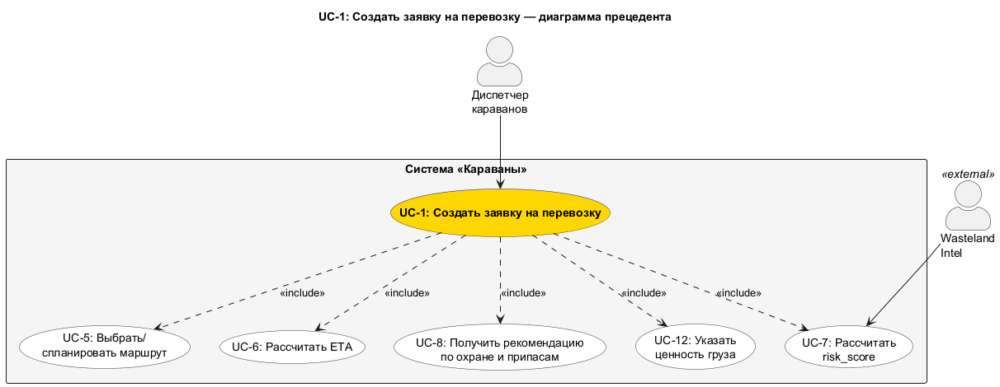

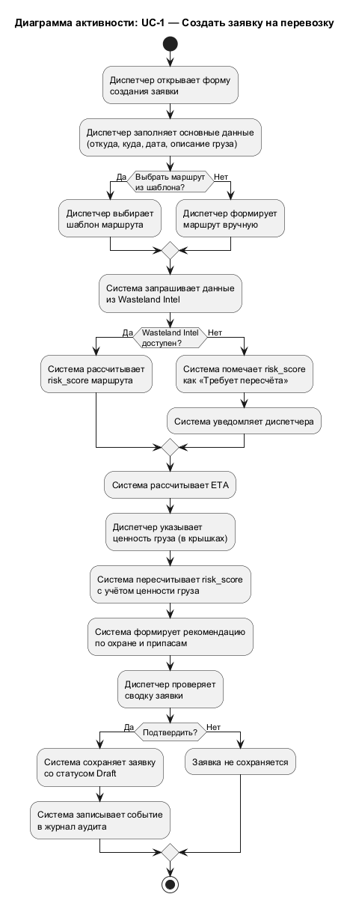

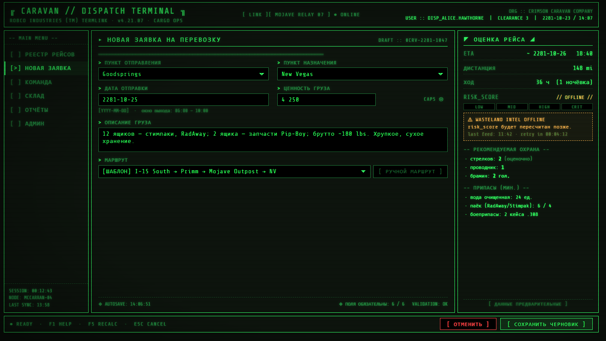

_Исходник: [mockups/uc1_create_request.html](mockups/uc1_create_request.html)_

---

## UC-7. Рассчитать risk_score

| Прецедент: Рассчитать risk_score |
|:---|
| **ID:** UC-7 |
| **Краткое описание:** Система автоматически рассчитывает оценку риска маршрута на основе данных Wasteland Intel и ценности груза. |
| **Главные актёры:** Диспетчер караванов |
| **Второстепенные актёры:** Wasteland Intel |
| **Предусловия:** 1. Для заявки выбран или сформирован маршрут (UC-5). 2. Указана ценность груза (или используется значение по умолчанию). |
| **Основной поток:** 1. Система формирует запрос к API Wasteland Intel, передавая список контрольных точек маршрута. 2. Wasteland Intel возвращает данные об угрозах по каждому участку маршрута (тип угрозы, уровень опасности, дата актуальности). 3. Система агрегирует данные об угрозах и вычисляет базовый risk_score маршрута. 4. Система применяет корректирующий коэффициент ценности груза: чем выше ценность, тем выше итоговый risk_score. 5. Система сохраняет итоговый risk_score в заявке и отображает его диспетчеру. 6. На основе risk_score система автоматически формирует рекомендацию по минимальному составу охраны и объёму припасов (UC-8). |
| **Постусловия:** 1. Заявка содержит актуальный risk_score. 2. Сформирована рекомендация по охране и припасам. |
| **Альтернативные потоки:** 2а. Wasteland Intel недоступен или возвращает ошибку — система устанавливает risk_score = «Н/Д», помечает заявку как «risk_score требует пересчёта» и уведомляет диспетчера. Диспетчер может повторить расчёт позднее. 2б. Wasteland Intel возвращает данные с датой актуальности старше 24 часов — система рассчитывает risk_score, но помечает его как «На основе устаревших данных» и предупреждает диспетчера. |

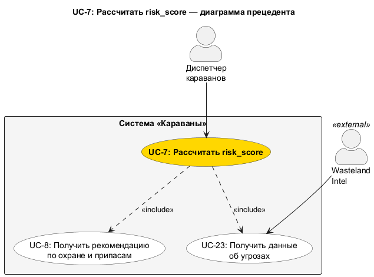

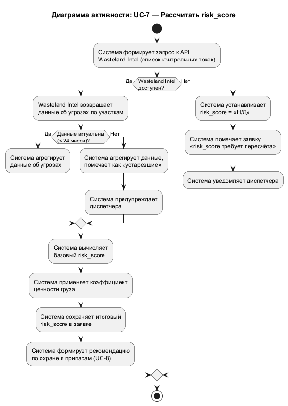

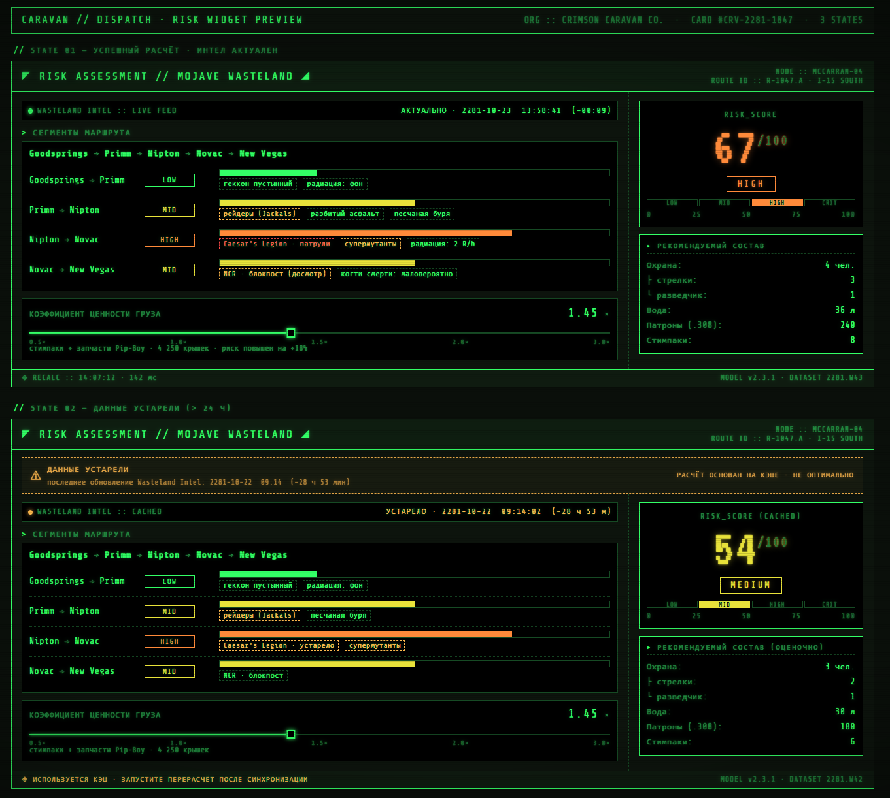

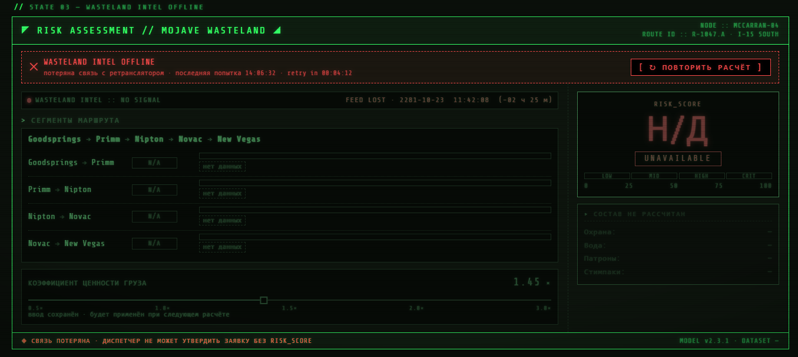

_Исходник: [mockups/uc7_risk_score.html](mockups/uc7_risk_score.html)_

---

## UC-16. Зафиксировать прохождение этапа рейса

| Прецедент: Зафиксировать прохождение этапа рейса |
|:---|
| **ID:** UC-16 |
| **Краткое описание:** Караван-мастер фиксирует факт прохождения очередного физического этапа рейса (загрузка завершена, караван вышел, прибытие на контрольную точку, груз выдан получателю). Результат — запись в CheckpointLog и переход рейса на следующий статус. |
| **Главные актёры:** Караван-мастер |
| **Второстепенные актёры:** Нет |
| **Предусловия:** 1. Караван-мастер аутентифицирован и назначен на рейс. 2. Рейс находится в статусе Ready или En Route. 3. В пути произошло физическое событие, требующее фиксации (загрузка груза завершена / караван покинул исходный пункт / караван прибыл на контрольную точку маршрута / груз выдан получателю в пункте назначения). |
| **Основной поток:** 1. Караван-мастер открывает карточку рейса на полевом устройстве. 2. Система отображает текущий этап рейса и список предстоящих этапов. 3. Караван-мастер выбирает физическое событие, которое произошло в пути. 4. Система автоматически фиксирует временную метку и координаты события. 5. Система выполняет переход статуса рейса согласно статусной модели (например, Ready → En Route при выходе каравана). 6. Система сохраняет запись в CheckpointLog. |
| **Постусловия:** 1. Этап рейса зафиксирован с временной меткой и координатами. 2. Статус рейса обновлён в соответствии со статусной моделью. 3. Запись добавлена в CheckpointLog. |
| **Альтернативные потоки:** 5а. Караван-мастер пытается зафиксировать этап вне допустимого порядка (например, «доставлен» без «вышел») — система отклоняет действие и отображает сообщение о необходимости зафиксировать предыдущий этап. 6а. Связь с сервером отсутствует — данные сохраняются локально на полевом устройстве и автоматически синхронизируются при восстановлении соединения. При синхронизации сервер применяет события в хронологическом порядке. |
| **Точки расширения:** EP-1 «Прибытие на контрольную точку» (шаг 3, событие «прибытие на КТ») — расширяется UC-17 «Отметить прохождение контрольной точки». EP-2 «Прохождение КПП» (шаг 3, событие «прибытие на КПП») — расширяется UC-18 «Отметить прохождение КПП (с пошлиной)». EP-3 «Подтверждение доставки» (шаг 3, событие «груз выдан получателю») — расширяется UC-14 «Подтвердить доставку груза (с пломбой)». |

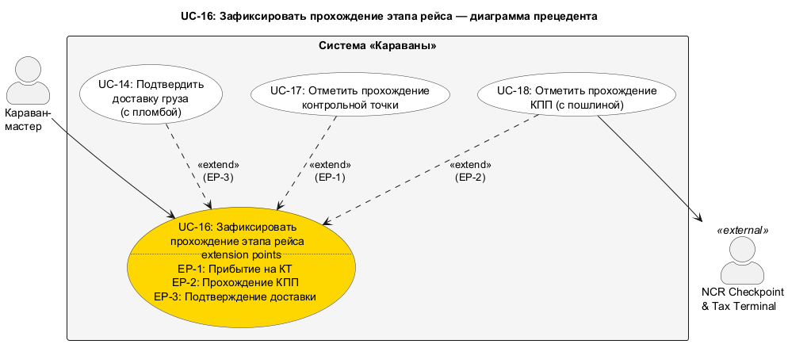

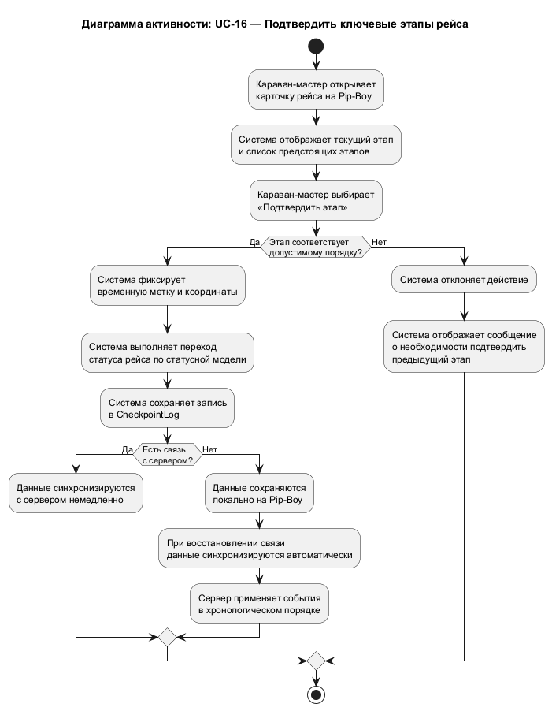

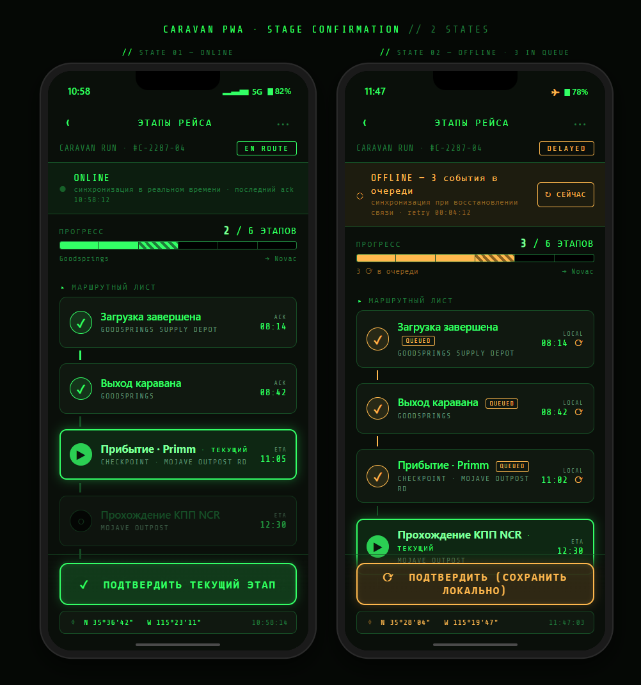

_Исходник: [mockups/uc16_caravan_stages.html](mockups/uc16_caravan_stages.html)_

---

## UC-19. Сообщить об инциденте в рейсе

| Прецедент: Сообщить об инциденте в рейсе |
|:---|
| **ID:** UC-19 |
| **Краткое описание:** Полевой пользователь сообщает о произошедшем в рейсе инциденте (нападение, поломка, медицинское происшествие, потеря груза и т.п.). Результат — карточка инцидента зарегистрирована, диспетчер уведомлён, при необходимости запускается реагирование. |
| **Главные актёры:** Полевой пользователь (обобщает Караван-мастера, Капитана охраны, Полевого медика) |
| **Второстепенные актёры:** Нет |
| **Предусловия:** 1. Полевой пользователь аутентифицирован и назначен на рейс. 2. Рейс находится в статусе En Route или Delayed. 3. В рейсе произошло событие, требующее эскалации (нападение, поломка, медицинское происшествие, потеря груза, стихийное бедствие). |
| **Основной поток:** 1. Полевой пользователь открывает форму сообщения об инциденте на полевом устройстве. 2. Система автоматически заполняет временную метку и координаты. 3. Пользователь выбирает тип инцидента из предопределённого списка. 4. Пользователь указывает тяжесть инцидента (низкая, средняя, высокая, критическая). 5. Пользователь добавляет описание и при необходимости отмечает пострадавших участников команды. 6. Пользователь подтверждает отправку сообщения. 7. Система регистрирует карточку инцидента и привязывает её к текущему рейсу. 8. Если тяжесть «высокая» или «критическая» — система автоматически переводит рейс в статус Delayed. 9. Система передаёт уведомление диспетчеру. |
| **Постусловия:** 1. Карточка инцидента зарегистрирована и привязана к рейсу. 2. При высокой/критической тяжести статус рейса изменён на Delayed. 3. Диспетчер уведомлён об инциденте. |
| **Альтернативные потоки:** 9а. Связь отсутствует — карточка сохраняется локально и синхронизируется при восстановлении соединения; уведомление диспетчеру отправляется при синхронизации с фактическим временем инцидента. 6а. Пользователь отменяет заполнение — карточка не регистрируется. |
| **Точки расширения:** EP-1 «Критический инцидент зарегистрирован» (после шага 8, при тяжести «высокая» или «критическая») — расширяется UC-20 «Инициировать RecoveryRequest» (эвакуация, подмога, повторная доставка). |

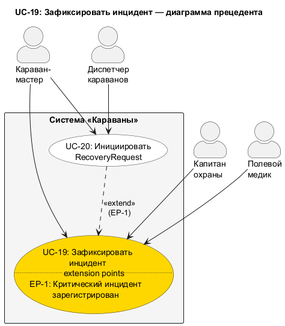

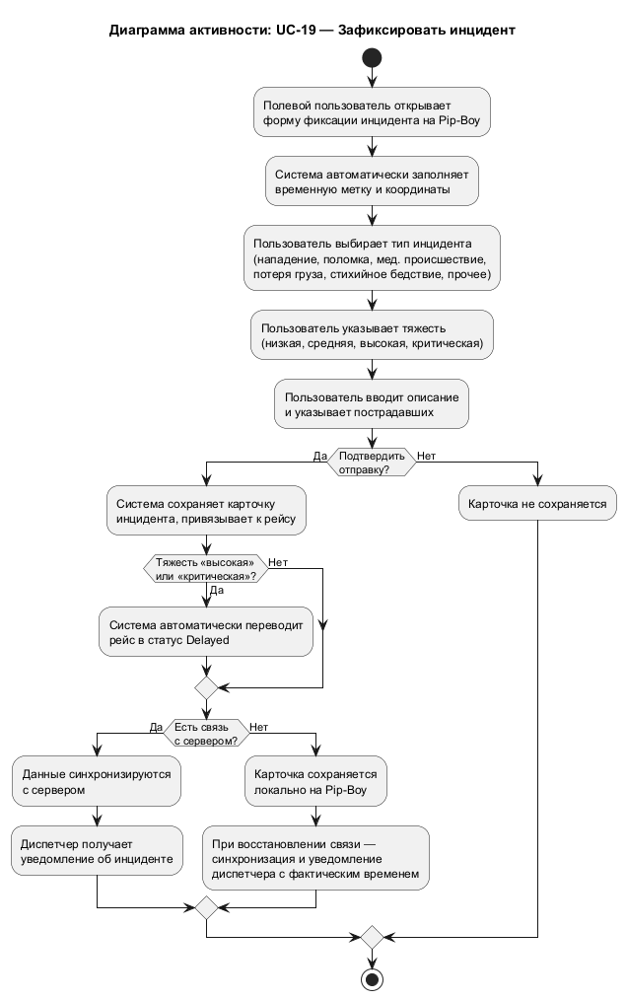

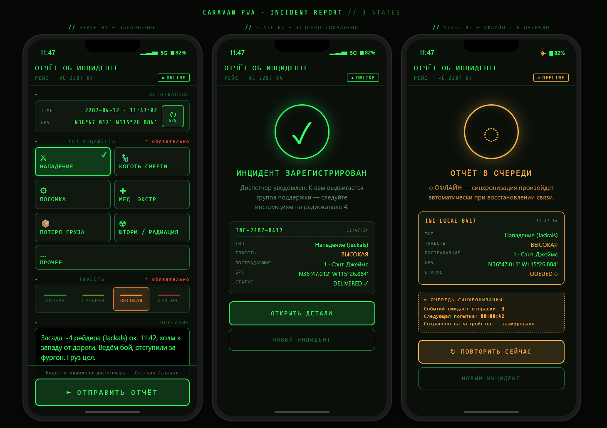

_Исходник: [mockups/uc19_incident_report.html](mockups/uc19_incident_report.html)_

---

## UC-32. Создать организацию

| Прецедент: Создать организацию |
|:---|
| **ID:** UC-32 |
| **Краткое описание:** Суперпользователь создаёт новую организацию (караванную компанию) в системе. |
| **Главные актёры:** Суперпользователь |
| **Второстепенные актёры:** Нет |
| **Предусловия:** 1. Суперпользователь аутентифицирован в системе. |
| **Основной поток:** 1. Суперпользователь открывает административный интерфейс управления организациями. 2. Суперпользователь выбирает действие «Создать организацию». 3. Суперпользователь заполняет данные организации: название, уровень подписки, контактные данные. 4. Система проверяет уникальность названия организации. 5. Система создаёт организацию и выделяет для неё изолированное пространство данных (все сущности организации привязываются к её идентификатору). 6. Система предлагает назначить первого диспетчера организации (UC-33). 7. Суперпользователь вводит ФИО, логин и начальный пароль для первого диспетчера. 8. Система создаёт учётную запись диспетчера, привязанную к новой организации. 9. Система записывает событие создания организации и назначения диспетчера в журнал аудита. |
| **Постусловия:** 1. В системе создана новая организация с изолированным пространством данных. 2. Создана учётная запись первого диспетчера, привязанная к организации. 3. Организация активна и готова к использованию. 4. В журнале аудита зафиксированы события создания. |
| **Альтернативные потоки:** 4а. Название организации не уникально — система отображает ошибку, суперпользователь вводит другое название. 6а. Суперпользователь пропускает назначение диспетчера — организация создаётся без пользователей, диспетчера можно назначить позже через UC-33. |
| **Точки расширения:** EP-1 «Организация создана» (шаг 6, опционально) — расширяется UC-33 «Назначить первого диспетчера организации». EP-2 «Организация создана» (после шага 9) — расширяется UC-34 «Управлять подписками» (активация подписки выбранного уровня). |

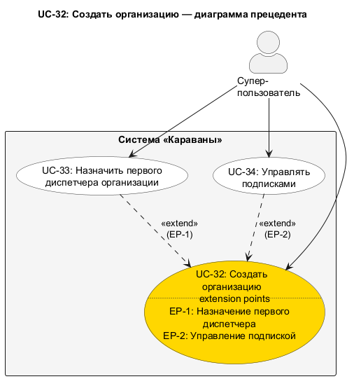

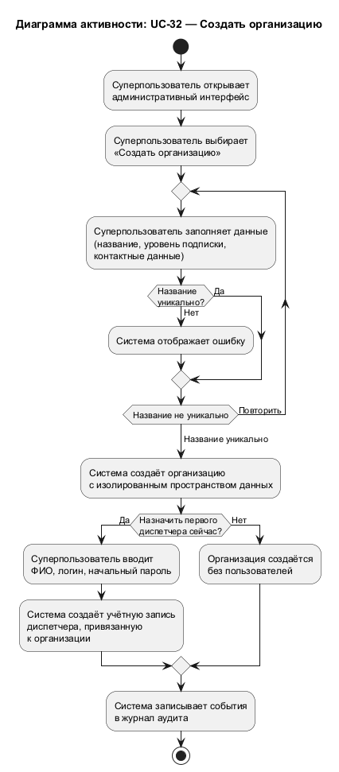

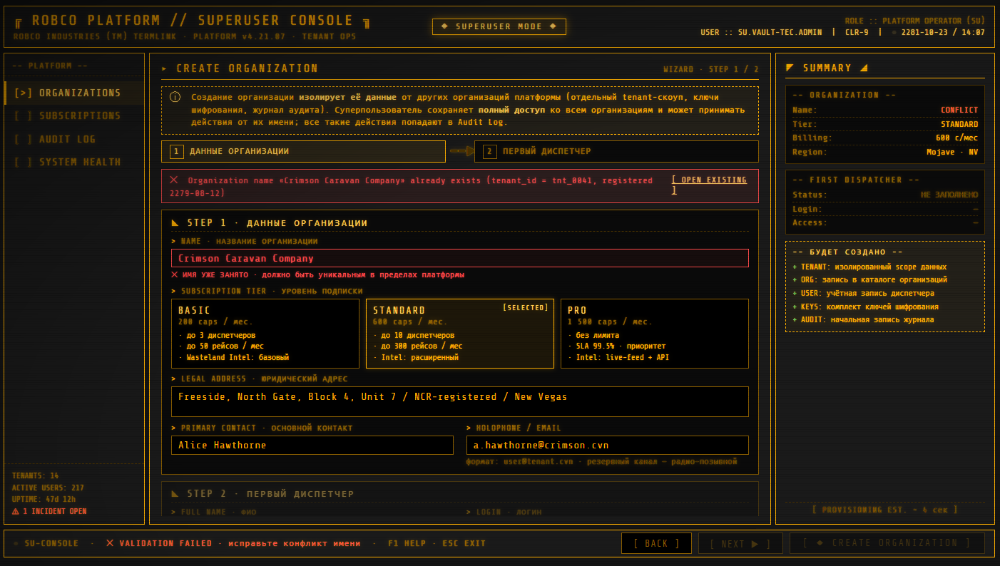

_Исходник: [mockups/uc32_create_organization.html](mockups/uc32_create_organization.html)_
