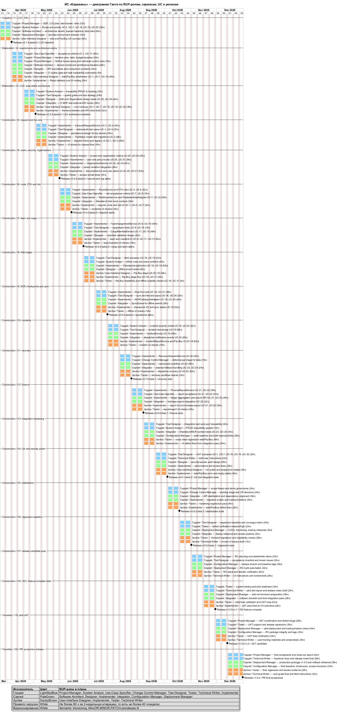

# 1. Introduction (Введение)

Документ задаёт организационный и управленческий контур разработки ИС «Караваны». Он связывает бизнес-видение, требования и use case-модель с практическим планом реализации: фазами, итерациями, ролями, бюджетом, контролями качества и рисками.

## 1.1 Purpose

Назначение настоящего документа - определить, как именно будет выполнена разработка продукта: в какие сроки, какими ролями, с какими артефактами, ограничениями и критериями управляемости. SDP используется как базовый документ для координации заказчика и команды разработки, а также как точка контроля изменений по срокам, бюджету и объёму работ.

## 1.2 Scope (Область применения)

План охватывает полный цикл реализации первой промышленно пригодной версии ИС «Караваны»: веб-клиент для стационарных ролей, полевой клиент для Pip-Boy, серверную часть, базы данных, интеграции с Wasteland Intel и NCR Checkpoint & Tax Terminal, модуль отчётности, многоорганизационный контур и средства аудита. Документ предназначен для участников проекта в RUP-ролях, представителей заказчика и пользователей, участвующих в согласовании и приёмке.

## 1.3 Definitions, Acronyms and Abbreviations (Определения и аббревиатуры)

Полный перечень терминов приведён в отдельном глоссарии. В рамках SDP используются следующие ключевые понятия:

| Термин / сокращение | Смысл в контексте проекта |
| --- | --- |
| ИС | Информационная система «Караваны», предмет разработки настоящего проекта. |
| CaravanRequest | Карточка заявки на перевозку, вокруг которой строится жизненный цикл рейса. |
| ETA | Ожидаемое время прибытия, рассчитываемое системой при планировании маршрута. |
| risk_score | Оценка риска маршрута с учётом угроз и ценности груза. |
| RecoveryRequest | Вторичная задача после инцидента: эвакуация, подмога, повторная доставка и т.п. |
| Pip-Boy | Полевое устройство для фиксации статусов, КПП и инцидентов на маршруте. |
| Audit trail | Неизменяемый журнал действий пользователей и системных событий. |
| LCO / LCA / IOC / PR | Контрольные вехи RUP: цели жизненного цикла, архитектура, начальная операционная готовность и релиз продукта. |
| SemVer | Принятая схема версионирования релизов `MAJOR.MINOR.PATCH-prerelease.N`, например `v1.0.0-rc.1`. |

## 1.4 References (Ссылки)
1. **Игровой лор Fallout: New Vegas** – источник истины о мире Fallout, в рамках которого разрабатывается система
    
2. **Вики Fallout** русскоязычная - [https://fallout.fandom.com/ru/wiki/Fallout](https://fallout.fandom.com/ru/wiki/Fallout), и англоязычная - [https://fallout.fandom.com/wiki/Fallout_Wiki](https://fallout.fandom.com/wiki/Fallout_Wiki)
    
3. **Глоссарий** [https://docs.google.com/document/d/1AoE4qzqL8gtCE5ctFHvpofifqBhW2ubGu15-tvnP3i8/edit?usp=sharing](https://docs.google.com/document/d/1AoE4qzqL8gtCE5ctFHvpofifqBhW2ubGu15-tvnP3i8/edit?usp=sharing)
    
4. **Vision** [https://docs.google.com/document/d/16DPB8_gGFQS-jttED2Ayl4UiRRkqW5dMni9uQASKMng/edit?usp=sharing](https://docs.google.com/document/d/16DPB8_gGFQS-jttED2Ayl4UiRRkqW5dMni9uQASKMng/edit?usp=sharing)

## 1.5 Overview (Обзор документа)

1. Раздел 2 фиксирует назначение проекта, его цели, ограничения, ключевые артефакты и правила актуализации SDP.

1. Раздел 3 описывает организацию проекта: состав команды, внешние интерфейсы и зоны ответственности.

1. Раздел 4 определяет управленческий процесс: сроки, фазы, итерации, релизы, бюджет, мониторинг, качество, риски и условия завершения.

# 2. Project Overview (Обзор продукта)

## 2.1 Project Purpose, Scope, and Objectives (Назначение, цели и контекст продукта)

Проект направлен на создание первой полнофункциональной версии ИС «Караваны» - специализированной платформы управления караванными перевозками в условиях Пустоши. Результатом проекта должны стать не только работающие программные компоненты, но и весь комплект производственных артефактов, необходимых для запуска пилота: требования, архитектурные решения, исходный код, тестовый набор, документация, пакет развёртывания и план поддержки.

Цели разработки сформулированы на основе Vision и SRS и считаются достигнутыми, если к концу проекта выполнены следующие условия:

- реализован полный жизненный цикл заявки и рейса от создания до закрытия, включая манифест, инциденты, маршрут, статусы и финансовый отчёт;

- поддержаны приоритетные продуктовые особенности: расчёт risk_score, ETA, формирование команды, полевой интерфейс, интеграции с внешними системами и аудит;

- подтверждены целевые нефункциональные характеристики: до 200 одновременных пользователей, до 500 активных рейсов в день, серверная доступность не ниже 99.0%, полевые действия не длиннее 3-5 шагов;

- на пилотном контуре обеспечено снижение среднего времени планирования рейса с 30 до 15 минут и создана база для снижения доли потерь/недостач с 10% до 6% в операционном сегменте независимых операторов;

- готов комплект документов для передачи в эксплуатацию: пользовательское руководство, инструкция по развёртыванию, release notes и журнал известных ограничений.

## 2.2 Assumptions and Constraints (Влияющие факторы и ограничения)

| Категория | Принятое допущение или ограничение |
| --- | --- |
| Сроки | План построен на горизонте 41 календарной недели с 23.03.2026 по 31.12.2026; рабочие итерации планируются с шагом 2 недели, финальная итерация совмещена с календарным закрытием года. |
| Команда | Базовая разработка выполняется командой из 3 исполнителей: Гордей, Сергей, Артём. Один человек может закрывать несколько RUP-ролей, но планирование и расчёт стоимости ведутся по фактическим часам в конкретной RUP-роли. |
| Загрузка | Ни один исполнитель не планируется более чем на 40 часов в неделю. Для стандартной двухнедельной итерации лимит составляет 80 часов на человека; максимальная плановая загрузка в обновлённом графике - 80 часов за итерацию. |
| Технологии | Стек фиксирован требованиями SRS: React 18, Java 21, PostgreSQL 16, MongoDB 7, HTTPS/JSON, layered backend. |
| Интеграции | Контракты внешних API Wasteland Intel и NCR Checkpoint должны быть доступны не позднее конца фазы Elaboration; при их недоступности используются mock/sandbox. |
| Эксплуатационный контур | Первый релиз ориентирован на одну пилотную организацию и один продуктивный контур. Массовое тиражирование в оценку не включено. |
| Полевой режим | Система обязана работать при нестабильной связи за счёт локальной фиксации событий и отложенной синхронизации. |
| UI-ограничения | Полевой интерфейс проектируется под низкое разрешение и монохромные экраны Pip-Boy, что ограничивает сложность экранов и объём отображаемой информации. |
| Версионирование | Релизы маркируются по SemVer: alpha для ранних инкрементов, beta для стабилизации функциональности, release candidate для пилота и `v1.0.0` для финального pilot-ready релиза. |
| Бюджет | Общая стоимость базовой реализации и пилота ограничена потолком 87 137 крышек, включая инфраструктуру, пилот и резерв по рискам. |

## 2.3 Project Deliverables (Ожидаемые результаты проекта)

| Артефакт | Содержание | Фаза готовности | Ответственный |
| --- | --- | --- | --- |
| SDP | Утверждённый план разработки, бюджет, контрольные правила, распределение RUP-ролей между исполнителями и риск-регистр. | Inception | Гордей (Project Manager) |
| Requirements baseline | Vision, SRS, Glossary, Use Cases, набор согласованных изменений и трассировка приоритетов. | Elaboration | Гордей (System Analyst / Use-Case Specifier) |
| Architecture baseline | Контекстная схема, логическая архитектура, модель данных, интеграционные контракты, решение по offline sync. | Elaboration | Сергей (Software Architect / Designer) |
| Исходный код и CI/CD | Реализация сервисов, UI, конфигураций БД, скриптов сборки, pipeline деплоя и миграций. | Construction | Гордей / Сергей / Артём (Implementer), Сергей (Integrator / Configuration Manager) |
| Test baseline | Тест-план, test cases, результаты функционального, интеграционного и приёмочного тестирования. | Construction/Transition | Гордей (Test Designer), Гордей / Артём (Tester) |
| Эксплуатационная документация | Инструкция по установке, пользовательское руководство, release notes, known issues. | Transition | Гордей / Артём (Technical Writer), Сергей (Deployment Manager) |
| Релизный пакет v1.0.0 | Собранные дистрибутивы, миграции, конфигурация окружения, чек-лист развертывания и rollback plan. | Transition | Сергей (Deployment Manager / Configuration Manager) |
| Диаграмма Ганта по RUP-ролям и релизам | Визуальный срез календарного плана: RUP-роли, сервисы, UC, часы, релизные версии и контроль загрузки. | Inception/актуализация SDP | Гордей (Project Manager), Сергей и Артём как источники оценок |

## 2.4 Evolution of the Software Development Plan (План развития данного документа)

SDP является управляемым документом и изменяется только при наступлении событий, влияющих на базовые параметры проекта. Каждое изменение фиксируется новой версией документа и согласуется руководителем проекта и представителем заказчика.

| Версия SDP | Этап / когда создаётся | Триггеры для обновления |
| --- | --- | --- |
| 0.1 | Старт проекта / Inception | Первичная оценка сроков, команды и границ MVP. |
| 0.5 | После baseline требований | Согласованы Vision, SRS, Use Cases; уточнены фазовый план и архитектурные риски. |
| 0.9 | После архитектурной стабилизации | Изменение сроков более чем на 2 недели, бюджета более чем на 10%, появление новой обязательной интеграции или критического технологического риска. |
| 1.0 | Перед запуском Construction/production baseline | Подтверждён объём релиза `v1.0.0` и ресурсный план. |
| 1.x | По мере необходимости | Формальное change request, затрагивающее сроки, бюджет, состав команды, критерии приемки или стратегию выпуска. |

# 3. Project Organization (Организация проекта)

## 3.1 Organizational Structure (Структура команды разработки)

Для проекта формируется компактная кросс-функциональная команда из 3 человек. Роль в плане не равна человеку: один исполнитель может закрывать несколько RUP-ролей, а расчёт стоимости ведётся по фактическим часам в каждой роли. Инженерные специализации вроде backend/frontend/devops не используются как роли планирования; они отражаются в названии конкретной работы или сервиса.

| Роль | Исполнитель | Основное участие | Ключевой результат |
| --- | --- | --- | --- |
| Project Manager | Гордей | Inception - Transition | SDP, phase gates, schedule baseline, бюджет, статус-отчётность. |
| System Analyst | Гордей | Inception - Construction | Уточнение границ системы, требований, зависимостей и traceability. |
| Use-Case Specifier | Гордей | Elaboration - Construction | Детализация UC, acceptance criteria и связь UC -> задачи -> тесты. |
| Software Architect | Сергей | Inception - Elaboration | Архитектурная база, layered backend, модель данных, интеграционные решения. |
| Designer | Сергей | Elaboration - Construction | Проектирование компонентов, API-контрактов, offline-модели и правил доступа. |
| Implementer | Гордей / Сергей / Артём | Elaboration - Construction | Реализация сервисов, UI, миграций и сценариев по UC. |
| Integrator | Сергей | Elaboration - Construction | CI, интеграционные сборки, внешние адаптеры, контрактные проверки. |
| User-Interface Designer | Артём | Inception - Construction | Макеты web/Pip-Boy, UX для 3-5 шагов и низкого разрешения. |
| Test Designer | Гордей | Elaboration - Construction | Тест-стратегия, тест-кейсы, матрица покрытия, UAT-сценарии. |
| Tester | Гордей / Артём | Construction - Transition | Smoke, functional, integration, regression, UAT verification. |
| Configuration Manager | Сергей | Construction - Transition | Baseline, release branch, теги, контроль состава релизного пакета. |
| Deployment Manager | Сергей | Inception - Transition | Окружения, деплой, мониторинг, backup/restore, rollback. |
| Technical Writer | Гордей / Артём | Construction - Transition | Пользовательская и эксплуатационная документация, release notes, known issues. |
| Change Control Manager | Гордей | Construction | Change request, triage scope/defects, контроль переносов между релизами. |

## 3.2 External Interfaces (Внешние интерфейсы)

| Внешняя сторона | Цель взаимодействия | Формат / периодичность | Основной артефакт взаимодействия |
| --- | --- | --- | --- |
| Представитель заказчика (руководство караванной компании) | Приоритизация объёма, согласование фаз, приёмка релизов и бюджета. | Еженедельный статус-созвон + демонстрация в конце итерации | Decision log, протокол демонстрации, акт приемки итерации |
| Представители пользователей: диспетчер, караван-мастер, кладовщик | Уточнение сценариев, UX-проверка форм и полевых действий. | Интервью/воркшопы по потребности, UAT в Transition | Протокол интервью, список замечаний, UAT findings |
| Владельцы интеграций Wasteland Intel и NCR Checkpoint | Согласование API-контрактов, SLA тестовых контуров, обработка ошибок. | По вехам Elaboration/Construction | API specification, mock contract, integration checklist |
| Эксплуатационная/инфраструктурная сторона | Подготовка окружений, доступов, резервного копирования и мониторинга. | На старте проекта и перед релизами | Runbook, deployment checklist, access matrix |

## 3.3 Roles and Responsibilities (Роли и обязанности)

| Роль | Зона ответственности | Ключевые решения / полномочия |
| --- | --- | --- |
| Project Manager | План проекта, бюджет, schedule baseline, коммуникации с заказчиком, статус-отчётность. | Ведёт baseline SDP; выносит изменения сроков/бюджета/scope на согласование; закрывает phase gate со стороны команды. |
| System Analyst | Сбор и уточнение требований, анализ границ системы, приоритизация и трассировка FR/UC -> задачи -> тесты. | Фиксирует requirements baseline и проверяет, что задачи имеют ссылку на FR/UC. |
| Use-Case Specifier | Детализация use cases, альтернативных потоков, предусловий, постусловий и acceptance criteria. | Утверждает достаточность UC для передачи в реализацию и тест-дизайн. |
| Software Architect | Архитектура, декомпозиция компонентов, модель данных, offline sync, интеграционные контуры. | Утверждает архитектурный baseline и технические ограничения реализации. |
| Designer | Детальное проектирование сервисов, API, схем данных, правил доступа и взаимодействий компонентов. | Принимает решения по контрактам компонентов до передачи задач Implementer. |
| Implementer | Реализация сервисов и UI: CaravanRequestService, SecurityService, RiskScoreService, CargoManifestService, IncidentService, RecoveryRequestService, FinanceReportService и связанные экраны. | Закрывает задачи согласно acceptance criteria и передаёт изменения на review/test. |
| Integrator | Сборка инкрементов, интеграция внешних API, CI, контрактные тесты, устранение конфликтов компонентов. | Подтверждает готовность инкремента к демо и включению в релизную ветку. |
| User-Interface Designer | Макеты, пользовательские потоки, адаптация сценариев под 3-5 шагов и низкое разрешение Pip-Boy. | Утверждает UX-прототипы перед передачей в реализацию. |
| Test Designer | Тест-дизайн, матрица покрытия, регрессионный набор, UAT-сценарии и release criteria. | Определяет минимальный набор проверок для каждой итерации и релиза. |
| Tester | Functional/integration/regression testing, поддержка UAT, дефект-менеджмент. | Блокирует релиз при blocker/critical defects или невыполнении release criteria. |
| Configuration Manager | Управление baseline, release branch, тегами, составом артефактов и воспроизводимостью сборки. | Фиксирует, какой код и конфигурация входят в конкретную версию. |
| Deployment Manager | Окружения, наблюдаемость, backup/restore, деплой и откат. | Утверждает готовность окружений, deployment checklist и rollback plan. |
| Technical Writer | Пользовательская инструкция, эксплуатационная инструкция, release notes, known issues. | Фиксирует комплект документации перед Transition и финальной приёмкой. |
| Change Control Manager | Регистрация change request, оценка влияния на сроки/бюджет/scope, triage переносов. | Принимает решение, что остаётся в `v1.0.0`, а что уходит в post-1.0 backlog после согласования с Project Manager и заказчиком. |
| Представитель заказчика | Финальное принятие объёма, подтверждение бизнес-приоритетов и результатов пилота. | Подписывает phase gate и final acceptance по итогам Transition. |

# 4. Management Process (Процесс управления)

## 4.1 Project Estimates (Оценка сроков разработки проекта)

Плановая оценка рассчитана по продуктовым областям, RUP-ролям, фазам RUP и персональному совмещению ролей внутри команды из 3 человек. Оценка включает создание MVP и доведение продукта до пилотной эксплуатационной готовности к 31.12.2026, но не включает последующее тиражирование на множество организаций. Стоимость пересчитана по формуле: **стоимость роли = часы в роли × ставка роли**. План не закладывает загрузку выше 40 часов в неделю на человека.

| Параметр | Плановое значение |
| --- | --- |
| Общая длительность проекта | 41 календарная неделя |
| Количество фаз | 4 (Inception, Elaboration, Construction, Transition) |
| Количество рабочих итераций | 20 итераций: основной шаг 2 недели; последняя итерация закрывается 31.12.2026 |
| Состав команды | 3 исполнителя: Гордей, Сергей, Артём |
| Плановая трудоёмкость | 3 830 чел.-часов |
| Максимальная плановая загрузка | 80 часов на человека за 2-недельную итерацию, то есть 40 часов в неделю |
| Базовая стоимость разработки | 68 380 крышек |
| Полный бюджет с резервом и пилотом | 87 137 крышек |
| Плановая дата релиза `v1.0.0` | 31.12.2026 |

## 4.2 Project Plan (План проекта)

### 4.2.1 Phase Plan (План фаз)

| Фаза | Количество итераций | Начало | Конец |
| --- | --- | --- | --- |
| Inception | 1 | 23.03.2026 | 05.04.2026 |
| Elaboration | 2 | 06.04.2026 | 03.05.2026 |
| Construction | 15 | 04.05.2026 | 29.11.2026 |
| Transition | 2 | 30.11.2026 | 31.12.2026 |

| Фаза | Описание | Вехи |
| --- | --- | --- |
| Inception | Фиксация границ проекта, baseline требований верхнего уровня, первичная оценка рисков, согласование объёма MVP, состава команды из 3 исполнителей и модели RUP-ролей. | LCO: утверждены цели проекта, базовый scope, состав команды и версия SDP 0.5 |
| Elaboration | Подготовка архитектурной базы: доменная модель, API-контракты, стратегия offline sync, skeleton UI, UX-прототипы и уточнённая оценка по ролям. | LCA: утверждена архитектура, трассировка требований и backlog Construction |
| Construction | Итеративная реализация приоритетных пользовательских сценариев, сервисов, интеграций, аудита, отчётности, тестовой автоматизации и release package. | IOC: feature-complete release candidate `v1.0.0-rc.1`, завершены тесты системного уровня |
| Transition | Пилотное развертывание, приёмочные испытания, обучение, исправление дефектов, подготовка финального релиза и передача в сопровождение. | PR: подписан UAT, выпущен релиз `v1.0.0`, переданы эксплуатационные артефакты |

### 4.2.2 Iteration Objectives (Цели итераций)

Итерации планируются короткими инкрементами. Базовый шаг — 2 недели; последняя итерация Transition длиннее из-за календарного закрытия релиза 31.12.2026. Каждая итерация декомпозирована на work packages: исполнитель, RUP-роль, конкретная работа или сервис, ссылка на UC и оценка в часах.

| Фаза | Номер итерации | Даты | Описание | Вехи |
| --- | --- | --- | --- | --- |
| Inception | I1 | 23.03.2026-05.04.2026 | Scope, SDP, LCO packet, архитектурный sketch, UX concept. | `v0.1.0-alpha.0`, LCO |
| Elaboration | I2 | 06.04.2026-19.04.2026 | Acceptance criteria UC-1..UC-11, правила GitHub Issues, доменная модель, API boundaries, CI quality gate, skeleton UI. | Requirements/API alpha |
| Elaboration | I3 | 20.04.2026-03.05.2026 | Traceability, quality gates, Auth/Organization spike, CI MVP, mock contracts. | `v0.2.0-alpha.0`, LCA |
| Construction | I4 | 04.05.2026-17.05.2026 | CaravanRequestService, TripStatus model, dispatch forms, status/audit tests. | Request/trip core |
| Construction | I5 | 18.05.2026-31.05.2026 | OrganizationService, SecurityService, user/admin UI, tenant isolation. | `v0.3.0-alpha.0` |
| Construction | I6 | 01.06.2026-14.06.2026 | RouteService, ETA, RiskScoreService, WastelandIntelAdapter, route/risk UI. | `v0.4.0-alpha.0` |
| Construction | I7 | 15.06.2026-28.06.2026 | TeamAssignmentService, CargoManifestService, team/manifest UI. | `v0.5.0-alpha.0` |
| Construction | I8 | 29.06.2026-12.07.2026 | CheckpointLogService, offline event model, Pip-Boy stage flow, readability/offline usability checks. | Field stage increment |
| Construction | I9 | 13.07.2026-26.07.2026 | NCRCheckpointAdapter, SyncQueue, DutyTax rules, checkpoint UX. | `v0.6.0-alpha.0` |
| Construction | I10 | 27.07.2026-09.08.2026 | IncidentService, IncidentReportService, severity model, notifications. | Incident increment |
| Construction | I11 | 10.08.2026-23.08.2026 | RecoveryRequestService, reschedule workflow, external fallback handling. | `v0.7.0-beta.1` |
| Construction | I12 | 24.08.2026-06.09.2026 | FinanceReportService, ledger aggregation, holotape export, report UI. | `v0.8.0-beta.1` |
| Construction | I13 | 07.09.2026-20.09.2026 | Wasteland/NCR contract tests, audit baseline, cross-client regression. | Integration hardening |
| Construction | I14 | 21.09.2026-04.10.2026 | UAT scenarios, security/access audit, UX polish and error/empty states. | `v0.8.1-beta.2` |
| Construction | I15 | 05.10.2026-18.10.2026 | Scope freeze, CR triage, API stabilization, migrations, hardening defects. | `v0.8.2-beta.3` |
| Construction | I16 | 19.10.2026-01.11.2026 | Regression baseline, CI/CD, monitoring, backup rehearsal, defect verification. | `v0.9.0-beta.1` |
| Construction | I17 | 02.11.2026-15.11.2026 | RC planning, acceptance checklist, release branch, RC build automation. | RC backlog frozen |
| Construction | I18 | 16.11.2026-29.11.2026 | System testing, pilot environment, rollback checklist, beta fixes validation. | `v1.0.0-rc.1`, IOC |
| Transition | I19 | 30.11.2026-13.12.2026 | Pilot deployment, UAT, user training, UAT fixes verification. | `v1.0.0-rc.2` |
| Transition | I20 | 14.12.2026-31.12.2026 | Final regression, production package, release notes, handover, close-out report. | `v1.0.0`, PR |

### 4.2.3 Releases (Релизы)

Принято SemVer-подобное версионирование `MAJOR.MINOR.PATCH-prerelease.N`. До финального релиза используются pre-release идентификаторы `alpha`, `beta` и `rc`. Увеличение `MINOR` означает новый функциональный инкремент, увеличение `PATCH` - стабилизационный инкремент без расширения scope.

| Номер версии | Тип | Основной объём / реализованные UC | Дата выпуска |
| --- | --- | --- | --- |
| `v0.1.0-alpha.0` | Project baseline | LCO: scope, SDP, риск-регистр, стартовое окружение. | 05.04.2026 |
| `v0.2.0-alpha.0` | Architecture baseline | LCA: доменная модель, API boundaries, CI MVP, UX skeleton, UC-1..UC-11 готовы к Construction. | 03.05.2026 |
| `v0.3.0-alpha.0` | Alpha | SecurityService, OrganizationService, пользователи и организации: UC-25..UC-34. | 31.05.2026 |
| `v0.4.0-alpha.0` | Alpha | CaravanRequestService, RouteService, ETA, RiskScoreService, WastelandIntelAdapter: UC-1..UC-8, UC-23. | 14.06.2026 |
| `v0.5.0-alpha.0` | Alpha | TeamAssignmentService, CargoManifestService, team/manifest UI: UC-9..UC-15. | 28.06.2026 |
| `v0.6.0-alpha.0` | Alpha | CheckpointLogService, NCRCheckpointAdapter, SyncQueue, DutyTax rules: UC-16..UC-18, UC-24. | 26.07.2026 |
| `v0.7.0-beta.1` | Beta | IncidentService, IncidentReportService, RecoveryRequestService, fallback handling: UC-19, UC-20. | 23.08.2026 |
| `v0.8.0-beta.1` | Beta | FinanceReportService, ledger aggregation, holotape export, report UI: UC-21, UC-22. | 06.09.2026 |
| `v0.8.1-beta.2` | Beta patch | Контрактные тесты Wasteland/NCR, audit baseline, UX/security hardening: UC-23, UC-24. | 04.10.2026 |
| `v0.8.2-beta.3` | Beta patch | Scope freeze, API stabilization, migrations, hardening fixes. | 18.10.2026 |
| `v0.9.0-beta.1` | Feature-complete beta | Регрессионный baseline, backup rehearsal, known UI issues; полный scope в тестовом контуре. | 01.11.2026 |
| `v1.0.0-rc.1` | Release candidate | IOC: system testing, pilot environment, rollback checklist, beta fixes validation. | 29.11.2026 |
| `v1.0.0-rc.2` | Release candidate | Пилотное развёртывание, UAT, обучение, подтверждение UAT fixes. | 13.12.2026 |
| `v1.0.0` | Production pilot | PR: финальная регрессия, документация, production package, handover и final acceptance. | 31.12.2026 |

### 4.2.4 Project Schedule (Расписание проекта и оценка трудозатрат)

#### 4.2.4.1 Ставки ролей

| Роль | Исполнитель / исполнители | Ставка, крышек / час |
| --- | --- | --- |
| Project Manager | Гордей | 20 |
| System Analyst | Гордей | 18 |
| Use-Case Specifier | Гордей | 18 |
| Software Architect | Сергей | 24 |
| Designer | Сергей | 22 |
| Implementer | Гордей / Сергей / Артём | 20 |
| Integrator | Сергей | 18 |
| User-Interface Designer | Артём | 16 |
| Test Designer | Гордей | 14 |
| Tester | Гордей / Артём | 14 |
| Configuration Manager | Сергей | 16 |
| Deployment Manager | Сергей | 18 |
| Technical Writer | Гордей / Артём | 12 |
| Change Control Manager | Гордей | 18 |

#### 4.2.4.2 Расчёт трудозатрат и стоимости по фазам и ролям

| Фаза | Project Manager | System Analyst | Use-Case Specifier | Software Architect | Designer | Implementer | Integrator | User-Interface Designer | Test Designer | Tester | Configuration Manager | Deployment Manager | Technical Writer | Change Control Manager | Общие трудозатраты | Стоимость реализации |
| --- | --- | --- | --- | --- | --- | --- | --- | --- | --- | --- | --- | --- | --- | --- | --- | --- |
| Inception | 32 | 28 | 0 | 40 | 0 | 0 | 0 | 40 | 0 | 0 | 0 | 16 | 0 | 0 | 156 | 3 032 |
| Elaboration | 40 | 32 | 40 | 48 | 66 | 56 | 36 | 76 | 28 | 0 | 0 | 0 | 0 | 0 | 422 | 8 076 |
| Construction | 46 | 76 | 34 | 0 | 98 | 1 328 | 274 | 58 | 256 | 426 | 64 | 104 | 82 | 40 | 2 886 | 51 624 |
| Transition | 52 | 0 | 0 | 0 | 0 | 0 | 0 | 0 | 0 | 92 | 44 | 80 | 98 | 0 | 366 | 5 648 |
| ИТОГО | 170 | 136 | 74 | 88 | 164 | 1 384 | 310 | 174 | 284 | 518 | 108 | 200 | 180 | 40 | 3 830 | 68 380 |

#### 4.2.4.3 Расчёт стоимости по исполнителям и совмещаемым ролям

| Исполнитель | Роль | Часы | Ставка, крышек / час | Стоимость, крышек |
| --- | --- | --- | --- | --- |
| Гордей | Project Manager | 170 | 20 | 3 400 |
| Гордей | System Analyst | 136 | 18 | 2 448 |
| Гордей | Use-Case Specifier | 74 | 18 | 1 332 |
| Гордей | Implementer | 272 | 20 | 5 440 |
| Гордей | Test Designer | 284 | 14 | 3 976 |
| Гордей | Tester | 88 | 14 | 1 232 |
| Гордей | Technical Writer | 80 | 12 | 960 |
| Гордей | Change Control Manager | 40 | 18 | 720 |
| Сергей | Software Architect | 88 | 24 | 2 112 |
| Сергей | Designer | 164 | 22 | 3 608 |
| Сергей | Implementer | 482 | 20 | 9 640 |
| Сергей | Integrator | 310 | 18 | 5 580 |
| Сергей | Configuration Manager | 108 | 16 | 1 728 |
| Сергей | Deployment Manager | 200 | 18 | 3 600 |
| Артём | User-Interface Designer | 174 | 16 | 2 784 |
| Артём | Implementer | 630 | 20 | 12 600 |
| Артём | Tester | 430 | 14 | 6 020 |
| Артём | Technical Writer | 100 | 12 | 1 200 |
| ИТОГО: Гордей |  | 1 144 |  | 19 508 |
| ИТОГО: Сергей |  | 1 352 |  | 26 268 |
| ИТОГО: Артём |  | 1 334 |  | 22 604 |
| ИТОГО ПО КОМАНДЕ |  | 3 830 |  | 68 380 |

Пример принципа расчёта: если один исполнитель в рамках итерации выполняет 7 часов как Implementer и 5 часов как Tester, стоимость равна `7 × 20 + 5 × 14 = 210` крышек. Поэтому итоговая сумма считается не по человеку, а по RUP-роли, в которой были выполнены часы.

#### 4.2.4.4 Контроль недельной загрузки

| Исполнитель | Максимальная плановая загрузка за 2-недельную итерацию | Эквивалент в неделю | Статус |
| --- | --- | --- | --- |
| Гордей | 80 ч | 40 ч/неделю | На лимите, без превышения |
| Сергей | 80 ч | 40 ч/неделю | На лимите, без превышения |
| Артём | 80 ч | 40 ч/неделю | На лимите, без превышения |

Задача не включается в iteration backlog, если после её добавления исполнитель превышает 80 часов за стандартную двухнедельную итерацию. Для финальной итерации I20 используется тот же практический лимит, хотя календарно она длиннее стандартной итерации.

#### 4.2.4.5 Диаграмма Ганта по RUP-ролям, UC и релизам

Отдельные файлы диаграммы: `diagrams/gantt/Gantt.puml` и `diagrams/gantt/Gantt.png`. Диаграмма показывает календарный срез по исполнителям, RUP-ролям, сервисам, UC-ссылкам, часам и релизным версиям. Визуально она должна использоваться вместе с таблицами 4.2.4.1-4.2.4.4, потому что именно таблицы являются расчётной базой бюджета и контроля загрузки.

### 4.2.5 Project Resourcing (Ресурсы проекта)

#### 4.2.5.1 Staffing Plan (План по сотрудникам)

| Исполнитель | Закрываемые роли | Плановые часы | Фаза наибольшей загрузки |
| --- | --- | --- | --- |
| Гордей | Project Manager, System Analyst, Use-Case Specifier, Implementer, Test Designer, Tester, Technical Writer, Change Control Manager | 1 144 | Elaboration, Construction |
| Сергей | Software Architect, Designer, Implementer, Integrator, Configuration Manager, Deployment Manager | 1 352 | Elaboration, Construction |
| Артём | User-Interface Designer, Implementer, Tester, Technical Writer | 1 334 | Construction, Transition |

Минимальный состав команды рассчитан на реализацию релиза `v1.0.0` в единственном пилотном контуре. При расширении объёма, добавлении второго клиента, полноценной мобильной оболочки или новых внешних интеграций потребуется отдельное увеличение команды и перерасчёт SDP.

#### 4.2.5.2 Resource Acquisition Plan (План поиска сотрудников)

- все RUP-роли закрываются внутренней командой из трёх человек; внешний найм не планируется в базовом сценарии;

- при риске перегрузки Implementer-задач приоритет отдаётся сервисам, закрывающим критичные UC и интеграции, а UI-polish и второстепенная отчётность переносятся только через change control;

- Designer и Software Architect не заменяют Implementer: проектирование и архитектурные решения планируются отдельными RUP-ролями и не должны скрывать реализационные часы;

- если один исполнитель временно недоступен более 5 рабочих дней, Project Manager пересобирает iteration backlog и перераспределяет задачи внутри существующих RUP-ролей без превышения 40 часов в неделю у оставшихся исполнителей;

- добавление новых исполнителей или изменение ставок допускается только через обновление SDP, так как напрямую меняет бюджет.

### 4.2.6 Budget (Бюджет)

| Статья бюджета | Сумма, крышки | Комментарий |
| --- | --- | --- |
| Базовая разработка | 68 380 | Трудозатраты трёх исполнителей по таблицам 4.2.4 и 4.2.5: часы × ставка конкретной RUP-роли. |
| Окружения и инфраструктурная подготовка | 5 500 | Серверный контур, сборка, наблюдаемость, backup/restore, тестовые стенды. |
| Пилотное внедрение и обучение | 3 000 | Подготовка пилота, UAT-сессии, обучение ключевых пользователей, выпуск инструкций. |
| Резерв по рискам (≈15% от разработки) | 10 257 | Покрытие технологических, интеграционных и ресурсных отклонений без пересмотра базового scope. |
| ИТОГО | 87 137 | Плановый бюджет проекта до релиза `v1.0.0` и закрытия пилота. |

## 4.3 Project Monitoring and Control (Мониторинг и контроль проекта)

### 4.3.1 Requirements Management Plan (План управления требованиями)

- базовая линия требований формируется из Vision, SRS, Glossary и Use Cases; все рабочие задачи должны ссылаться на конкретные FR/UC;

- любое изменение, влияющее на срок, бюджет, интеграции, модель данных или приоритет релиза `v1.0.0`, оформляется как change request;

- review требований проводится минимум один раз в неделю руководителем проекта и представителем заказчика;

- перед закрытием каждой итерации выполняется проверка трассируемости: требование -> задача -> тест -> статус реализации.

### 4.3.2 Schedule Control Plan (План управления расписанием)

- задачи проекта заводятся в GitHub Issues репозитория: [https://github.com/granikartem/MPI/issues](https://github.com/granikartem/MPI/issues). Каждая задача должна содержать исполнителя, RUP-роль, плановые часы, целевую итерацию, релиз и ссылку на UC/FR или пометку `project` для управленческой работы;

- планирование ведётся по итерациям; внутри итерации используется недельный контроль факта по задачам и фазовым вехам;

- лимит планирования - не более 40 часов в неделю на человека. Если новая задача превышает лимит, она переносится в следующую итерацию, дробится или проходит change control;

- критическое отклонение - срыв контрольной вехи более чем на 5 рабочих дней или прогноз смещения финального релиза более чем на 2 недели;

- при жёлтом статусе (риск сдвига до 5 рабочих дней) Project Manager обязан подготовить recovery plan; при красном - вынести вопрос на steering review с заказчиком;

- изменение даты релиза `v1.0.0` без обновления SDP не допускается.

### 4.3.3 Budget Control Plan (План управления бюджетом)

- учёт фактических трудозатрат ведётся еженедельно по RUP-ролям, фазам и задачам GitHub Issues;

- допустимое отклонение фактической стоимости от плана - до 10% по фазе и до 15% по проекту с использованием резервного фонда;

- расходование резервного фонда возможно только после фиксации риска/проблемы и согласования corrective action;

- если прогноз превышения бюджета выше 15%, Project Manager обязан инициировать change control и пересмотр объёма релиза.

### 4.3.4 Quality Control Plan (План управления качеством)

- каждый инкремент проходит code review, smoke-тест и демонстрацию сценариев, покрывающих ключевые use cases текущей итерации;

- для релизов `v0.8.0-beta.1`, `v0.9.0-beta.1`, `v1.0.0-rc.1`, `v1.0.0-rc.2` и `v1.0.0` обязательны функциональная регрессия, интеграционные проверки и проверка rollback-процедуры;

- release `v1.0.0` может быть выпущен только при отсутствии blocker и critical defects, прохождении не менее 95% запланированных тестов и успешном UAT;

- по нефункциональным требованиям проверяются минимум: время отклика ключевых операций, offline sync, аудит, ролевые ограничения и восстановление после отказа.

### 4.3.5 Reporting Plan (План отчётности)

| Отчёт / событие | Периодичность | Содержимое |
| --- | --- | --- |
| Weekly status report | Еженедельно | Факт vs план, риски, блокеры, отклонения по срокам/бюджету, решения за неделю. |
| Iteration demo & review | В конце каждой итерации | Показ реализованных сценариев, замечания заказчика, решение по переходу к следующей итерации. |
| Phase gate packet | По завершении фазы | Вехи, выполненные deliverables, остаточные риски, обновлённый прогноз проекта. |
| Final project report | В конце Transition | Итоги пилота, качество релиза, бюджет, lessons learned и рекомендации по следующему релизу. |

## 4.4 Risk Management Plan (План управления рисками)

Риск-менеджмент ведётся непрерывно. Для каждого существенного риска определяются вероятность, влияние, владелец и стратегия ответа. Риск-регистр пересматривается еженедельно и обязательно - на phase gate.

| ID | Риск | Вероятность | Влияние | Стратегия снижения / response owner |
| --- | --- | --- | --- | --- |
| R1 | Недоступность или нестабильность внешних API Wasteland Intel / NCR Checkpoint. | Средняя | Высокое | Mock/sandbox в Elaboration, timeout/fallback logic в сервисах; владелец - Software Architect / Integrator. |
| R2 | Недооценка сложности offline sync и конфликтов полевых событий. | Высокая | Высокое | Прототип синхронизации во 2-й итерации, отдельные тест-кейсы на конфликтные сценарии; владелец - Software Architect / Test Designer. |
| R3 | Рост объёма из-за дополнительных полевых сценариев и исключений. | Средняя | Высокое | Жёсткое разделение на MVP и post-1.0 backlog, change control для всех новых требований; владелец - Project Manager / Change Control Manager. |
| R4 | Проседание UX на Pip-Boy из-за низкого разрешения и ограниченной читаемости. | Средняя | Среднее | Раннее прототипирование low-resolution экранов, валидация с полевыми ролями; владелец - User-Interface Designer. |
| R5 | Накопление дефектов и регрессионного долга к концу Construction. | Средняя | Высокое | Еженедельная регрессия, quality gate на каждую итерацию, недопуск переноса blocker defects; владелец - Test Designer / Tester. |
| R6 | Отставание по настройке окружений и релизной автоматизации. | Низкая | Среднее | Поднять CI/CD и базовые окружения до конца Elaboration, отдельный checklist готовности; владелец - Deployment Manager / Configuration Manager. |
| R7 | Потеря участника команды: отчисление, длительная болезнь, уход из проекта или недоступность более 10 рабочих дней. | Средняя | Высокое | Сразу пересчитать capacity, закрыть доступы выбывшего участника, передать незавершённые GitHub Issues, сохранить лимит 40 ч/неделю у оставшихся; владелец - Project Manager / Configuration Manager. |

## 4.5 Close-out Plan (План завершения проекта)

Проект считается завершённым после формального закрытия Transition-фазы и выполнения всех критериев выхода.

1.  Выпущен и развёрнут релиз `v1.0.0`, соответствующий утверждённому scope релиза.

2.  Успешно завершены UAT и smoke/regression прогоны; открытых blocker и critical defects нет.

3.  Заказчику переданы эксплуатационные артефакты: release package, инструкции, список известных ограничений и план сопровождения.

4.  Сформирован финальный отчёт по проекту: фактические сроки, бюджет, качество, остаточные риски и lessons learned.

5.  Выполнен организационный handover в сопровождение: доступы, runbook, backup/restore, owner list и канал обработки инцидентов.

6.  Проверено, что все задачи в GitHub Issues закрыты, перенесены в согласованный post-1.0 backlog или имеют documented exception с владельцем и сроком.

7.  Если к моменту закрытия один из участников выбыл из проекта, отчислен или недоступен, Project Manager обязан до final acceptance выполнить отдельный close-out по человеку: закрыть/передать доступы, назначить нового владельца открытых задач, зафиксировать фактические часы, пересчитать остаточный бюджет и подтвердить, что незавершённые работы не блокируют `v1.0.0`.

8.  Если выбытие участника делает невозможным выполнение критерия `v1.0.0` без превышения 40 часов в неделю у оставшейся команды, проект не закрывается как успешный в исходном scope. В этом случае оформляется один из трёх вариантов: перенос части scope в post-1.0 backlog, перенос даты релиза через обновление SDP или привлечение замены через change control.

После закрытия проекта проводится постпроектная ретроспектива и принимается решение о содержании следующего релиза (масштабирование на новые организации, расширение отчётности, развитие мобильного контура и дополнительные интеграции).
