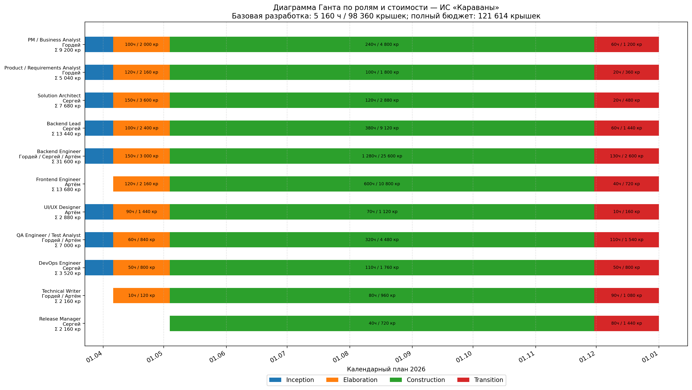

# 1. Introduction (Введение)

Документ задаёт организационный и управленческий контур разработки ИС «Караваны». Он связывает бизнес-видение, требования и use case-модель с практическим планом реализации: фазами, итерациями, ролями, бюджетом, контролями качества и рисками.

## 1.1 Purpose

Назначение настоящего документа - определить, как именно будет выполнена разработка продукта: в какие сроки, какими ролями, с какими артефактами, ограничениями и критериями управляемости. SDP используется как базовый документ для координации заказчика и команды разработки, а также как точка контроля изменений по срокам, бюджету и объёму работ.

## 1.2 Scope (Область применения)

План охватывает полный цикл реализации первой промышленно пригодной версии ИС «Караваны»: веб-клиент для стационарных ролей, полевой клиент для Pip-Boy, серверную часть, базы данных, интеграции с Wasteland Intel и NCR Checkpoint & Tax Terminal, модуль отчётности, многоорганизационный контур и средства аудита. Документ предназначен для руководителя проекта, аналитика, архитектора, разработчиков, QA, DevOps и представителей заказчика, участвующих в согласовании и приёмке.

## 1.3 Definitions, Acronyms and Abbreviations (Определения и аббревиатуры)

Полный перечень терминов приведён в отдельном глоссарии. В рамках SDP используются следующие ключевые понятия:

| Термин / сокращение | Смысл в контексте проекта |
| --- | --- |
| ИС | Информационная система «Караваны», предмет разработки настоящего проекта. |
| CaravanRequest | Карточка заявки на перевозку, вокруг которой строится жизненный цикл рейса. |
| ETA | Ожидаемое время прибытия, рассчитываемое системой при планировании маршрута. |
| risk_score | Оценка риска маршрута с учётом угроз и ценности груза. |
| RecoveryRequest | Вторичная задача после инцидента: эвакуация, подмога, повторная доставка и т.п. |
| Pip-Boy | Полевое устройство для фиксации статусов, КПП и инцидентов на маршруте. |
| Audit trail | Неизменяемый журнал действий пользователей и системных событий. |
| LCO / LCA / IOC / PR | Контрольные вехи RUP: цели жизненного цикла, архитектура, начальная операционная готовность и релиз продукта. |

## 1.4 References (Ссылки)
1. **Игровой лор Fallout: New Vegas** – источник истины о мире Fallout, в рамках которого разрабатывается система
    
2. **Вики Fallout** русскоязычная - [https://fallout.fandom.com/ru/wiki/Fallout](https://fallout.fandom.com/ru/wiki/Fallout), и англоязычная - [https://fallout.fandom.com/wiki/Fallout_Wiki](https://fallout.fandom.com/wiki/Fallout_Wiki)
    
3. **Глоссарий** [https://docs.google.com/document/d/1AoE4qzqL8gtCE5ctFHvpofifqBhW2ubGu15-tvnP3i8/edit?usp=sharing](https://docs.google.com/document/d/1AoE4qzqL8gtCE5ctFHvpofifqBhW2ubGu15-tvnP3i8/edit?usp=sharing)
    
4. **Vision** [https://docs.google.com/document/d/16DPB8_gGFQS-jttED2Ayl4UiRRkqW5dMni9uQASKMng/edit?usp=sharing](https://docs.google.com/document/d/16DPB8_gGFQS-jttED2Ayl4UiRRkqW5dMni9uQASKMng/edit?usp=sharing)

## 1.5 Overview (Обзор документа)

1. Раздел 2 фиксирует назначение проекта, его цели, ограничения, ключевые артефакты и правила актуализации SDP.

1. Раздел 3 описывает организацию проекта: состав команды, внешние интерфейсы и зоны ответственности.

1. Раздел 4 определяет управленческий процесс: сроки, фазы, итерации, релизы, бюджет, мониторинг, качество, риски и условия завершения.

# 2. Project Overview (Обзор продукта)

## 2.1 Project Purpose, Scope, and Objectives (Назначение, цели и контекст продукта)

Проект направлен на создание первой полнофункциональной версии ИС «Караваны» - специализированной платформы управления караванными перевозками в условиях Пустоши. Результатом проекта должны стать не только работающие программные компоненты, но и весь комплект производственных артефактов, необходимых для запуска пилота: требования, архитектурные решения, исходный код, тестовый набор, документация, пакет развёртывания и план поддержки.

Цели разработки сформулированы на основе Vision и SRS и считаются достигнутыми, если к концу проекта выполнены следующие условия:

- реализован полный жизненный цикл заявки и рейса от создания до закрытия, включая манифест, инциденты, маршрут, статусы и финансовый отчёт;

- поддержаны приоритетные продуктовые особенности: расчёт risk_score, ETA, формирование команды, полевой интерфейс, интеграции с внешними системами и аудит;

- подтверждены целевые нефункциональные характеристики: до 200 одновременных пользователей, до 500 активных рейсов в день, серверная доступность не ниже 99.0%, полевые действия не длиннее 3-5 шагов;

- на пилотном контуре обеспечено снижение среднего времени планирования рейса с 30 до 15 минут и создана база для снижения доли потерь/недостач с 10% до 6% в операционном сегменте независимых операторов;

- готов комплект документов для передачи в эксплуатацию: пользовательское руководство, инструкция по развёртыванию, release notes и журнал известных ограничений.

## 2.2 Assumptions and Constraints (Влияющие факторы и ограничения)

| Категория | Принятое допущение или ограничение |
| --- | --- |
| Сроки | План построен на горизонте 41 календарной недели с 23.03.2026 по 31.12.2026; рабочие итерации планируются с шагом 2 недели, финальная итерация совмещена с календарным закрытием года. |
| Команда | Базовая разработка выполняется командой из 3 исполнителей: Гордей, Сергей, Артём. Один человек может закрывать несколько производственных ролей, но планирование и расчёт стоимости ведутся именно по ролям. |
| Технологии | Стек фиксирован требованиями SRS: React 18, Java 21, PostgreSQL 16, MongoDB 7, HTTPS/JSON, layered backend. |
| Интеграции | Контракты внешних API Wasteland Intel и NCR Checkpoint должны быть доступны не позднее конца фазы Elaboration; при их недоступности используются mock/sandbox. |
| Эксплуатационный контур | Первый релиз ориентирован на одну пилотную организацию и один продуктивный контур. Массовое тиражирование в оценку не включено. |
| Полевой режим | Система обязана работать при нестабильной связи за счёт локальной фиксации событий и отложенной синхронизации. |
| UI-ограничения | Полевой интерфейс проектируется под низкое разрешение и монохромные экраны Pip-Boy, что ограничивает сложность экранов и объём отображаемой информации. |
| Бюджет | Общая стоимость базовой реализации и пилота ограничена потолком 121 614 крышек, включая инфраструктуру, пилот и резерв по рискам. |

## 2.3 Project Deliverables (Ожидаемые результаты проекта)

| Артефакт | Содержание | Фаза готовности | Ответственный |
| --- | --- | --- | --- |
| SDP | Утверждённый план разработки, бюджет, контрольные правила, распределение ролей между исполнителями и риск-регистр. | Inception | Гордей (PM/BA) |
| Requirements baseline | Vision, SRS, Glossary, Use Cases, набор согласованных изменений и трассировка приоритетов. | Elaboration | Гордей (Product/Requirements Analyst) |
| Architecture baseline | Контекстная схема, логическая архитектура, модель данных, интеграционные контракты, решение по offline sync. | Elaboration | Сергей (Solution Architect / Backend Lead) |
| Исходный код и CI/CD | Frontend, backend, конфигурации БД, скрипты сборки, pipeline деплоя и миграции. | Construction | Сергей (Backend Lead/DevOps), Артём (Frontend), Гордей/Сергей/Артём (Backend Engineer) |
| Test baseline | Тест-план, test cases, результаты функционального, интеграционного и приёмочного тестирования. | Construction/Transition | Гордей + Артём (QA/Test Analyst) |
| Эксплуатационная документация | Инструкция по установке, пользовательское руководство, release notes, known issues. | Transition | Гордей + Артём (Technical Writer), Сергей (Release Manager) |
| Релизный пакет 1.0 | Собранные дистрибутивы, миграции, конфигурация окружения, чек-лист развертывания и rollback plan. | Transition | Сергей (Release Manager / DevOps) |
| Диаграмма Ганта по ролям и стоимости | Визуальный срез календарного плана: роли, фазы, часы и стоимость работ. | Inception/актуализация SDP | Гордей (PM/BA), Сергей и Артём как источники оценок |

## 2.4 Evolution of the Software Development Plan (План развития данного документа)

SDP является управляемым документом и изменяется только при наступлении событий, влияющих на базовые параметры проекта. Каждое изменение фиксируется новой версией документа и согласуется руководителем проекта и представителем заказчика.

| Версия SDP | Этап / когда создаётся | Триггеры для обновления |
| --- | --- | --- |
| 0.1 | Старт проекта / Inception | Первичная оценка сроков, команды и границ MVP. |
| 0.5 | После baseline требований | Согласованы Vision, SRS, Use Cases; уточнены фазовый план и архитектурные риски. |
| 0.9 | После архитектурной стабилизации | Изменение сроков более чем на 2 недели, бюджета более чем на 10%, появление новой обязательной интеграции или критического технологического риска. |
| 1.0 | Перед запуском Construction/production baseline | Подтверждён объём релиза 1.0 и ресурсный план. |
| 1.x | По мере необходимости | Формальное change request, затрагивающее сроки, бюджет, состав команды, критерии приемки или стратегию выпуска. |

# 3. Project Organization (Организация проекта)

## 3.1 Organizational Structure (Структура команды разработки)

Для проекта формируется компактная кросс-функциональная команда из 3 человек. Роль в плане не равна человеку: один исполнитель может закрывать несколько ролей, а расчёт стоимости ведётся по фактическим часам в каждой роли. 

| Роль | Исполнитель | Основное участие | Ключевой результат |
| --- | --- | --- | --- |
| PM / Business Analyst | Гордей | Inception - Transition | План, budget baseline, backlog, change control, статус-отчётность. |
| Product / Requirements Analyst | Гордей | Inception - Elaboration | Уточнение Vision/SRS/Use Cases, приоритизация требований, traceability. |
| Solution Architect | Сергей | Inception - Elaboration | Архитектурная база, выбор технических решений, границы компонентов. |
| Backend Lead | Сергей | Elaboration - Transition | Техническое лидерство backend-направления, API, code review, качество серверной архитектуры. |
| Backend Engineer | Гордей / Сергей / Артём | Elaboration - Transition | Реализация доменной логики, API, интеграций, миграций и серверных сценариев. |
| Frontend Engineer | Артём | Elaboration - Transition | Веб-клиент терминала, Pip-Boy UI, клиентские состояния, формы и валидация. |
| UI/UX Designer | Артём | Inception - Construction | Макеты стационарного и полевого интерфейса, проверка коротких пользовательских сценариев. |
| QA Engineer / Test Analyst | Гордей / Артём | Elaboration - Transition | Тест-план, тест-кейсы, регрессия, UAT findings, отчёт о качестве. |
| DevOps Engineer | Сергей | Inception - Transition | Окружения, CI/CD, деплой, мониторинг, backup/restore, release automation. |
| Technical Writer | Гордей / Артём | Construction - Transition | Пользовательская и эксплуатационная документация, release notes, known issues. |
| Release Manager | Сергей | Transition | Сборка релизного пакета, checklist, rollback plan, передача в эксплуатацию. |

## 3.2 External Interfaces (Внешние интерфейсы)

| Внешняя сторона | Цель взаимодействия | Формат / периодичность | Основной артефакт взаимодействия |
| --- | --- | --- | --- |
| Представитель заказчика (руководство караванной компании) | Приоритизация объёма, согласование фаз, приёмка релизов и бюджета. | Еженедельный статус-созвон + демонстрация в конце итерации | Decision log, протокол демонстрации, акт приемки итерации |
| Представители пользователей: диспетчер, караван-мастер, кладовщик | Уточнение сценариев, UX-проверка форм и полевых действий. | Интервью/воркшопы по потребности, UAT в Transition | Протокол интервью, список замечаний, UAT findings |
| Владельцы интеграций Wasteland Intel и NCR Checkpoint | Согласование API-контрактов, SLA тестовых контуров, обработка ошибок. | По вехам Elaboration/Construction | API specification, mock contract, integration checklist |
| Эксплуатационная/инфраструктурная сторона | Подготовка окружений, доступов, резервного копирования и мониторинга. | На старте проекта и перед релизами | Runbook, deployment checklist, access matrix |

## 3.3 Roles and Responsibilities (Роли и обязанности)

| Роль | Зона ответственности | Ключевые решения / полномочия |
| --- | --- | --- |
| PM / Business Analyst | План проекта, бюджет, backlog, change control, коммуникации с заказчиком, статус-отчётность. | Ведёт baseline SDP; выносит изменения сроков/бюджета/scope на согласование; закрывает phase gate со стороны команды. |
| Product / Requirements Analyst | Сбор и уточнение требований, согласование use cases, приоритизация и трассировка FR/UC -> задачи -> тесты. | Фиксирует requirements baseline и критерии приёмки по итерациям. |
| Solution Architect | Архитектура, декомпозиция компонентов, модель данных, offline sync, интеграционные контуры. | Утверждает архитектурный baseline и технические ограничения реализации. |
| Backend Lead | Backend-дизайн, API, code review, технические стандарты, координация серверных задач. | Принимает решения по серверной архитектуре, контрактам API и миграциям данных. |
| Backend Engineer | Реализация backend-модулей: заявки, маршруты, risk_score, ETA, манифест, инциденты, отчёты, интеграции. | Закрывает backend-задачи согласно acceptance criteria и проходит code review Backend Lead. |
| Frontend Engineer | Стационарный web UI и Pip-Boy UI, клиентские состояния, формы, валидация, UX ограниченных устройств. | Принимает решения по компонентной структуре клиента в рамках архитектурных ограничений. |
| UI/UX Designer | Макеты, пользовательские потоки, адаптация сценариев под 3-5 шагов и низкое разрешение Pip-Boy. | Утверждает UX-прототипы перед передачей в разработку. |
| QA Engineer / Test Analyst | Тест-дизайн, functional/integration/regression testing, поддержка UAT, дефект-менеджмент. | Блокирует релиз при blocker/critical defects или невыполнении release criteria. |
| DevOps Engineer | CI/CD, окружения, наблюдаемость, backup/restore, деплой и откат. | Утверждает готовность окружений и release automation. |
| Technical Writer | Пользовательская инструкция, эксплуатационная инструкция, release notes, known issues. | Фиксирует комплект документации перед Transition. |
| Release Manager | Релизная сборка, release checklist, rollback plan, передача пакета в эксплуатацию. | Принимает решение о технической готовности релиза 1.0 к выкладке. |
| Представитель заказчика | Финальное принятие объёма, подтверждение бизнес-приоритетов и результатов пилота. | Подписывает phase gate и final acceptance по итогам Transition. |

# 4. Management Process (Процесс управления)

## 4.1 Project Estimates (Оценка сроков разработки проекта)

Плановая оценка рассчитана по продуктовым областям, производственным ролям, фазам RUP и персональному совмещению ролей внутри команды из 3 человек. Оценка включает создание MVP и доведение продукта до пилотной эксплуатационной готовности к 31.12.2026, но не включает последующее тиражирование на множество организаций. Стоимость пересчитана по формуле: **стоимость роли = часы в роли × ставка роли**.

| Параметр | Плановое значение |
| --- | --- |
| Общая длительность проекта | 41 календарная неделя |
| Количество фаз | 4 (Inception, Elaboration, Construction, Transition) |
| Количество рабочих итераций | 20 итераций: основной шаг 2 недели; последняя итерация закрывается 31.12.2026 |
| Состав команды | 3 исполнителя: Гордей, Сергей, Артём |
| Плановая трудоёмкость | 5 160 чел.-часов |
| Базовая стоимость разработки | 98 360 крышек |
| Полный бюджет с резервом и пилотом | 121 614 крышек |
| Плановая дата релиза 1.0 | 31.12.2026 |

## 4.2 Project Plan (План проекта)

### 4.2.1 Phase Plan (План фаз)

| Фаза | Количество итераций | Начало | Конец |
| --- | --- | --- | --- |
| Inception | 1 | 23.03.2026 | 05.04.2026 |
| Elaboration | 2 | 06.04.2026 | 03.05.2026 |
| Construction | 15 | 04.05.2026 | 29.11.2026 |
| Transition | 2 | 30.11.2026 | 31.12.2026 |

| Фаза | Описание | Вехи |
| --- | --- | --- |
| Inception | Фиксация границ проекта, baseline требований верхнего уровня, первичная оценка рисков, согласование объёма MVP, состава команды из 3 исполнителей и модели ролей. | LCO: утверждены цели проекта, базовый scope, состав команды и версия SDP 0.5 |
| Elaboration | Подготовка архитектурной базы: доменная модель, API-контракты, стратегия offline sync, skeleton UI, UX-прототипы и уточнённая оценка по ролям. | LCA: утверждена архитектура, трассировка требований и backlog Construction |
| Construction | Итеративная реализация приоритетных пользовательских сценариев, интеграций, аудита, отчётности, тестовой автоматизации и release package. | IOC: feature-complete beta, завершены тесты системного уровня, выпуск релиза 0.9 |
| Transition | Пилотное развертывание, приёмочные испытания, обучение, исправление дефектов, подготовка финального релиза и передача в сопровождение. | PR: подписан UAT, выпущен релиз 1.0, переданы эксплуатационные артефакты |

### 4.2.2 Iteration Objectives (Цели итераций)

Итерации планируются короткими инкрементами. Базовый шаг — 2 недели; последняя итерация Transition длиннее из-за календарного закрытия релиза 31.12.2026.

| Фаза | Номер итерации | Даты | Описание | Вехи |
| --- | --- | --- | --- | --- |
| Inception | I1 | 23.03.2026-05.04.2026 | Kick-off, уточнение scope, продуктовый backlog, базовый риск-регистр, схема окружений и draft SDP. | Scope baseline, LCO packet |
| Elaboration | I2 | 06.04.2026-19.04.2026 | Архитектурный спайк: аутентификация, организации, каркас данных, skeleton web UI, базовый UX Pip-Boy. | Architecture spike approved |
| Elaboration | I3 | 20.04.2026-03.05.2026 | Уточнение сценариев UC-1..UC-11, прототипы форм, контракты интеграций, модель offline sync, уточнение ролей и ставок. | LCA, backlog Construction frozen |
| Construction | I4 | 04.05.2026-17.05.2026 | Доменное ядро: заявки, рейсы, статусы, базовая модель данных и audit trail. | Core domain skeleton |
| Construction | I5 | 18.05.2026-31.05.2026 | Пользователи, роли доступа, организации, ставки сотрудников и базовые административные сценарии. | Access and org increment |
| Construction | I6 | 01.06.2026-14.06.2026 | Маршруты, ETA, risk_score, интеграционный mock Wasteland Intel, создание заявки. | Release 0.6 / dispatch alpha |
| Construction | I7 | 15.06.2026-28.06.2026 | Назначение команды рейса, CargoManifest, ценность груза, резервы припасов. | Cargo/team increment |
| Construction | I8 | 29.06.2026-12.07.2026 | Pip-Boy UI: ключевые этапы рейса, контрольные точки, короткие полевые сценарии. | Field flow alpha |
| Construction | I9 | 13.07.2026-26.07.2026 | NCR Checkpoint, пошлины, локальная фиксация событий и базовая синхронизация. | Release 0.7 / operational beta |
| Construction | I10 | 27.07.2026-09.08.2026 | Инциденты, участники инцидента, потери, автопереходы статусов. | Incident increment |
| Construction | I11 | 10.08.2026-23.08.2026 | RecoveryRequest, перепланирование, уведомления и обработка недоступности внешних систем. | Recovery increment |
| Construction | I12 | 24.08.2026-06.09.2026 | Финансовый отчёт по рейсу, экспорт на голотейп, расширение отчётности. | Release 0.8 |
| Construction | I13 | 07.09.2026-20.09.2026 | Усиление интеграций, контрактные тесты, audit trail и безопасность доступа. | Integration hardening |
| Construction | I14 | 21.09.2026-04.10.2026 | Frontend hardening, UX-полировка web/Pip-Boy, обработка ошибок и пустых состояний. | UX-complete increment |
| Construction | I15 | 05.10.2026-18.10.2026 | Backend performance/security checks, миграции, стабилизация API. | Release 0.85 |
| Construction | I16 | 19.10.2026-01.11.2026 | Автотесты, регрессионный набор, исправление дефектов medium/high. | Regression baseline |
| Construction | I17 | 02.11.2026-15.11.2026 | Feature freeze, release candidate backlog, подготовка known issues. | RC backlog frozen |
| Construction | I18 | 16.11.2026-29.11.2026 | Feature-complete beta, системное тестирование, готовность к пилоту. | IOC / release 0.9 |
| Transition | I19 | 30.11.2026-13.12.2026 | Пилотное развёртывание, UAT, обучение ключевых пользователей, сбор замечаний. | UAT findings, release 0.95 |
| Transition | I20 | 14.12.2026-31.12.2026 | Исправление критических замечаний, финальная регрессия, эксплуатационные инструкции, релиз 1.0. | PR / final acceptance |

### 4.2.3 Releases (Релизы)

| Номер версии | Описание релиза | Дата выпуска |
| --- | --- | --- |
| 0.1 | Project baseline: согласованные границы проекта, первичный план, стартовое окружение. | 05.04.2026 |
| 0.5 | Architecture baseline: каркас системы, модели данных и подтверждённый backlog реализации. | 03.05.2026 |
| 0.6 | Dispatch alpha: заявки, маршруты, ETA, risk_score и базовый поток диспетчера. | 14.06.2026 |
| 0.7 | Operational beta: команда рейса, манифест, Pip-Boy, КПП и базовая синхронизация. | 26.07.2026 |
| 0.8 | Extended beta: инциденты, RecoveryRequest, финансы и отчёты. | 06.09.2026 |
| 0.85 | Hardening build: интеграции, безопасность, UX-полировка и производительность. | 18.10.2026 |
| 0.9 | Feature-complete beta: полный scope, регрессия, известные ограничения. | 29.11.2026 |
| 0.95 | Release candidate: пилотное развёртывание, UAT и финальные замечания. | 13.12.2026 |
| 1.0 | Pilot-ready production release: финальная регрессия, документация и пакет развёртывания. | 31.12.2026 |

### 4.2.4 Project Schedule (Расписание проекта и оценка трудозатрат)

#### 4.2.4.1 Ставки ролей

| Роль | Исполнитель / исполнители | Ставка, крышек / час |
| --- | --- | --- |
| PM / Business Analyst | Гордей | 20 |
| Product / Requirements Analyst | Гордей | 18 |
| Solution Architect | Сергей | 24 |
| Backend Lead | Сергей | 24 |
| Backend Engineer | Гордей / Сергей / Артём | 20 |
| Frontend Engineer | Артём | 18 |
| UI/UX Designer | Артём | 16 |
| QA Engineer / Test Analyst | Гордей / Артём | 14 |
| DevOps Engineer | Сергей | 16 |
| Technical Writer | Гордей / Артём | 12 |
| Release Manager | Сергей | 18 |

#### 4.2.4.2 Расчёт трудозатрат и стоимости по фазам и ролям

| Фаза | PM / Business Analyst | Product / Requirements Analyst | Solution Architect | Backend Lead | Backend Engineer | Frontend Engineer | UI/UX Designer | QA Engineer / Test Analyst | DevOps Engineer | Technical Writer | Release Manager | Общие трудозатраты | Стоимость реализации |
| --- | --- | --- | --- | --- | --- | --- | --- | --- | --- | --- | --- | --- | --- |
| Inception | 60 | 40 | 30 | 20 | 20 | 0 | 10 | 10 | 10 | 0 | 0 | 200 | 3 980 |
| Elaboration | 100 | 120 | 150 | 100 | 150 | 120 | 90 | 60 | 50 | 10 | 0 | 950 | 18 520 |
| Construction | 240 | 100 | 120 | 380 | 1 280 | 600 | 70 | 320 | 110 | 80 | 40 | 3 340 | 64 040 |
| Transition | 60 | 20 | 20 | 60 | 130 | 40 | 10 | 110 | 50 | 90 | 80 | 670 | 11 820 |
| ИТОГО | 460 | 280 | 320 | 560 | 1 580 | 760 | 180 | 500 | 220 | 180 | 120 | 5 160 | 98 360 |

#### 4.2.4.3 Расчёт стоимости по исполнителям и совмещаемым ролям

| Исполнитель | Роль | Часы | Ставка, крышек / час | Стоимость, крышек |
| --- | --- | --- | --- | --- |
| Гордей | PM / Business Analyst | 460 | 20 | 9 200 |
| Гордей | Product / Requirements Analyst | 280 | 18 | 5 040 |
| Гордей | Backend Engineer | 360 | 20 | 7 200 |
| Гордей | QA Engineer / Test Analyst | 320 | 14 | 4 480 |
| Гордей | Technical Writer | 120 | 12 | 1 440 |
| Сергей | Solution Architect | 320 | 24 | 7 680 |
| Сергей | Backend Lead | 560 | 24 | 13 440 |
| Сергей | Backend Engineer | 700 | 20 | 14 000 |
| Сергей | DevOps Engineer | 220 | 16 | 3 520 |
| Сергей | Release Manager | 120 | 18 | 2 160 |
| Артём | Frontend Engineer | 760 | 18 | 13 680 |
| Артём | UI/UX Designer | 180 | 16 | 2 880 |
| Артём | Backend Engineer | 520 | 20 | 10 400 |
| Артём | QA Engineer / Test Analyst | 180 | 14 | 2 520 |
| Артём | Technical Writer | 60 | 12 | 720 |
| ИТОГО: Гордей |  | 1 540 |  | 27 360 |
| ИТОГО: Сергей |  | 1 920 |  | 40 800 |
| ИТОГО: Артём |  | 1 700 |  | 30 200 |
| ИТОГО ПО КОМАНДЕ |  | 5 160 |  | 98 360 |

Пример принципа расчёта: если один исполнитель в рамках итерации выполняет 7 часов как Backend Engineer и 5 часов как QA Engineer / Test Analyst, стоимость равна `7 × 20 + 5 × 14 = 210` крышек. Поэтому итоговая сумма считается не по человеку, а по роли, в которой были выполнены часы.

#### 4.2.4.4 Диаграмма Ганта по ролям и стоимости

Отдельный файл диаграммы: `Gantt_Roles_Cost.png`. Диаграмма показывает календарный срез по ролям, фазам, часам и стоимости. Визуально она должна использоваться вместе с таблицами 4.2.4.1-4.2.4.3, потому что именно таблицы являются расчётной базой бюджета.

### 4.2.5 Project Resourcing (Ресурсы проекта)

#### 4.2.5.1 Staffing Plan (План по сотрудникам)

| Исполнитель | Закрываемые роли | Плановые часы | Фаза наибольшей загрузки |
| --- | --- | --- | --- |
| Гордей | PM/BA, Product/Requirements Analyst, Backend Engineer, QA/Test Analyst, Technical Writer | 1 540 | Inception, Elaboration, Transition |
| Сергей | Solution Architect, Backend Lead, Backend Engineer, DevOps Engineer, Release Manager | 1 920 | Elaboration, Construction |
| Артём | Frontend Engineer, UI/UX Designer, Backend Engineer, QA/Test Analyst, Technical Writer | 1 700 | Construction, Transition |

Минимальный состав команды рассчитан на реализацию релиза 1.0 в единственном пилотном контуре. При расширении объёма, добавлении второго клиента, полноценной мобильной оболочки или новых внешних интеграций потребуется отдельное увеличение команды и перерасчёт SDP.

#### 4.2.5.2 Resource Acquisition Plan (План поиска сотрудников)

- все роли закрываются внутренней командой из трёх человек; внешний найм не планируется;

- при перегрузке по Backend Engineer задачам приоритет отдаётся серверному ядру, интеграциям и безопасности, а UI-polish переносится только через change control;

- Backend Lead не заменяет Backend Engineer: лидер отвечает за решения и review, инженерная роль — за реализацию задач;

- если один исполнитель временно недоступен более 5 рабочих дней, PM/BA пересобирает iteration backlog и перераспределяет задачи внутри существующих ролей;

- добавление новых исполнителей или изменение ставок допускается только через обновление SDP, так как напрямую меняет бюджет.

### 4.2.6 Budget (Бюджет)

| Статья бюджета | Сумма, крышки | Комментарий |
| --- | --- | --- |
| Базовая разработка | 98 360 | Трудозатраты трёх исполнителей по таблицам 4.2.4 и 4.2.5: часы × ставка конкретной роли. |
| Окружения и инфраструктурная подготовка | 5 500 | Серверный контур, сборка, наблюдаемость, backup/restore, тестовые стенды. |
| Пилотное внедрение и обучение | 3 000 | Подготовка пилота, UAT-сессии, обучение ключевых пользователей, выпуск инструкций. |
| Резерв по рискам (≈15% от разработки) | 14 754 | Покрытие технологических и интеграционных отклонений без пересмотра базового scope. |
| ИТОГО | 121 614 | Плановый бюджет проекта до релиза 1.0 и закрытия пилота. |

## 4.3 Project Monitoring and Control (Мониторинг и контроль проекта)

### 4.3.1 Requirements Management Plan (План управления требованиями)

- базовая линия требований формируется из Vision, SRS, Glossary и Use Cases; все рабочие задачи должны ссылаться на конкретные FR/UC;

- любое изменение, влияющее на срок, бюджет, интеграции, модель данных или приоритет релиза 1.0, оформляется как change request;

- review требований проводится минимум один раз в неделю руководителем проекта и представителем заказчика;

- перед закрытием каждой итерации выполняется проверка трассируемости: требование -> задача -> тест -> статус реализации.

### 4.3.2 Schedule Control Plan (План управления расписанием)

- планирование ведётся по итерациям; внутри итерации используется недельный контроль факта по задачам и фазовым вехам;

- критическое отклонение - срыв контрольной вехи более чем на 5 рабочих дней или прогноз смещения финального релиза более чем на 2 недели;

- при жёлтом статусе (риск сдвига до 5 рабочих дней) руководитель проекта обязан подготовить recovery plan; при красном - вынести вопрос на steering review с заказчиком;

- изменение даты релиза 1.0 без обновления SDP не допускается.

### 4.3.3 Budget Control Plan (План управления бюджетом)

- учёт фактических трудозатрат ведётся еженедельно по ролям и фазам;

- допустимое отклонение фактической стоимости от плана - до 10% по фазе и до 15% по проекту с использованием резервного фонда;

- расходование резервного фонда возможно только после фиксации риска/проблемы и согласования corrective action;

- если прогноз превышения бюджета выше 15%, PM обязан инициировать change control и пересмотр объёма релиза.

### 4.3.4 Quality Control Plan (План управления качеством)

- каждый инкремент проходит code review, smoke-тест и демонстрацию сценариев, покрывающих ключевые use cases текущей итерации;

- для релизов 0.8, 0.9, 0.95 и 1.0 обязательны функциональная регрессия, интеграционные проверки и проверка rollback-процедуры;

- release 1.0 может быть выпущен только при отсутствии blocker и critical defects, прохождении не менее 95% запланированных тестов и успешном UAT;

- по нефункциональным требованиям проверяются минимум: время отклика ключевых операций, offline sync, аудит, ролевые ограничения и восстановление после отказа.

### 4.3.5 Reporting Plan (План отчётности)

| Отчёт / событие | Периодичность | Содержимое |
| --- | --- | --- |
| Weekly status report | Еженедельно | Факт vs план, риски, блокеры, отклонения по срокам/бюджету, решения за неделю. |
| Iteration demo & review | В конце каждой итерации | Показ реализованных сценариев, замечания заказчика, решение по переходу к следующей итерации. |
| Phase gate packet | По завершении фазы | Вехи, выполненные deliverables, остаточные риски, обновлённый прогноз проекта. |
| Final project report | В конце Transition | Итоги пилота, качество релиза, бюджет, lessons learned и рекомендации по следующему релизу. |

## 4.4 Risk Management Plan (План управления рисками)

Риск-менеджмент ведётся непрерывно. Для каждого существенного риска определяются вероятность, влияние, владелец и стратегия ответа. Риск-регистр пересматривается еженедельно и обязательно - на phase gate.

| ID | Риск | Вероятность | Влияние | Стратегия снижения / response owner |
| --- | --- | --- | --- | --- |
| R1 | Недоступность или нестабильность внешних API Wasteland Intel / NCR Checkpoint. | Средняя | Высокое | Mock/sandbox в Elaboration, timeout/fallback logic в backend; владелец - Architect/Backend Lead. |
| R2 | Недооценка сложности offline sync и конфликтов полевых событий. | Высокая | Высокое | Прототип синхронизации во 2-й итерации, отдельные тест-кейсы на конфликтные сценарии; владелец - Architect + QA. |
| R3 | Рост объёма из-за дополнительных полевых сценариев и исключений. | Средняя | Высокое | Жёсткое разделение на MVP и post-1.0 backlog, change control для всех новых требований; владелец - PM/BA. |
| R4 | Проседание UX на Pip-Boy из-за низкого разрешения и ограниченной читаемости. | Средняя | Среднее | Раннее прототипирование low-resolution экранов, валидация с полевыми ролями; владелец - Frontend Engineer. |
| R5 | Накопление дефектов и регрессионного долга к концу Construction. | Средняя | Высокое | Еженедельная регрессия, quality gate на каждую итерацию, недопуск переноса blocker defects; владелец - QA Engineer. |
| R6 | Отставание по настройке окружений и релизной автоматизации. | Низкая | Среднее | Поднять CI/CD и базовые окружения до конца Elaboration, отдельный checklist готовности; владелец - DevOps Engineer. |

## 4.5 Close-out Plan (План завершения проекта)

Проект считается завершённым после формального закрытия Transition-фазы и выполнения всех критериев выхода.

1.  Выпущен и развёрнут релиз 1.0, соответствующий утверждённому scope релиза.

2.  Успешно завершены UAT и smoke/regression прогоны; открытых blocker и critical defects нет.

3.  Заказчику переданы эксплуатационные артефакты: release package, инструкции, список известных ограничений и план сопровождения.

4.  Сформирован финальный отчёт по проекту: фактические сроки, бюджет, качество, остаточные риски и lessons learned.

5.  Выполнен организационный handover в сопровождение: доступы, runbook, backup/restore, owner list и канал обработки инцидентов.

После закрытия проекта проводится постпроектная ретроспектива и принимается решение о содержании следующего релиза (масштабирование на новые организации, расширение отчётности, развитие мобильного контура и дополнительные интеграции).
