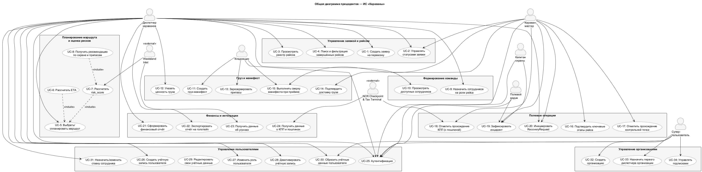
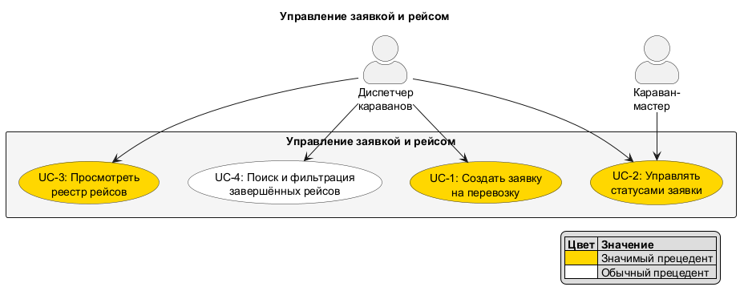
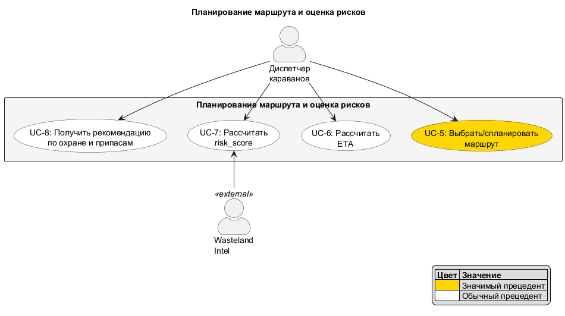
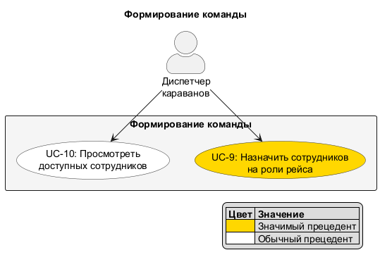
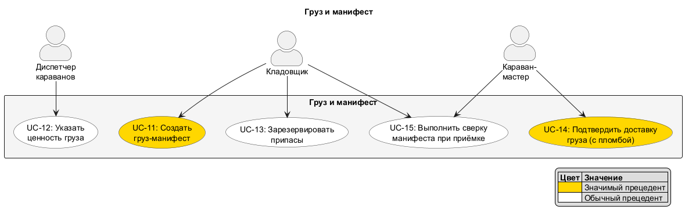
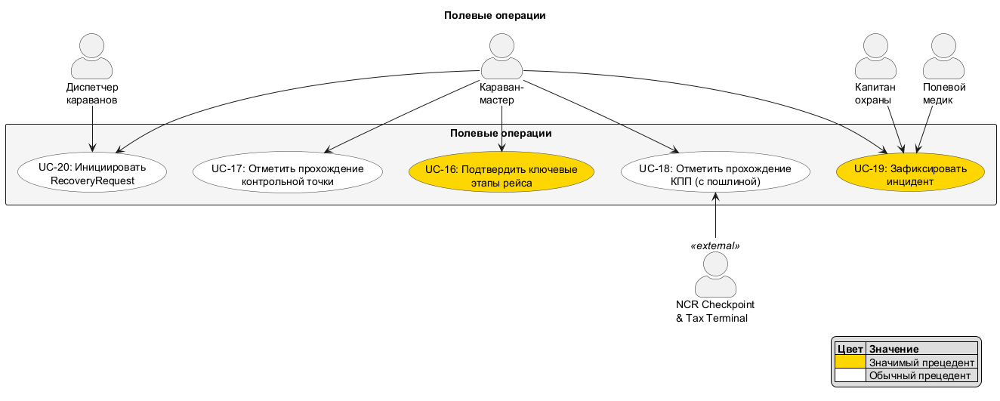
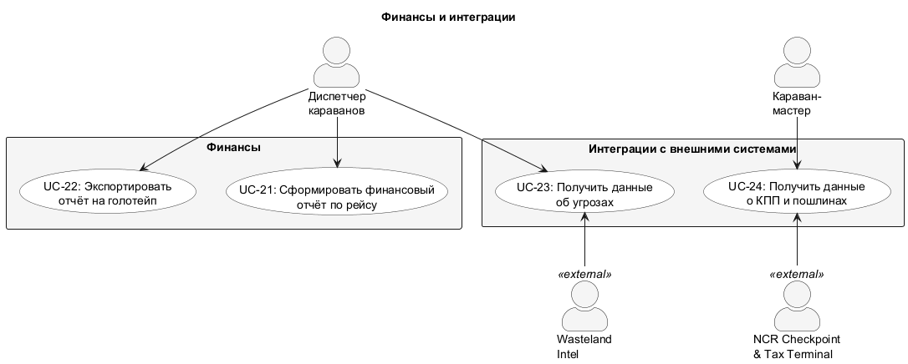
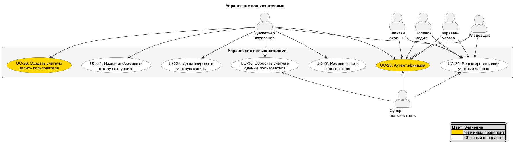
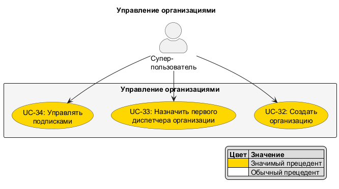

# Список прецедентов (Use Cases) — ИС «Караваны»

## Акторы

### Пользователи системы
| Актор | Тип | Описание |
|-------|-----|----------|
| Диспетчер караванов | Стационарный | Основной операционный пользователь, управляет жизненным циклом заявки |
| Караван-мастер | Полевой | Исполнитель рейса, фиксирует этапы и события в пути |
| Кладовщик | Стационарный | Подготовка груза, манифест, припасы, сверка |
| Капитан охраны | Полевой | Безопасность рейса, фиксация угроз и инцидентов |
| Полевой медик | Полевой | Медприпасы, медицинская часть инцидентов |
| Суперпользователь | Стационарный | Администратор платформы, управление организациями |

### Внешние системы
| Актор | Описание |
|-------|----------|
| Wasteland Intel | Данные об угрозах на маршруте для risk_score |
| NCR Checkpoint & Tax Terminal | Данные о прохождении КПП и пошлинах |

## Общая диаграмма прецедентов

> Детальное описание архитектурно значимых прецедентов (UC-1, UC-7, UC-16, UC-19, UC-32) вынесено в отдельный документ: [CoreUseCases.md](CoreUseCases.md).

## Сводная таблица прецедентов

### Управление заявкой и рейсом
| # | Прецедент | Акторы |
|---|-----------|--------|
| UC-1 | Создать заявку на перевозку | Диспетчер | - IMPORTANT
| UC-2 | Управлять статусами заявки | Диспетчер, Караван-мастер | - IMPORTANT
| UC-3 | Просмотреть реестр рейсов | Диспетчер | - IMPORTANT
| UC-4 | Поиск и фильтрация завершённых рейсов | Диспетчер |

### Планирование маршрута и оценка рисков
| # | Прецедент | Акторы |
|---|-----------|--------|
| UC-5 | Выбрать/спланировать маршрут | Диспетчер | - IMPORTANT
| UC-6 | Рассчитать ETA | Диспетчер (система автоматически) |
| UC-7 | Рассчитать risk_score | Диспетчер, Wasteland Intel |
| UC-8 | Получить рекомендацию по охране и припасам | Диспетчер (система автоматически) |

### Формирование команды
| # | Прецедент | Акторы |
|---|-----------|--------|
| UC-9 | Назначить сотрудников на роли рейса | Диспетчер | - IMPORTANT
| UC-10 | Просмотреть доступных сотрудников | Диспетчер |

### Груз и манифест
| # | Прецедент | Акторы |
|---|-----------|--------|
| UC-11 | Создать груз-манифест | Кладовщик | - IMPORTANT
| UC-12 | Указать ценность груза | Диспетчер |
| UC-13 | Зарезервировать припасы | Кладовщик |
| UC-14 | Подтвердить доставку груза (с пломбой) | Караван-мастер | - IMPORTANT
| UC-15 | Выполнить сверку манифеста при приёмке | Кладовщик, Караван-мастер |

### Полевые операции
| # | Прецедент | Акторы |
|---|-----------|--------|
| UC-16 | Подтвердить ключевые этапы рейса | Караван-мастер | - IMPORTANT
| UC-17 | Отметить прохождение контрольной точки | Караван-мастер |
| UC-18 | Отметить прохождение КПП (с пошлиной) | Караван-мастер, NCR Checkpoint |
| UC-19 | Зафиксировать инцидент | Караван-мастер, Капитан охраны, Полевой медик | - IMPORTANT
| UC-20 | Инициировать RecoveryRequest | Диспетчер, Караван-мастер |

### Финансы
| # | Прецедент | Акторы |
|---|-----------|--------|
| UC-21 | Сформировать финансовый отчёт по рейсу | Диспетчер |
| UC-22 | Экспортировать отчёт на голотейп | Диспетчер |

### Интеграции с внешними системами
| # | Прецедент | Акторы |
|---|-----------|--------|
| UC-23 | Получить данные об угрозах | Wasteland Intel |
| UC-24 | Получить данные о КПП и пошлинах | NCR Checkpoint |

### Управление пользователями
| # | Прецедент | Акторы |
|---|-----------|--------|
| UC-25 | Аутентификация | Все пользователи | - IMPORTANT
| UC-26 | Создать учётную запись пользователя | Диспетчер | - IMPORTANT
| UC-27 | Изменить роль пользователя | Диспетчер |
| UC-28 | Деактивировать учётную запись | Диспетчер |
| UC-29 | Редактировать свои учётные данные | Все пользователи |
| UC-30 | Сбросить учётные данные пользователя | Диспетчер, Суперпользователь |
| UC-31 | Назначить/изменить ставку сотрудника | Диспетчер |

### Управление организациями
| # | Прецедент | Акторы |
|---|-----------|--------|
| UC-32 | Создать организацию | Суперпользователь | - IMPORTANT
| UC-33 | Назначить первого диспетчера организации | Суперпользователь | - IMPORTANT
| UC-34 | Управлять подписками | Суперпользователь | - IMPORTANT

---

## Описание прецедентов

### Управление заявкой и рейсом

| Прецедент: Создать заявку на перевозку |
|:---|
| **ID:** UC-1 |
| **Краткое описание:** Диспетчер создаёт новую заявку на перевозку, выбирая шаблон маршрута или заполняя данные вручную. |
| **Главные актёры:** Диспетчер караванов |
| **Второстепенные актёры:** Wasteland Intel (для расчёта risk_score) |
| **Предусловия:** 1. Диспетчер аутентифицирован в системе. 2. В системе существует хотя бы один маршрут (шаблон) или диспетчер готов задать маршрут вручную. |
| **Основной поток:** 1. Диспетчер открывает форму создания заявки. 2. Диспетчер заполняет основные данные: пункт отправления, пункт назначения, желаемая дата отправки, описание груза. 3. Диспетчер выбирает маршрут из списка шаблонов. 4. Система запрашивает данные об угрозах из Wasteland Intel и рассчитывает risk_score маршрута. 5. Система рассчитывает ETA на основе маршрута и текущей обстановки. 6. Диспетчер указывает оценочную ценность груза (в крышках). 7. Система пересчитывает risk_score с учётом ценности груза и формирует рекомендацию по минимальному составу охраны и объёму припасов. 8. Диспетчер проверяет сводку заявки и подтверждает создание. 9. Система сохраняет заявку со статусом Draft и записывает событие создания в журнал аудита. |
| **Постусловия:** 1. В системе создана заявка со статусом Draft. 2. Заявка содержит маршрут, ETA, risk_score и рекомендацию по охране/припасам. 3. В журнале аудита зафиксировано событие создания заявки. |
| **Альтернативные потоки:** 3а. Диспетчер формирует маршрут вручную (задаёт контрольные точки) вместо выбора шаблона → поток продолжается с шага 4. 4а. Wasteland Intel недоступен — система создаёт заявку без risk_score, помечает поле как «Требует пересчёта» и уведомляет диспетчера. 8а. Диспетчер отменяет создание — заявка не сохраняется. |

| Прецедент: Управлять статусами заявки |
|:---|
| **ID:** UC-2 |
| **Краткое описание:** Система поддерживает статусную модель заявки (Draft, Ready, En Route, Delayed, Delivered, Closed, Cancelled), переходы инициируются пользователями или событиями. |
| **Главные актёры:** Диспетчер караванов, Караван-мастер |
| **Второстепенные актёры:** Нет |
| **Предусловия:** |
| **Основной поток:** |
| **Постусловия:** |
| **Альтернативные потоки:** |

| Прецедент: Просмотреть реестр рейсов |
|:---|
| **ID:** UC-3 |
| **Краткое описание:** Диспетчер просматривает дашборд активных рейсов с цветовой индикацией статуса и risk_score. |
| **Главные актёры:** Диспетчер караванов |
| **Второстепенные актёры:** Нет |
| **Предусловия:** |
| **Основной поток:** |
| **Постусловия:** |
| **Альтернативные потоки:** |

| Прецедент: Поиск и фильтрация завершённых рейсов |
|:---|
| **ID:** UC-4 |
| **Краткое описание:** Диспетчер выполняет поиск и фильтрацию по истории завершённых рейсов. |
| **Главные актёры:** Диспетчер караванов |
| **Второстепенные актёры:** Нет |
| **Предусловия:** |
| **Основной поток:** |
| **Постусловия:** |
| **Альтернативные потоки:** |

### Планирование маршрута и оценка рисков

| Прецедент: Выбрать/спланировать маршрут |
|:---|
| **ID:** UC-5 |
| **Краткое описание:** Диспетчер выбирает маршрут из шаблонов или формирует вручную с учётом контрольных точек и данных об обстановке. |
| **Главные актёры:** Диспетчер караванов |
| **Второстепенные актёры:** Нет |
| **Предусловия:** |
| **Основной поток:** |
| **Постусловия:** |
| **Альтернативные потоки:** |

| Прецедент: Рассчитать ETA |
|:---|
| **ID:** UC-6 |
| **Краткое описание:** Система автоматически рассчитывает ожидаемое время прибытия на основе выбранного маршрута и текущих данных об обстановке. |
| **Главные актёры:** Диспетчер караванов |
| **Второстепенные актёры:** Нет |
| **Предусловия:** |
| **Основной поток:** |
| **Постусловия:** |
| **Альтернативные потоки:** |

| Прецедент: Рассчитать risk_score |
|:---|
| **ID:** UC-7 |
| **Краткое описание:** Система автоматически рассчитывает оценку риска маршрута на основе данных Wasteland Intel и ценности груза. |
| **Главные актёры:** Диспетчер караванов |
| **Второстепенные актёры:** Wasteland Intel |
| **Предусловия:** 1. Для заявки выбран или сформирован маршрут (UC-5). 2. Указана ценность груза (или используется значение по умолчанию). |
| **Основной поток:** 1. Система формирует запрос к API Wasteland Intel, передавая список контрольных точек маршрута. 2. Wasteland Intel возвращает данные об угрозах по каждому участку маршрута (тип угрозы, уровень опасности, дата актуальности). 3. Система агрегирует данные об угрозах и вычисляет базовый risk_score маршрута. 4. Система применяет корректирующий коэффициент ценности груза: чем выше ценность, тем выше итоговый risk_score. 5. Система сохраняет итоговый risk_score в заявке и отображает его диспетчеру. 6. На основе risk_score система автоматически формирует рекомендацию по минимальному составу охраны и объёму припасов (UC-8). |
| **Постусловия:** 1. Заявка содержит актуальный risk_score. 2. Сформирована рекомендация по охране и припасам. |
| **Альтернативные потоки:** 2а. Wasteland Intel недоступен или возвращает ошибку — система устанавливает risk_score = «Н/Д», помечает заявку как «risk_score требует пересчёта» и уведомляет диспетчера. Диспетчер может повторить расчёт позднее. 2б. Wasteland Intel возвращает данные с датой актуальности старше 24 часов — система рассчитывает risk_score, но помечает его как «На основе устаревших данных» и предупреждает диспетчера. |

| Прецедент: Получить рекомендацию по охране и припасам |
|:---|
| **ID:** UC-8 |
| **Краткое описание:** На основе risk_score система формирует рекомендацию по минимальному составу охраны и объёму припасов; диспетчер может принять или скорректировать. |
| **Главные актёры:** Диспетчер караванов |
| **Второстепенные актёры:** Нет |
| **Предусловия:** |
| **Основной поток:** |
| **Постусловия:** |
| **Альтернативные потоки:** |

### Формирование команды

| Прецедент: Назначить сотрудников на роли рейса |
|:---|
| **ID:** UC-9 |
| **Краткое описание:** Диспетчер назначает сотрудников на ключевые роли рейса. Система блокирует выпуск при незаполненных обязательных ролях. |
| **Главные актёры:** Диспетчер караванов |
| **Второстепенные актёры:** Нет |
| **Предусловия:** |
| **Основной поток:** |
| **Постусловия:** |
| **Альтернативные потоки:** |

| Прецедент: Просмотреть доступных сотрудников |
|:---|
| **ID:** UC-10 |
| **Краткое описание:** Диспетчер просматривает список доступных сотрудников с указанием их текущей занятости и статуса. |
| **Главные актёры:** Диспетчер караванов |
| **Второстепенные актёры:** Нет |
| **Предусловия:** |
| **Основной поток:** |
| **Постусловия:** |
| **Альтернативные потоки:** |

### Груз и манифест

| Прецедент: Создать груз-манифест |
|:---|
| **ID:** UC-11 |
| **Краткое описание:** Кладовщик создаёт цифровой груз-манифест с перечнем позиций, упаковкой и пломбами. |
| **Главные актёры:** Кладовщик |
| **Второстепенные актёры:** Нет |
| **Предусловия:** |
| **Основной поток:** |
| **Постусловия:** |
| **Альтернативные потоки:** |

| Прецедент: Указать ценность груза |
|:---|
| **ID:** UC-12 |
| **Краткое описание:** Диспетчер указывает оценочную ценность груза (в крышках) при создании заявки; значение используется при расчёте risk_score. |
| **Главные актёры:** Диспетчер караванов |
| **Второстепенные актёры:** Нет |
| **Предусловия:** |
| **Основной поток:** |
| **Постусловия:** |
| **Альтернативные потоки:** |

| Прецедент: Зарезервировать припасы |
|:---|
| **ID:** UC-13 |
| **Краткое описание:** Кладовщик резервирует припасы под рейс (вода, еда, боеприпасы, ремкомплекты, медприпасы). |
| **Главные актёры:** Кладовщик |
| **Второстепенные актёры:** Нет |
| **Предусловия:** |
| **Основной поток:** |
| **Постусловия:** |
| **Альтернативные потоки:** |

| Прецедент: Подтвердить доставку груза (с пломбой) |
|:---|
| **ID:** UC-14 |
| **Краткое описание:** Караван-мастер подтверждает факт доставки груза с фиксацией целостности пломбы (статус Delivered). |
| **Главные актёры:** Караван-мастер |
| **Второстепенные актёры:** Нет |
| **Предусловия:** |
| **Основной поток:** |
| **Постусловия:** |
| **Альтернативные потоки:** |

| Прецедент: Выполнить сверку манифеста при приёмке |
|:---|
| **ID:** UC-15 |
| **Краткое описание:** Кладовщик на принимающей стороне выполняет сверку груз-манифеста и фиксирует результат. При отсутствии кладовщика приёмку закрывает караван-мастер. |
| **Главные актёры:** Кладовщик |
| **Второстепенные актёры:** Караван-мастер |
| **Предусловия:** |
| **Основной поток:** |
| **Постусловия:** |
| **Альтернативные потоки:** |

### Полевые операции

| Прецедент: Подтвердить ключевые этапы рейса |
|:---|
| **ID:** UC-16 |
| **Краткое описание:** Караван-мастер подтверждает ключевые этапы: загрузка, выход, прибытие на контрольные точки, доставка груза. |
| **Главные актёры:** Караван-мастер |
| **Второстепенные актёры:** Нет |
| **Предусловия:** 1. Караван-мастер аутентифицирован и назначен на рейс. 2. Рейс находится в статусе Ready или En Route. |
| **Основной поток:** 1. Караван-мастер открывает карточку рейса на Pip-Boy. 2. Система отображает текущий этап рейса и список предстоящих этапов. 3. Караван-мастер выбирает действие «Подтвердить этап» для текущего этапа (загрузка завершена / караван вышел / прибытие на контрольную точку / груз доставлен). 4. Система автоматически фиксирует временную метку и координаты. 5. Система выполняет переход статуса рейса согласно статусной модели (например, Ready → En Route при подтверждении выхода). 6. Система сохраняет запись в CheckpointLog. 7. Если есть связь с сервером — данные синхронизируются немедленно. |
| **Постусловия:** 1. Этап рейса зафиксирован с временной меткой и координатами. 2. Статус рейса обновлён в соответствии со статусной моделью. 3. Запись добавлена в CheckpointLog. |
| **Альтернативные потоки:** 7а. Связь с сервером отсутствует — данные сохраняются локально на Pip-Boy и автоматически синхронизируются при восстановлении соединения. При синхронизации сервер проверяет временные метки и применяет события в хронологическом порядке. 5а. Караван-мастер пытается подтвердить этап вне допустимого порядка (например, «доставлен» без «вышел») — система отклоняет действие и отображает сообщение о необходимости подтвердить предыдущий этап. |

| Прецедент: Отметить прохождение контрольной точки |
|:---|
| **ID:** UC-17 |
| **Краткое описание:** Караван-мастер фиксирует прохождение контрольной точки на маршруте (CheckpointLog). |
| **Главные актёры:** Караван-мастер |
| **Второстепенные актёры:** Нет |
| **Предусловия:** |
| **Основной поток:** |
| **Постусловия:** |
| **Альтернативные потоки:** |

| Прецедент: Отметить прохождение КПП (с пошлиной) |
|:---|
| **ID:** UC-18 |
| **Краткое описание:** Караван-мастер отмечает прохождение КПП; система запрашивает данные с терминала NCR (название, сумма пошлины, валюта) и записывает в финансовый журнал. |
| **Главные актёры:** Караван-мастер |
| **Второстепенные актёры:** NCR Checkpoint & Tax Terminal |
| **Предусловия:** |
| **Основной поток:** |
| **Постусловия:** |
| **Альтернативные потоки:** |

| Прецедент: Зафиксировать инцидент |
|:---|
| **ID:** UC-19 |
| **Краткое описание:** Полевой пользователь фиксирует инцидент через форму: тип, тяжесть, описание; время и координаты фиксируются автоматически. |
| **Главные актёры:** Караван-мастер, Капитан охраны, Полевой медик |
| **Второстепенные актёры:** Нет |
| **Предусловия:** 1. Пользователь аутентифицирован и назначен на рейс. 2. Рейс находится в статусе En Route или Delayed. |
| **Основной поток:** 1. Полевой пользователь открывает форму фиксации инцидента на Pip-Boy. 2. Система автоматически заполняет временную метку и координаты на основе данных устройства. 3. Пользователь выбирает тип инцидента из предопределённого списка (нападение, поломка, медицинское происшествие, потеря груза, стихийное бедствие, прочее). 4. Пользователь указывает тяжесть инцидента (низкая, средняя, высокая, критическая). 5. Пользователь вводит текстовое описание и при необходимости указывает пострадавших участников команды. 6. Пользователь подтверждает отправку. 7. Система сохраняет карточку инцидента и привязывает её к текущему рейсу. 8. Если тяжесть «высокая» или «критическая» — система автоматически переводит рейс в статус Delayed. 9. Если есть связь — данные синхронизируются с сервером и диспетчер получает уведомление. |
| **Постусловия:** 1. Карточка инцидента создана и привязана к рейсу. 2. При высокой/критической тяжести статус рейса изменён на Delayed. 3. Диспетчер уведомлён об инциденте (при наличии связи). |
| **Альтернативные потоки:** 9а. Связь отсутствует — карточка инцидента сохраняется локально на Pip-Boy и синхронизируется при восстановлении соединения; при синхронизации диспетчер получает уведомление с фактическим временем инцидента. 6а. Пользователь отменяет заполнение — карточка не сохраняется. 8а. После фиксации инцидента критической тяжести караван-мастер или диспетчер может инициировать RecoveryRequest (UC-20). |

| Прецедент: Инициировать RecoveryRequest |
|:---|
| **ID:** UC-20 |
| **Краткое описание:** На основе зафиксированного инцидента инициируется запрос на эвакуацию, подмогу или повторную доставку груза. |
| **Главные актёры:** Диспетчер караванов, Караван-мастер |
| **Второстепенные актёры:** Нет |
| **Предусловия:** |
| **Основной поток:** |
| **Постусловия:** |
| **Альтернативные потоки:** |

### Финансы

| Прецедент: Сформировать финансовый отчёт по рейсу |
|:---|
| **ID:** UC-21 |
| **Краткое описание:** Система автоматически формирует итоговый финансовый отчёт по рейсу (расходы, доходы, пошлины, расхождения, итого в крышках). |
| **Главные актёры:** Диспетчер караванов |
| **Второстепенные актёры:** Нет |
| **Предусловия:** |
| **Основной поток:** |
| **Постусловия:** |
| **Альтернативные потоки:** |

| Прецедент: Экспортировать отчёт на голотейп |
|:---|
| **ID:** UC-22 |
| **Краткое описание:** Диспетчер экспортирует сформированный финансовый отчёт на голотейп для передачи клиенту. |
| **Главные актёры:** Диспетчер караванов |
| **Второстепенные актёры:** Нет |
| **Предусловия:** |
| **Основной поток:** |
| **Постусловия:** |
| **Альтернативные потоки:** |

### Интеграции с внешними системами

| Прецедент: Получить данные об угрозах |
|:---|
| **ID:** UC-23 |
| **Краткое описание:** Система интегрируется с Wasteland Intel для получения актуальных данных об угрозах на маршруте. |
| **Главные актёры:** Диспетчер караванов |
| **Второстепенные актёры:** Wasteland Intel |
| **Предусловия:** |
| **Основной поток:** |
| **Постусловия:** |
| **Альтернативные потоки:** |

| Прецедент: Получить данные о КПП и пошлинах |
|:---|
| **ID:** UC-24 |
| **Краткое описание:** Система интегрируется с NCR Checkpoint & Tax Terminal для получения данных о прохождении и суммах пошлин. |
| **Главные актёры:** Караван-мастер |
| **Второстепенные актёры:** NCR Checkpoint & Tax Terminal |
| **Предусловия:** |
| **Основной поток:** |
| **Постусловия:** |
| **Альтернативные потоки:** |

### Управление пользователями

| Прецедент: Аутентификация |
|:---|
| **ID:** UC-25 |
| **Краткое описание:** Пользователь входит в систему по логину и паролю. Свободная регистрация отсутствует. |
| **Главные актёры:** Все пользователи (Диспетчер, Караван-мастер, Кладовщик, Капитан охраны, Полевой медик, Суперпользователь) |
| **Второстепенные актёры:** Нет |
| **Предусловия:** |
| **Основной поток:** |
| **Постусловия:** |
| **Альтернативные потоки:** |

| Прецедент: Создать учётную запись пользователя |
|:---|
| **ID:** UC-26 |
| **Краткое описание:** Диспетчер создаёт учётную запись пользователя в рамках своей организации с указанием роли, ФИО и начальных учётных данных. |
| **Главные актёры:** Диспетчер караванов |
| **Второстепенные актёры:** Нет |
| **Предусловия:** |
| **Основной поток:** |
| **Постусловия:** |
| **Альтернативные потоки:** |

| Прецедент: Изменить роль пользователя |
|:---|
| **ID:** UC-27 |
| **Краткое описание:** Диспетчер изменяет роль существующего пользователя в рамках своей организации. |
| **Главные актёры:** Диспетчер караванов |
| **Второстепенные актёры:** Нет |
| **Предусловия:** |
| **Основной поток:** |
| **Постусловия:** |
| **Альтернативные потоки:** |

| Прецедент: Деактивировать учётную запись |
|:---|
| **ID:** UC-28 |
| **Краткое описание:** Диспетчер деактивирует учётную запись пользователя; система запрещает деактивацию последнего диспетчера в организации. |
| **Главные актёры:** Диспетчер караванов |
| **Второстепенные актёры:** Нет |
| **Предусловия:** |
| **Основной поток:** |
| **Постусловия:** |
| **Альтернативные потоки:** |

| Прецедент: Редактировать свои учётные данные |
|:---|
| **ID:** UC-29 |
| **Краткое описание:** Пользователь редактирует собственные учётные данные (логин, пароль). |
| **Главные актёры:** Все пользователи |
| **Второстепенные актёры:** Нет |
| **Предусловия:** |
| **Основной поток:** |
| **Постусловия:** |
| **Альтернативные потоки:** |

| Прецедент: Сбросить учётные данные пользователя |
|:---|
| **ID:** UC-30 |
| **Краткое описание:** Диспетчер или суперпользователь сбрасывает/изменяет учётные данные любого пользователя в рамках организации. |
| **Главные актёры:** Диспетчер караванов, Суперпользователь |
| **Второстепенные актёры:** Нет |
| **Предусловия:** |
| **Основной поток:** |
| **Постусловия:** |
| **Альтернативные потоки:** |

| Прецедент: Назначить/изменить ставку сотрудника |
|:---|
| **ID:** UC-31 |
| **Краткое описание:** Диспетчер назначает или редактирует ставку (должностной оклад) сотрудника. |
| **Главные актёры:** Диспетчер караванов |
| **Второстепенные актёры:** Нет |
| **Предусловия:** |
| **Основной поток:** |
| **Постусловия:** |
| **Альтернативные потоки:** |

### Управление организациями

| Прецедент: Создать организацию |
|:---|
| **ID:** UC-32 |
| **Краткое описание:** Суперпользователь создаёт новую организацию (караванную компанию) в системе. |
| **Главные актёры:** Суперпользователь |
| **Второстепенные актёры:** Нет |
| **Предусловия:** 1. Суперпользователь аутентифицирован в системе. |
| **Основной поток:** 1. Суперпользователь открывает административный интерфейс управления организациями. 2. Суперпользователь выбирает действие «Создать организацию». 3. Суперпользователь заполняет данные организации: название, уровень подписки, контактные данные. 4. Система проверяет уникальность названия организации. 5. Система создаёт организацию и выделяет для неё изолированное пространство данных (все сущности организации привязываются к её идентификатору). 6. Система предлагает назначить первого диспетчера организации (UC-33). 7. Суперпользователь вводит ФИО, логин и начальный пароль для первого диспетчера. 8. Система создаёт учётную запись диспетчера, привязанную к новой организации. 9. Система записывает событие создания организации и назначения диспетчера в журнал аудита. |
| **Постусловия:** 1. В системе создана новая организация с изолированным пространством данных. 2. Создана учётная запись первого диспетчера, привязанная к организации. 3. Организация активна и готова к использованию. 4. В журнале аудита зафиксированы события создания. |
| **Альтернативные потоки:** 4а. Название организации не уникально — система отображает ошибку, суперпользователь вводит другое название. 6а. Суперпользователь пропускает назначение диспетчера — организация создаётся без пользователей, диспетчера можно назначить позже через UC-33. |

| Прецедент: Назначить первого диспетчера организации |
|:---|
| **ID:** UC-33 |
| **Краткое описание:** Суперпользователь назначает первого диспетчера для вновь созданной организации. |
| **Главные актёры:** Суперпользователь |
| **Второстепенные актёры:** Нет |
| **Предусловия:** |
| **Основной поток:** |
| **Постусловия:** |
| **Альтернативные потоки:** |

| Прецедент: Управлять подписками |
|:---|
| **ID:** UC-34 |
| **Краткое описание:** Суперпользователь управляет подписками организаций (уровни доступа, продление, блокировка). |
| **Главные актёры:** Суперпользователь |
| **Второстепенные актёры:** Нет |
| **Предусловия:** |
| **Основной поток:** |
| **Постусловия:** |
| **Альтернативные потоки:** |
