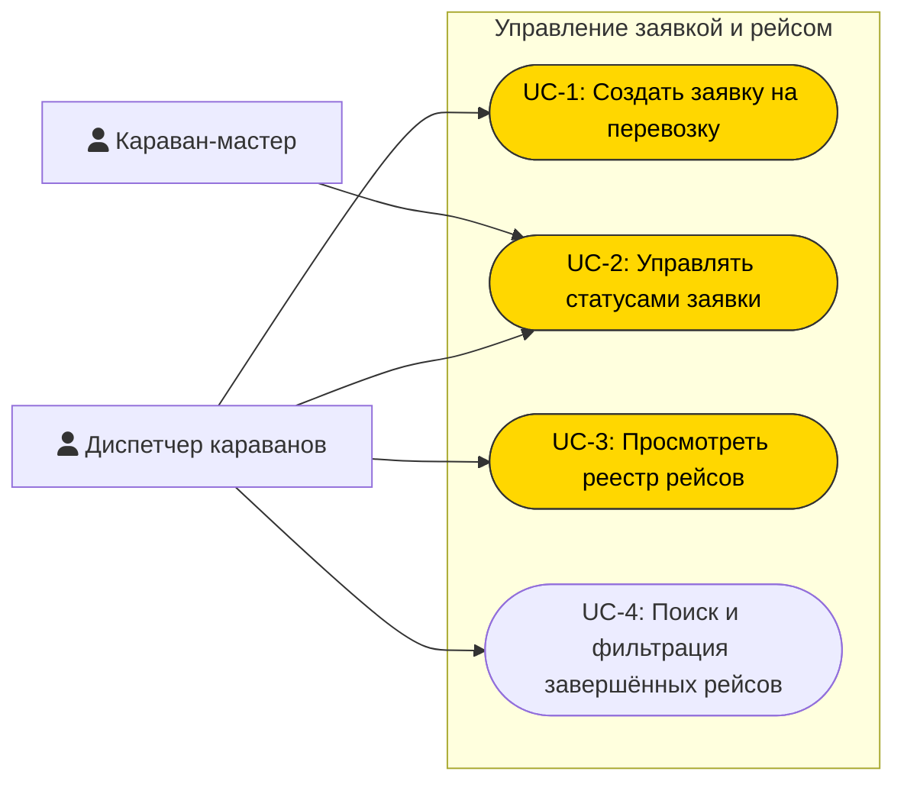
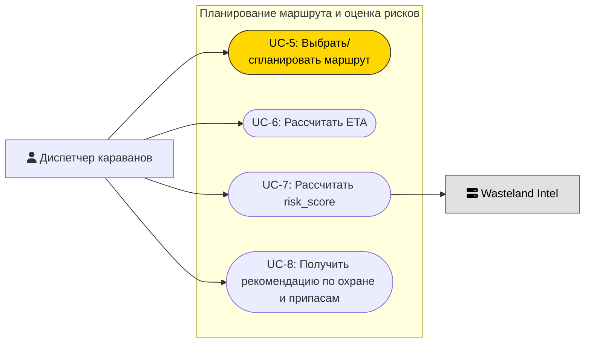
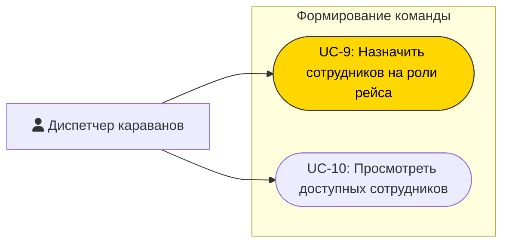
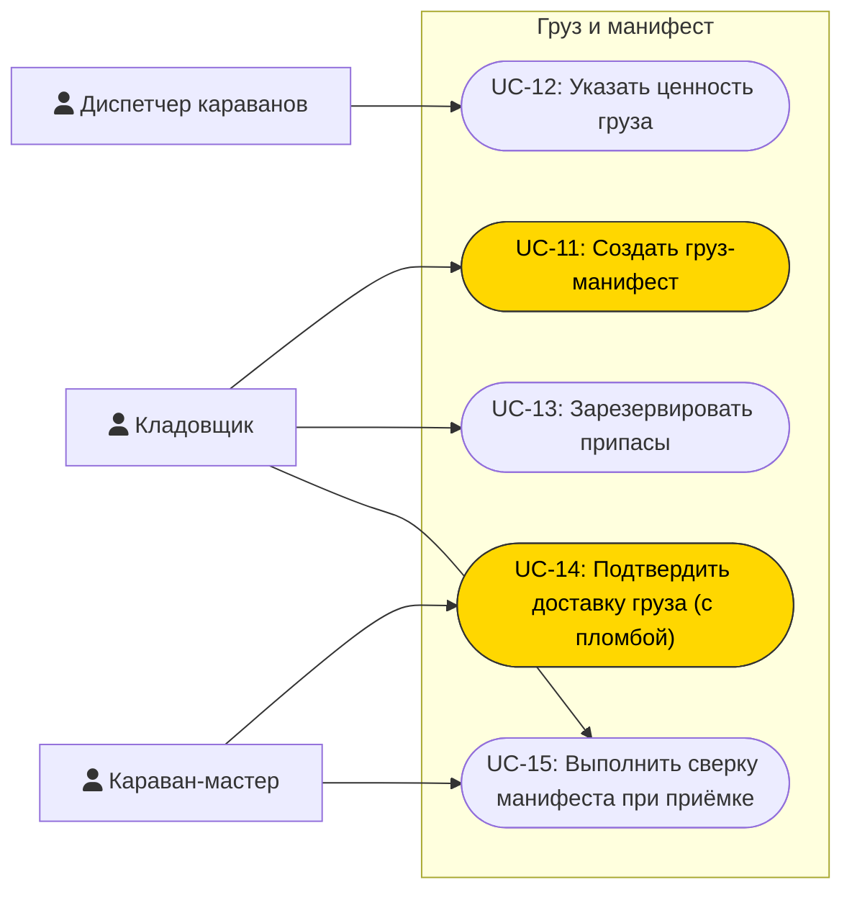
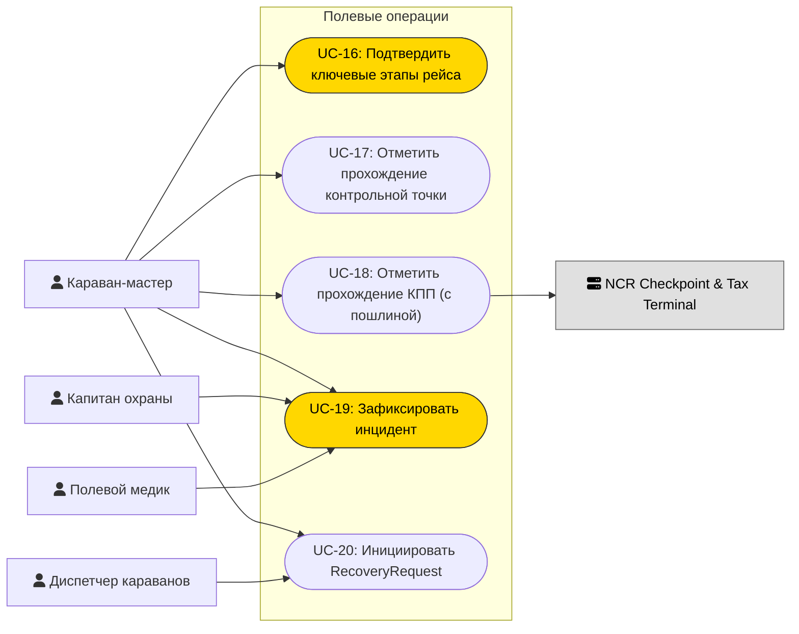
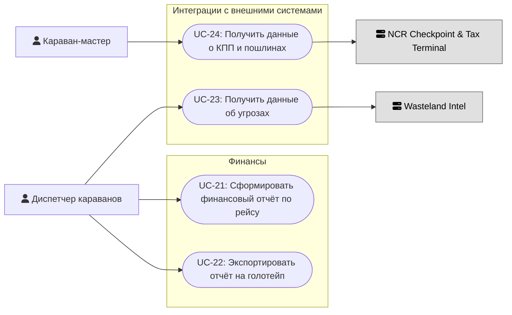
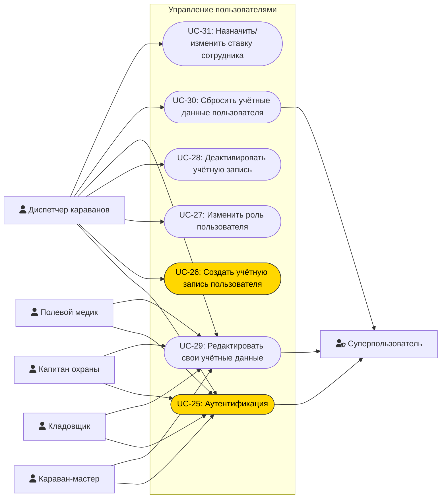
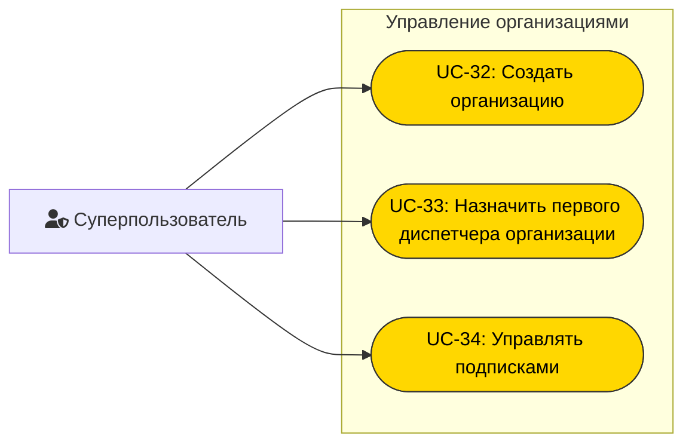

# Список прецедентов (Use Cases) — ИС «Караваны»

## Акторы

### Пользователи системы
| Актор | Тип | Описание |
|-------|-----|----------|
| Диспетчер караванов | Стационарный | Основной операционный пользователь, управляет жизненным циклом заявки |
| Караван-мастер | Полевой | Исполнитель рейса, фиксирует этапы и события в пути |
| Кладовщик | Стационарный | Подготовка груза, манифест, припасы, сверка |
| Капитан охраны | Полевой | Безопасность рейса, фиксация угроз и инцидентов |
| Полевой медик | Полевой | Медприпасы, медицинская часть инцидентов |
| Суперпользователь | Стационарный | Администратор платформы, управление организациями |

### Внешние системы
| Актор | Описание |
|-------|----------|
| Wasteland Intel | Данные об угрозах на маршруте для risk_score |
| NCR Checkpoint & Tax Terminal | Данные о прохождении КПП и пошлинах |

## Сводная таблица прецедентов

### Управление заявкой и рейсом
| # | Прецедент | Акторы |
|---|-----------|--------|
| UC-1 | Создать заявку на перевозку | Диспетчер | - IMPORTANT
| UC-2 | Управлять статусами заявки | Диспетчер, Караван-мастер | - IMPORTANT
| UC-3 | Просмотреть реестр рейсов | Диспетчер | - IMPORTANT
| UC-4 | Поиск и фильтрация завершённых рейсов | Диспетчер |

### Планирование маршрута и оценка рисков
| # | Прецедент | Акторы |
|---|-----------|--------|
| UC-5 | Выбрать/спланировать маршрут | Диспетчер | - IMPORTANT
| UC-6 | Рассчитать ETA | Диспетчер (система автоматически) |
| UC-7 | Рассчитать risk_score | Диспетчер, Wasteland Intel |
| UC-8 | Получить рекомендацию по охране и припасам | Диспетчер (система автоматически) |

### Формирование команды
| # | Прецедент | Акторы |
|---|-----------|--------|
| UC-9 | Назначить сотрудников на роли рейса | Диспетчер | - IMPORTANT
| UC-10 | Просмотреть доступных сотрудников | Диспетчер |

### Груз и манифест
| # | Прецедент | Акторы |
|---|-----------|--------|
| UC-11 | Создать груз-манифест | Кладовщик | - IMPORTANT
| UC-12 | Указать ценность груза | Диспетчер |
| UC-13 | Зарезервировать припасы | Кладовщик |
| UC-14 | Подтвердить доставку груза (с пломбой) | Караван-мастер | - IMPORTANT
| UC-15 | Выполнить сверку манифеста при приёмке | Кладовщик, Караван-мастер |

### Полевые операции
| # | Прецедент | Акторы |
|---|-----------|--------|
| UC-16 | Подтвердить ключевые этапы рейса | Караван-мастер | - IMPORTANT
| UC-17 | Отметить прохождение контрольной точки | Караван-мастер |
| UC-18 | Отметить прохождение КПП (с пошлиной) | Караван-мастер, NCR Checkpoint |
| UC-19 | Зафиксировать инцидент | Караван-мастер, Капитан охраны, Полевой медик | - IMPORTANT
| UC-20 | Инициировать RecoveryRequest | Диспетчер, Караван-мастер |

### Финансы
| # | Прецедент | Акторы |
|---|-----------|--------|
| UC-21 | Сформировать финансовый отчёт по рейсу | Диспетчер |
| UC-22 | Экспортировать отчёт на голотейп | Диспетчер |

### Интеграции с внешними системами
| # | Прецедент | Акторы |
|---|-----------|--------|
| UC-23 | Получить данные об угрозах | Wasteland Intel |
| UC-24 | Получить данные о КПП и пошлинах | NCR Checkpoint |

### Управление пользователями
| # | Прецедент | Акторы |
|---|-----------|--------|
| UC-25 | Аутентификация | Все пользователи | - IMPORTANT
| UC-26 | Создать учётную запись пользователя | Диспетчер | - IMPORTANT
| UC-27 | Изменить роль пользователя | Диспетчер |
| UC-28 | Деактивировать учётную запись | Диспетчер |
| UC-29 | Редактировать свои учётные данные | Все пользователи |
| UC-30 | Сбросить учётные данные пользователя | Диспетчер, Суперпользователь |
| UC-31 | Назначить/изменить ставку сотрудника | Диспетчер |

### Управление организациями
| # | Прецедент | Акторы |
|---|-----------|--------|
| UC-32 | Создать организацию | Суперпользователь | - IMPORTANT
| UC-33 | Назначить первого диспетчера организации | Суперпользователь | - IMPORTANT
| UC-34 | Управлять подписками | Суперпользователь | - IMPORTANT

---

## Описание прецедентов

### Управление заявкой и рейсом

| Прецедент: Создать заявку на перевозку |
|:---|
| **ID:** UC-1 |
| **Краткое описание:** Диспетчер создаёт новую заявку на перевозку, выбирая шаблон маршрута или заполняя данные вручную. |
| **Главные актёры:** Диспетчер караванов |
| **Второстепенные актёры:** Нет |
| **Предусловия:** |
| **Основной поток:** |
| **Постусловия:** |
| **Альтернативные потоки:** |

| Прецедент: Управлять статусами заявки |
|:---|
| **ID:** UC-2 |
| **Краткое описание:** Система поддерживает статусную модель заявки (Draft, Ready, En Route, Delayed, Delivered, Closed, Cancelled), переходы инициируются пользователями или событиями. |
| **Главные актёры:** Диспетчер караванов, Караван-мастер |
| **Второстепенные актёры:** Нет |
| **Предусловия:** |
| **Основной поток:** |
| **Постусловия:** |
| **Альтернативные потоки:** |

| Прецедент: Просмотреть реестр рейсов |
|:---|
| **ID:** UC-3 |
| **Краткое описание:** Диспетчер просматривает дашборд активных рейсов с цветовой индикацией статуса и risk_score. |
| **Главные актёры:** Диспетчер караванов |
| **Второстепенные актёры:** Нет |
| **Предусловия:** |
| **Основной поток:** |
| **Постусловия:** |
| **Альтернативные потоки:** |

| Прецедент: Поиск и фильтрация завершённых рейсов |
|:---|
| **ID:** UC-4 |
| **Краткое описание:** Диспетчер выполняет поиск и фильтрацию по истории завершённых рейсов. |
| **Главные актёры:** Диспетчер караванов |
| **Второстепенные актёры:** Нет |
| **Предусловия:** |
| **Основной поток:** |
| **Постусловия:** |
| **Альтернативные потоки:** |

### Планирование маршрута и оценка рисков

| Прецедент: Выбрать/спланировать маршрут |
|:---|
| **ID:** UC-5 |
| **Краткое описание:** Диспетчер выбирает маршрут из шаблонов или формирует вручную с учётом контрольных точек и данных об обстановке. |
| **Главные актёры:** Диспетчер караванов |
| **Второстепенные актёры:** Нет |
| **Предусловия:** |
| **Основной поток:** |
| **Постусловия:** |
| **Альтернативные потоки:** |

| Прецедент: Рассчитать ETA |
|:---|
| **ID:** UC-6 |
| **Краткое описание:** Система автоматически рассчитывает ожидаемое время прибытия на основе выбранного маршрута и текущих данных об обстановке. |
| **Главные актёры:** Диспетчер караванов |
| **Второстепенные актёры:** Нет |
| **Предусловия:** |
| **Основной поток:** |
| **Постусловия:** |
| **Альтернативные потоки:** |

| Прецедент: Рассчитать risk_score |
|:---|
| **ID:** UC-7 |
| **Краткое описание:** Система автоматически рассчитывает оценку риска маршрута на основе данных Wasteland Intel и ценности груза. |
| **Главные актёры:** Диспетчер караванов |
| **Второстепенные актёры:** Wasteland Intel |
| **Предусловия:** |
| **Основной поток:** |
| **Постусловия:** |
| **Альтернативные потоки:** |

| Прецедент: Получить рекомендацию по охране и припасам |
|:---|
| **ID:** UC-8 |
| **Краткое описание:** На основе risk_score система формирует рекомендацию по минимальному составу охраны и объёму припасов; диспетчер может принять или скорректировать. |
| **Главные актёры:** Диспетчер караванов |
| **Второстепенные актёры:** Нет |
| **Предусловия:** |
| **Основной поток:** |
| **Постусловия:** |
| **Альтернативные потоки:** |

### Формирование команды

| Прецедент: Назначить сотрудников на роли рейса |
|:---|
| **ID:** UC-9 |
| **Краткое описание:** Диспетчер назначает сотрудников на ключевые роли рейса. Система блокирует выпуск при незаполненных обязательных ролях. |
| **Главные актёры:** Диспетчер караванов |
| **Второстепенные актёры:** Нет |
| **Предусловия:** |
| **Основной поток:** |
| **Постусловия:** |
| **Альтернативные потоки:** |

| Прецедент: Просмотреть доступных сотрудников |
|:---|
| **ID:** UC-10 |
| **Краткое описание:** Диспетчер просматривает список доступных сотрудников с указанием их текущей занятости и статуса. |
| **Главные актёры:** Диспетчер караванов |
| **Второстепенные актёры:** Нет |
| **Предусловия:** |
| **Основной поток:** |
| **Постусловия:** |
| **Альтернативные потоки:** |

### Груз и манифест

| Прецедент: Создать груз-манифест |
|:---|
| **ID:** UC-11 |
| **Краткое описание:** Кладовщик создаёт цифровой груз-манифест с перечнем позиций, упаковкой и пломбами. |
| **Главные актёры:** Кладовщик |
| **Второстепенные актёры:** Нет |
| **Предусловия:** |
| **Основной поток:** |
| **Постусловия:** |
| **Альтернативные потоки:** |

| Прецедент: Указать ценность груза |
|:---|
| **ID:** UC-12 |
| **Краткое описание:** Диспетчер указывает оценочную ценность груза (в крышках) при создании заявки; значение используется при расчёте risk_score. |
| **Главные актёры:** Диспетчер караванов |
| **Второстепенные актёры:** Нет |
| **Предусловия:** |
| **Основной поток:** |
| **Постусловия:** |
| **Альтернативные потоки:** |

| Прецедент: Зарезервировать припасы |
|:---|
| **ID:** UC-13 |
| **Краткое описание:** Кладовщик резервирует припасы под рейс (вода, еда, боеприпасы, ремкомплекты, медприпасы). |
| **Главные актёры:** Кладовщик |
| **Второстепенные актёры:** Нет |
| **Предусловия:** |
| **Основной поток:** |
| **Постусловия:** |
| **Альтернативные потоки:** |

| Прецедент: Подтвердить доставку груза (с пломбой) |
|:---|
| **ID:** UC-14 |
| **Краткое описание:** Караван-мастер подтверждает факт доставки груза с фиксацией целостности пломбы (статус Delivered). |
| **Главные актёры:** Караван-мастер |
| **Второстепенные актёры:** Нет |
| **Предусловия:** |
| **Основной поток:** |
| **Постусловия:** |
| **Альтернативные потоки:** |

| Прецедент: Выполнить сверку манифеста при приёмке |
|:---|
| **ID:** UC-15 |
| **Краткое описание:** Кладовщик на принимающей стороне выполняет сверку груз-манифеста и фиксирует результат. При отсутствии кладовщика приёмку закрывает караван-мастер. |
| **Главные актёры:** Кладовщик |
| **Второстепенные актёры:** Караван-мастер |
| **Предусловия:** |
| **Основной поток:** |
| **Постусловия:** |
| **Альтернативные потоки:** |

### Полевые операции

| Прецедент: Подтвердить ключевые этапы рейса |
|:---|
| **ID:** UC-16 |
| **Краткое описание:** Караван-мастер подтверждает ключевые этапы: загрузка, выход, прибытие на контрольные точки, доставка груза. |
| **Главные актёры:** Караван-мастер |
| **Второстепенные актёры:** Нет |
| **Предусловия:** |
| **Основной поток:** |
| **Постусловия:** |
| **Альтернативные потоки:** |

| Прецедент: Отметить прохождение контрольной точки |
|:---|
| **ID:** UC-17 |
| **Краткое описание:** Караван-мастер фиксирует прохождение контрольной точки на маршруте (CheckpointLog). |
| **Главные актёры:** Караван-мастер |
| **Второстепенные актёры:** Нет |
| **Предусловия:** |
| **Основной поток:** |
| **Постусловия:** |
| **Альтернативные потоки:** |

| Прецедент: Отметить прохождение КПП (с пошлиной) |
|:---|
| **ID:** UC-18 |
| **Краткое описание:** Караван-мастер отмечает прохождение КПП; система запрашивает данные с терминала NCR (название, сумма пошлины, валюта) и записывает в финансовый журнал. |
| **Главные актёры:** Караван-мастер |
| **Второстепенные актёры:** NCR Checkpoint & Tax Terminal |
| **Предусловия:** |
| **Основной поток:** |
| **Постусловия:** |
| **Альтернативные потоки:** |

| Прецедент: Зафиксировать инцидент |
|:---|
| **ID:** UC-19 |
| **Краткое описание:** Полевой пользователь фиксирует инцидент через форму: тип, тяжесть, описание; время и координаты фиксируются автоматически. |
| **Главные актёры:** Караван-мастер, Капитан охраны, Полевой медик |
| **Второстепенные актёры:** Нет |
| **Предусловия:** |
| **Основной поток:** |
| **Постусловия:** |
| **Альтернативные потоки:** |

| Прецедент: Инициировать RecoveryRequest |
|:---|
| **ID:** UC-20 |
| **Краткое описание:** На основе зафиксированного инцидента инициируется запрос на эвакуацию, подмогу или повторную доставку груза. |
| **Главные актёры:** Диспетчер караванов, Караван-мастер |
| **Второстепенные актёры:** Нет |
| **Предусловия:** |
| **Основной поток:** |
| **Постусловия:** |
| **Альтернативные потоки:** |

### Финансы

| Прецедент: Сформировать финансовый отчёт по рейсу |
|:---|
| **ID:** UC-21 |
| **Краткое описание:** Система автоматически формирует итоговый финансовый отчёт по рейсу (расходы, доходы, пошлины, расхождения, итого в крышках). |
| **Главные актёры:** Диспетчер караванов |
| **Второстепенные актёры:** Нет |
| **Предусловия:** |
| **Основной поток:** |
| **Постусловия:** |
| **Альтернативные потоки:** |

| Прецедент: Экспортировать отчёт на голотейп |
|:---|
| **ID:** UC-22 |
| **Краткое описание:** Диспетчер экспортирует сформированный финансовый отчёт на голотейп для передачи клиенту. |
| **Главные актёры:** Диспетчер караванов |
| **Второстепенные актёры:** Нет |
| **Предусловия:** |
| **Основной поток:** |
| **Постусловия:** |
| **Альтернативные потоки:** |

### Интеграции с внешними системами

| Прецедент: Получить данные об угрозах |
|:---|
| **ID:** UC-23 |
| **Краткое описание:** Система интегрируется с Wasteland Intel для получения актуальных данных об угрозах на маршруте. |
| **Главные актёры:** Диспетчер караванов |
| **Второстепенные актёры:** Wasteland Intel |
| **Предусловия:** |
| **Основной поток:** |
| **Постусловия:** |
| **Альтернативные потоки:** |

| Прецедент: Получить данные о КПП и пошлинах |
|:---|
| **ID:** UC-24 |
| **Краткое описание:** Система интегрируется с NCR Checkpoint & Tax Terminal для получения данных о прохождении и суммах пошлин. |
| **Главные актёры:** Караван-мастер |
| **Второстепенные актёры:** NCR Checkpoint & Tax Terminal |
| **Предусловия:** |
| **Основной поток:** |
| **Постусловия:** |
| **Альтернативные потоки:** |

### Управление пользователями

| Прецедент: Аутентификация |
|:---|
| **ID:** UC-25 |
| **Краткое описание:** Пользователь входит в систему по логину и паролю. Свободная регистрация отсутствует. |
| **Главные актёры:** Все пользователи (Диспетчер, Караван-мастер, Кладовщик, Капитан охраны, Полевой медик, Суперпользователь) |
| **Второстепенные актёры:** Нет |
| **Предусловия:** |
| **Основной поток:** |
| **Постусловия:** |
| **Альтернативные потоки:** |

| Прецедент: Создать учётную запись пользователя |
|:---|
| **ID:** UC-26 |
| **Краткое описание:** Диспетчер создаёт учётную запись пользователя в рамках своей организации с указанием роли, ФИО и начальных учётных данных. |
| **Главные актёры:** Диспетчер караванов |
| **Второстепенные актёры:** Нет |
| **Предусловия:** |
| **Основной поток:** |
| **Постусловия:** |
| **Альтернативные потоки:** |

| Прецедент: Изменить роль пользователя |
|:---|
| **ID:** UC-27 |
| **Краткое описание:** Диспетчер изменяет роль существующего пользователя в рамках своей организации. |
| **Главные актёры:** Диспетчер караванов |
| **Второстепенные актёры:** Нет |
| **Предусловия:** |
| **Основной поток:** |
| **Постусловия:** |
| **Альтернативные потоки:** |

| Прецедент: Деактивировать учётную запись |
|:---|
| **ID:** UC-28 |
| **Краткое описание:** Диспетчер деактивирует учётную запись пользователя; система запрещает деактивацию последнего диспетчера в организации. |
| **Главные актёры:** Диспетчер караванов |
| **Второстепенные актёры:** Нет |
| **Предусловия:** |
| **Основной поток:** |
| **Постусловия:** |
| **Альтернативные потоки:** |

| Прецедент: Редактировать свои учётные данные |
|:---|
| **ID:** UC-29 |
| **Краткое описание:** Пользователь редактирует собственные учётные данные (логин, пароль). |
| **Главные актёры:** Все пользователи |
| **Второстепенные актёры:** Нет |
| **Предусловия:** |
| **Основной поток:** |
| **Постусловия:** |
| **Альтернативные потоки:** |

| Прецедент: Сбросить учётные данные пользователя |
|:---|
| **ID:** UC-30 |
| **Краткое описание:** Диспетчер или суперпользователь сбрасывает/изменяет учётные данные любого пользователя в рамках организации. |
| **Главные актёры:** Диспетчер караванов, Суперпользователь |
| **Второстепенные актёры:** Нет |
| **Предусловия:** |
| **Основной поток:** |
| **Постусловия:** |
| **Альтернативные потоки:** |

| Прецедент: Назначить/изменить ставку сотрудника |
|:---|
| **ID:** UC-31 |
| **Краткое описание:** Диспетчер назначает или редактирует ставку (должностной оклад) сотрудника. |
| **Главные актёры:** Диспетчер караванов |
| **Второстепенные актёры:** Нет |
| **Предусловия:** |
| **Основной поток:** |
| **Постусловия:** |
| **Альтернативные потоки:** |

### Управление организациями

| Прецедент: Создать организацию |
|:---|
| **ID:** UC-32 |
| **Краткое описание:** Суперпользователь создаёт новую организацию (караванную компанию) в системе. |
| **Главные актёры:** Суперпользователь |
| **Второстепенные актёры:** Нет |
| **Предусловия:** |
| **Основной поток:** |
| **Постусловия:** |
| **Альтернативные потоки:** |

| Прецедент: Назначить первого диспетчера организации |
|:---|
| **ID:** UC-33 |
| **Краткое описание:** Суперпользователь назначает первого диспетчера для вновь созданной организации. |
| **Главные актёры:** Суперпользователь |
| **Второстепенные актёры:** Нет |
| **Предусловия:** |
| **Основной поток:** |
| **Постусловия:** |
| **Альтернативные потоки:** |

| Прецедент: Управлять подписками |
|:---|
| **ID:** UC-34 |
| **Краткое описание:** Суперпользователь управляет подписками организаций (уровни доступа, продление, блокировка). |
| **Главные актёры:** Суперпользователь |
| **Второстепенные актёры:** Нет |
| **Предусловия:** |
| **Основной поток:** |
| **Постусловия:** |
| **Альтернативные потоки:** |
