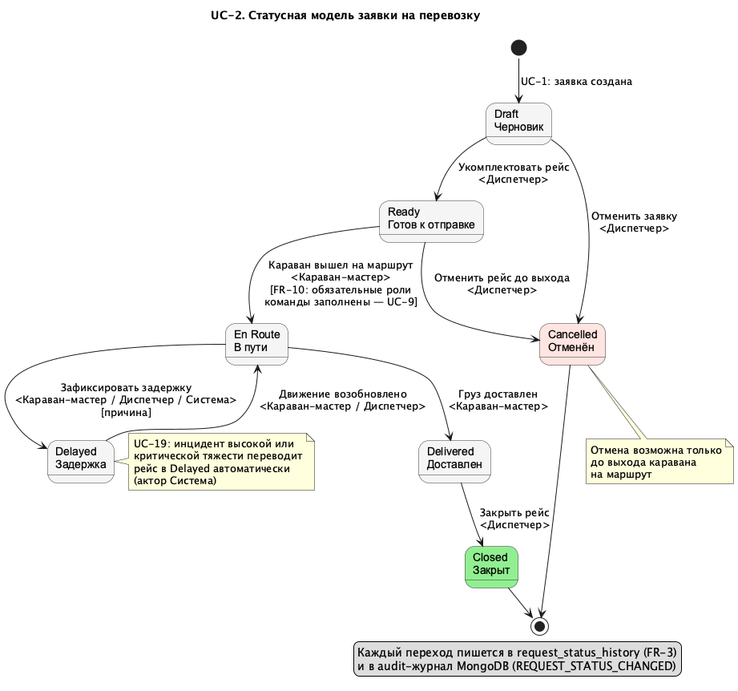

# UC-2 — Управлять статусами заявки

Реализация epic [#2 «[Epic][UC-2] Управлять статусами заявки»](https://github.com/granikartem/MPI/issues/2)
и задачи [#75 «TripStatus model and migrations UC-2»](https://github.com/granikartem/MPI/issues/75).

Прецедент закрывает пробел, зафиксированный в [ImplementationPlan](ImplementationPlan.md):
после UC-1 заявка умела существовать только в статусе `DRAFT`.

Покрываемые требования [SRS](SRS.md): **FR-2** (статусная модель заявки), **FR-3** (история всех
изменений статуса перевозки), частично **FR-35** (audit trail).

## Статусная модель

Состояния — по [глоссарию](Glossary_Karavany_FNV.md) («Статусная модель заявки»).

_Исходник: [diagrams/usecases/UC_2_Status.puml](diagrams/usecases/UC_2_Status.puml)_

| Из | В | Действие | Кто инициирует | Причина обязательна | Основание в документах |
|----|---|----------|----------------|---------------------|------------------------|
| Draft | Ready | Укомплектовать рейс | Диспетчер | нет | Glossary: Ready — «заявка укомплектована»; Vision: диспетчер контролирует статусы |
| Draft | Cancelled | Отменить заявку | Диспетчер | нет | Glossary: Cancelled — до выхода каравана |
| Ready | Cancelled | Отменить рейс до выхода | Диспетчер | нет | Glossary: Cancelled — до выхода каравана |
| Ready | En Route | Караван вышел на маршрут | Караван-мастер | нет | Vision: «Переводит рейс в статус EN_ROUTE» |
| En Route | Delayed | Зафиксировать задержку | Караван-мастер, Диспетчер, Система | да | Glossary: Delayed — движение приостановлено; Vision: «причины задержек»; UC-19 (актор Система) |
| Delayed | En Route | Движение возобновлено | Караван-мастер, Диспетчер | нет | Glossary: En Route — караван на маршруте |
| En Route | Delivered | Груз доставлен | Караван-мастер | нет | SRS FR-15 |
| Delivered | Closed | Закрыть рейс | Диспетчер | нет | Vision: диспетчер «закрывает перевозку» |

`Closed` и `Cancelled` — финальные: переходов из них нет. Отмена возможна только до выхода
каравана на маршрут (глоссарий: «рейс отменён до выхода каравана на маршрут»). Возврата из
`Ready` в `Draft` в модели нет: такой переход не описан ни в одном документе проекта.

Модель собрана из документов; таблицы переходов как таковой в SRS, SDP и UseCases не было —
источники: состояния и их смысл из [глоссария](Glossary_Karavany_FNV.md), инициаторы переходов
из [Vision](Vision.md) и SRS (FR-10, FR-15), автоматический переход по инциденту из
[CoreUseCases UC-19](CoreUseCases.md), отклонение перехода вне порядка — из UC-16.

Роль `Система` предусмотрена для автоматического перехода `En Route → Delayed` из UC-19
(инцидент высокой или критической тяжести) — переход в модели уже разрешён, вызов появится
вместе с UC-19.

## Что сделано

### Backend

- `request/domain/RequestStatus` — enum статусов с русскими подписями; поле `caravan_request.status`
  переведено со строки на enum (`@Enumerated(STRING)`).
- `request/domain/ActorRole` — роли акторов перехода (`DISPATCHER`, `CARAVAN_MASTER`, `SYSTEM`).
- `request/domain/RequestStatusMachine` — таблица переходов без зависимостей от Spring и БД:
  допустимость перехода, роли, обязательность причины, признак финального статуса.
- `request/service/RequestReadinessGuard` — место для проверок готовности данных, отделённое от
  таблицы переходов. Единственная заданная документами проверка — FR-10 (перевод в «В пути» без
  укомплектованных обязательных ролей), и она требует модели команды рейса из UC-9, поэтому
  сейчас блокировок нет ни для одного перехода.
- `request/service/RequestStatusService` — применение перехода: проверки → смена статуса →
  запись истории → audit-событие. Отказ — через `StatusTransitionException` (HTTP 409).
- `request/domain/RequestStatusHistory` + репозиторий — история переходов (FR-3).
- `audit/AuditEvent.requestStatusChanged(...)` — событие `REQUEST_STATUS_CHANGED` в MongoDB.
- `request/web/RequestStatusController` — три эндпоинта UC-2.
- UC-1 при создании заявки пишет стартовую запись истории (`— → Draft`).

### База данных

Миграция `V5__request_status_history.sql`:

- таблица `request_status_history` (`request_id`, `from_status`, `to_status`, `actor_role`,
  `actor_name`, `reason`, `occurred_at`) + индекс по `(request_id, occurred_at)`;
- backfill: заявки, созданные до UC-2, получают стартовую запись истории на момент создания;
- `check`-ограничение на `caravan_request.status` по семи статусам модели.

### API

| Метод | Путь | Назначение |
|-------|------|-----------|
| GET | `/api/requests/{id}/status` | текущий статус + доступные переходы с ролями и причинами блокировки |
| POST | `/api/requests/{id}/status` | выполнить переход (`targetStatus`, `actorRole`, `actorName`, `reason`) |
| GET | `/api/requests/{id}/status-history` | история изменений статуса (FR-3) |

Коды ответов: `200` — переход выполнен; `409` — переход отклонён (модель, роль, отсутствие
обязательной причины, непройденная проверка готовности); `400` — некорректный запрос
(неизвестный статус или роль, заявка не найдена).

В `GET/POST /api/requests` ответ дополнен полем `statusLabel` (человекочитаемая подпись статуса).

### Frontend

- `components/StatusBadge` — цветовая индикация статуса (Vision: дашборд с индикацией статуса):
  Черновик — серый, Готов — жёлтый, В пути — голубой, Задержка — оранжевый, Доставлен — зелёный,
  Закрыт — приглушённый зелёный, Отменён — красный.
- `components/StatusModal` — управление статусом: выбор роли актора и ФИО, поле причины, список
  доступных переходов кнопками. Недоступный переход показан отключённой кнопкой с объяснением
  («Действие доступно роли: …», «Укажите причину перехода»).
- В той же модалке — таблица истории переходов: когда, переход, кто, причина.
- В реестре заявок статус стал кликабельным бейджем, открывающим модалку.

### Тесты

`backend/src/test/java/com/karavany/request/RequestStatusMachineTest` — 10 тестов статусной
модели: основной поток, задержка и возобновление, запрет перескакивания этапов, отмена только
до выхода, финальные статусы, права ролей, обязательность причины только для задержки,
отсутствие перехода `Ready → Draft`, отсутствие проверок готовности до UC-9, отсутствие дублей
в таблице переходов.

## Соответствие acceptance criteria эпика

| Критерий | Статус |
|----------|--------|
| Основной поток реализован | да — переход через `POST /api/requests/{id}/status` и UI |
| Альтернативные потоки и ошибки не теряются | да — недопустимый переход, финальный статус, чужая роль, отсутствие обязательной причины (все — 409 с текстом) |
| Доступ ограничен ролями акторов | на уровне модели переходов; полноценная авторизация — после UC-25 (см. «Ограничения») |
| События попадают в audit trail | да — `REQUEST_STATUS_CHANGED` в MongoDB + история в PostgreSQL |
| Тестовое покрытие | да — 10 unit-тестов статусной модели |
| UI/API/документация согласованы | да — этот документ, заполненный UC-2 в [UseCases.md](UseCases.md), диаграмма состояний, README |

## Ограничения и что осталось за рамками UC-2

- **Аутентификация (UC-25).** Роль актора приходит с клиента полем `actorRole`, а не из сессии.
  Это осознанное ограничение до реализации UC-25/UC-26: сервер уже проверяет права роли на
  переход, остаётся заменить источник роли на аутентифицированного пользователя.
- **FR-10** (блокировка выхода на маршрут без укомплектованных обязательных ролей команды) —
  единственная проверка готовности, заданная документами. Реализована как точка расширения в
  `RequestReadinessGuard`: сама проверка появится вместе с моделью команды рейса в UC-9.
- Проверки из глоссария, требующие соседних прецедентов: укомплектованность заявки перед `Ready`
  (манифест — UC-11, припасы — UC-13) и сверенный манифест с финансовым отчётом перед `Closed`
  (UC-15, UC-21). Пока не проверяются.
- **UC-16/UC-19.** Переходы `Ready → En Route`, `En Route → Delivered`, `En Route → Delayed`
  реализованы как ручные действия. Их автоматическая инициация из полевых событий и инцидентов
  относится к UC-16 и UC-19.
- Диаграмма `UC_2_Status.puml` рендерится встроенным движком PlantUML (`!pragma layout smetana`) —
  для неё не нужен установленный Graphviz.

## Результат проверки

**Unit-тесты (backend):** `gradle test` — 10 тестов, 0 падений (`RequestStatusMachineTest`).

**Сборка frontend:** `npm run build` (`tsc && vite build`) — успешно.

**Инфраструктура:** `docker compose up -d --build` — PostgreSQL, MongoDB, backend, frontend,
mock-intel подняты; Flyway применил 5 миграций, включая `V5 - request status history`.

**End-to-end (25 проверок против поднятого стека, все пройдены):**

| Сценарий | Ожидание | Результат |
|----------|----------|-----------|
| Заявка создаётся в `DRAFT`, в истории есть стартовая запись | 1 запись | ок |
| Из `Draft` доступны ровно два перехода (Ready, Cancelled) | 2 | ок |
| Проверок готовности пока нет (FR-10 ждёт UC-9) | `blockedReason: null` | ок |
| `Draft → En Route` (через этап) | 409 | ок |
| `Draft → Ready` от караван-мастера | 409 | ок |
| Переход в тот же статус | 409 | ок |
| Неизвестный статус в теле запроса | 400 | ок |
| `Draft → Ready` без рассчитанного `risk_score` | 200 (статус не зависит от risk_score) | ок |
| Возврат `Ready → Draft` | 409 (нет в модели) | ок |
| Отмена до выхода без причины | 200 (причина не обязательна) | ок |
| `Draft → Ready` (диспетчер) | 200 | ок |
| `Ready → En Route` диспетчером | 409 | ок |
| `Ready → En Route` (караван-мастер) | 200 | ок |
| Отмена после выхода на маршрут | 409 | ок |
| `En Route → Delayed` без причины | 409 | ок |
| `En Route → Delayed` с причиной | 200 | ок |
| `Delayed → En Route` | 200 | ок |
| `En Route → Delivered` | 200 | ок |
| `Delivered → Closed` караван-мастером | 409 | ок |
| `Delivered → Closed` диспетчером | 200 | ок |
| Переход из финального статуса | 409, `terminal: true`, 0 доступных переходов | ок |
| История после полного цикла | 7 записей (создание + 6 переходов) | ок |
| Audit-события в MongoDB | `REQUEST_STATUS_CHANGED` с actor, from, to, reason | ок |

**UI (http://localhost:5173/requests):** статус в реестре отображается цветным бейджем; по клику
открывается модалка со статусом, списком переходов и историей. Проверено вручную: при роли
«Караван-мастер» переходы диспетчера отключены с подсказкой «Действие доступно роли: Диспетчер
караванов»; выполнение перехода `Черновик → Готов к отправке` обновляет бейдж в модалке и в
реестре и добавляет запись в историю.
