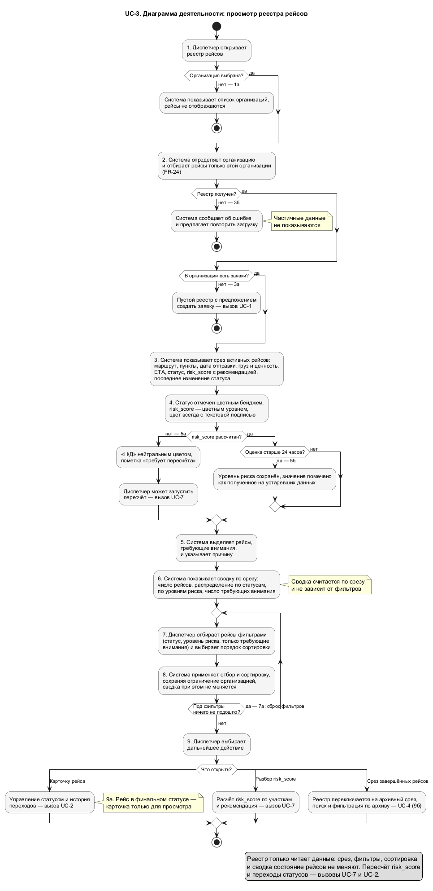

# UC-3 — Просмотреть реестр рейсов

Реализация epic [#3 «[Epic][UC-3] Просмотреть реестр рейсов»](https://github.com/granikartem/MPI/issues/3)
и задачи [#76 «dispatch forms and registry UI UC-1, UC-3»](https://github.com/granikartem/MPI/issues/76).

Прецедент закрывает пробел, зафиксированный в [ImplementationPlan](ImplementationPlan.md): после
UC-1 реестр существовал плоской таблицей без срезов, сводки, фильтров и сортировки, серверный
отбор — только по организации.

Покрываемые требования [SRS](SRS.md): **FR-2** и **FR-3** (отображение статуса рейса и вход в
историю его изменений), **FR-7** и **FR-8** (risk_score и рекомендация по охране в строке реестра),
**FR-24** (изоляция данных организаций — для эндпоинта реестра), UI-требование SRS 3.6.1 («дашборд
с реестром рейсов»). Из [Vision](Vision.md): 4.2 («Дашборд активных рейсов с цветовой индикацией
статуса и risk_score (зелёный/жёлтый/красный)») и строка «Загрузка реестра рейсов ≤ 500 мс» из
таблицы времени отклика 9.3. Остальные строки этой таблицы UC-3 не закрывает: «Поиск по реестру
≤ 1 с» относится к UC-4, «Открытие карточки рейса ≤ 400 мс» — к будущему экрану карточки.

## Модель реестра

_Исходник: [diagrams/usecases/UC_3_Registry.puml](diagrams/usecases/UC_3_Registry.puml)_

Реестр читается двумя срезами. Срез задаёт набор статусов и подпись вкладки.

| Срез | Статусы | Основание в документах |
|------|---------|------------------------|
| `ACTIVE` — «Активные» | Черновик, Готов к отправке, В пути, Задержка, Доставлен | нефинальные статусы статусной модели [UC-2](UC-2.md) (`RequestStatusMachine.isTerminal` == false); Vision 4.2: «дашборд активных рейсов» |
| `COMPLETED` — «Архив» | Закрыт, Отменён | финальные статусы статусной модели [UC-2](UC-2.md); [глоссарий](Glossary_Karavany_FNV.md): Closed — «рейс завершён», Cancelled — «рейс отменён до выхода каравана на маршрут» |

Срезы разбивают все семь статусов без пересечений и пропусков. «Доставлен» отнесён к активным:
из него ещё есть переход `Delivered → Closed` (UC-2), то есть рейс требует действия диспетчера.
SRS FR-4 говорит буквально только о завершённых рейсах, поэтому отнесение «Отменён» к архивному
срезу — решение UC-3/UC-4, а не цитата требования.

Уровень риска строки выводится из значения risk_score и признака его свежести. Цвет всегда
сопровождается текстовой подписью.

| Уровень | Подпись | Условие | Цвет | Основание в документах |
|---------|---------|---------|------|------------------------|
| `UNKNOWN` | Н/Д | признак свежести `NA` либо risk_score отсутствует | `#888` | UC-7, альт. 2а: «risk_score = Н/Д, пометить как требует пересчёта» |
| `LOW` | Низкий | `0 <= score < 30` | `#33ff66` | Vision 5.4: зелёная зона шкалы risk_score; порог и подпись — из реализованного UC-7 |
| `MEDIUM` | Средний | `30 <= score < 60` | `#ffd633` | Vision 5.4: жёлтая зона шкалы risk_score; порог и подпись — из реализованного UC-7 |
| `HIGH` | Высокий | `60 <= score < 80` | `#ff9800` | макет `mockups/caravan_dispatch.png` (кнопка `HIGH`); порог и подпись — из реализованного UC-7 |
| `CRITICAL` | Критический | `score >= 80` | `#ff4444` | Vision 5.4: красная зона шкалы risk_score; порог и подпись — из реализованного UC-7 |

Признак `Н/Д` проверяется первым: отсутствие расчёта побеждает любое сохранённое значение
risk_score. Vision 5.4 задаёт лишь трёхцветную шкалу, поэтому разбиение на четыре уровня и
отдельное состояние «нет оценки» — решение UC-3 по макету терминала диспетчера
(`mockups/caravan_dispatch.png`, кнопки `LOW / MID / HIGH / CRIT`).

Рейсы, требующие внимания диспетчера, помечаются флагами. Флаги считает сервер, клиент показывает
присланные подписи.

| Флаг | Подпись | Условие | Основание в документах |
|------|---------|---------|------------------------|
| `DELAYED` | Задержка | статус «Задержка» | [глоссарий](Glossary_Karavany_FNV.md): Delayed — «движение приостановлено» |
| `AWAITING_CLOSURE` | Ждёт закрытия | статус «Доставлен» | Vision: диспетчер «закрывает перевозку»; UC-2: единственный оставшийся переход `Delivered → Closed` |
| `RISK_RECALCULATION_REQUIRED` | Требует пересчёта risk_score | признак свежести risk_score `NA` | UC-7, альт. 2а: «risk_score = Н/Д, пометить как требует пересчёта» |
| `RISK_DATA_STALE` | risk_score по устаревшим данным | признак свежести risk_score `STALE` | UC-7, альт. 2б: «На основе устаревших данных» |

Критический уровень риска сам по себе флагом внимания не является: уровень риска уже несёт
отдельная цветовая индикация со своей подписью. Это решение UC-3, оно зафиксировано unit-тестом.

Сводка считается по срезу и не зависит ни от применённых фильтров, ни от ограничения выборки:
переключение фильтров не должно менять картину загрузки организации. Исключение — счётчики
активных и завершённых рейсов: это размеры двух срезов, они по определению считаются по всей
организации и нужны для подписей вкладок «Активные (N)» и «Архив (N)».

Сводка содержит размеры обоих срезов и размер текущего среза, распределение текущего среза по
статусам (только статусы этого среза, все — даже с нулём), распределение по пяти уровням риска
(все ключи присутствуют), распределение по четырём флагам внимания (все ключи присутствуют) и
число рейсов, у которых есть хотя бы один флаг. Последнее число не равно сумме по флагам: у одного
рейса может быть несколько флагов сразу.

Состав строки реестра собран из документов: перечень отображаемых полей — из SRS 3.6.1 и Vision
4.2, цветовая индикация статуса и risk_score с рекомендацией — из Vision 4.2 и 5.4, статусы и
признак финальности — из статусной модели UC-2 и [глоссария](Glossary_Karavany_FNV.md),
risk_score с состояниями «Н/Д» и «устаревшие данные» и рекомендация по охране — из UC-7,
ограничение выборки организацией — из FR-23 и FR-24.

Часть модели документами не задана. Перечня фильтров активного реестра нет ни в SRS, ни в Vision:
состав фильтров (статус, уровень риска, только требующие внимания) и закрытый набор порядков
сортировки — решение UC-3. Флаги «требует внимания» отдельной колонкой — тоже решение UC-3,
выведенное из уже существующих данных UC-2 и UC-7, а не из отдельного требования. Пороги
30/60/80 в документах не записаны — они взяты из уже реализованного UC-7
(`RiskService.recommendation`), подписи уровней совпадают с текстами его рекомендаций.

Документы расходятся в вопросе цвета. SRS 2.3: «Полевые устройства и стационарные терминалы в мире
Fallout могут иметь устаревшие экраны, низкую яркость, используются только зелёный и чёрный цвет,
а также невысокое разрешение» — ограничение распространяется и на стационарный терминал диспетчера.
Vision 4.2 и 5.4 при этом требуют индикации «зелёный/жёлтый/красный». Это известное расхождение
требований, и принадлежность реестра к стационарным терминалам его не снимает. UC-3 реализует
цветовую шкалу Vision (она конкретнее и уже реализована в UC-2 и UC-7) и компенсирует ограничение
SRS 2.3 тем, что цвет никогда не остаётся единственным носителем смысла: статус, уровень риска и
флаг внимания всегда подписаны текстом. Дублирование подписью — решение UC-3, а не цитата SRS.

## Что сделано

### Backend

- `risk/RiskLevel` — enum уровней риска с русскими подписями, разбор значения из параметра запроса
  и вывод уровня из risk_score и признака его свежести по порогам 30/60/80.
- `request/domain/RegistryScope` — enum срезов с подписями: набор статусов среза и проверка
  принадлежности статуса срезу считаются через `RequestStatusMachine.isTerminal`, поэтому срезы
  остаются согласованными со статусной моделью UC-2.
- `request/domain/AttentionFlag` — enum флагов «требует внимания» с русскими подписями.
- `request/domain/RegistrySort` — enum порядков сортировки с подписями и компаратором; направление
  вшито в значение, устойчивый порядок обеспечивается доопределением по дате создания и
  идентификатору.
- `request/domain/RegistryEntry` — record строки реестра: чистые данные без зависимости от JPA,
  на них работает вся доменная логика.
- `request/domain/RequestRegistry` — логика реестра без Spring и БД: расчёт флагов внимания,
  отбор по фильтрам, сортировка, ограничение выборки и признак усечения, сводка по срезу, разбор
  и валидация параметров запроса.
- `request/service/RequestRegistryService` — чтение под `@Transactional(readOnly = true)`: проверка
  организации, выборка её заявок методом репозитория UC-1 и последних записей истории статусов —
  одним запросом по списку заявок, а не по одному запросу на рейс, — сборка строк реестра и вызов
  доменной логики.
- `request/web/RequestRegistryController` — эндпоинт реестра, record-DTO ответа внутри контроллера,
  `@ExceptionHandler` на отклонённые параметры → `400` с `ErrorResponse` из `RequestController`.
- `request/repository/RequestStatusHistoryRepository` — добавлена выборка истории по списку заявок
  для свёртки в последнее изменение статуса каждого рейса.

Контракты UC-1 и UC-2 не изменены: `GET/POST /api/requests` и эндпоинты статусов остались как были.

### База данных

Миграция `V6__request_registry_index.sql` — только индекс, новых таблиц и колонок UC-3 не вводит:

- `ix_caravan_request_org_created` по `(organization_id, created_at desc)` — под единственный запрос
  реестра «заявки организации, сначала новые». До UC-3 у `caravan_request` был только индекс
  первичного ключа: вторичных индексов, в том числе по `organization_id`, не было, поэтому выборка
  по организации шла последовательным просмотром таблицы.

Индекс обслуживает требование Vision 9.3 (загрузка реестра ≤ 500 мс). Срез, фильтры и сортировка
применяются в памяти (см. «Ограничения»), поэтому индекса по `status` UC-3 не добавляет: ни один
его запрос отбором по статусу в БД не пользуется.

### API

| Метод | Путь | Назначение |
|-------|------|-----------|
| GET | `/api/requests/registry` | реестр рейсов организации: срез, фильтры, сортировка, сводка |

| Параметр | Значения | По умолчанию | Назначение |
|----------|----------|--------------|-----------|
| `organizationId` | UUID, обязателен | — | организация, чьи рейсы отдаются (FR-24) |
| `scope` | `ACTIVE`, `COMPLETED` | `ACTIVE` | срез реестра |
| `status` | статусы текущего среза, параметр повторяемый | все статусы среза | фильтр по статусу |
| `riskLevel` | `UNKNOWN`, `LOW`, `MEDIUM`, `HIGH`, `CRITICAL`, параметр повторяемый | все уровни | фильтр по уровню риска |
| `attentionOnly` | `true`, `false` | `false` | только рейсы с флагами внимания |
| `sort` | `CREATED_DESC` («Сначала новые»), `DEPARTURE_ASC` («По дате отправки»), `RISK_DESC` («По risk_score»), `STATUS_CHANGED_DESC` («По последнему изменению статуса») | `CREATED_DESC` | порядок строк |
| `limit` | от 1 до 1000 | `200` | ограничение размера выборки |

Повторяемые параметры передаются повторением имени (`?status=DRAFT&status=READY`); список через
запятую (`?status=DRAFT,READY`) Spring расщепляет сам и даёт тот же результат. Переданное пустое
значение (`?scope=`, `?sort=`) трактуется как отсутствие параметра, то есть даёт значение по
умолчанию; отклоняются только непустые неизвестные значения.

Ответ содержит срез и его подпись, выбранный порядок, ограничение выборки, число показанных строк
и признак усечения, время формирования данных, сводку по срезу и строки реестра. Строка несёт
маршрут и пункты, дату отправки, груз и его ценность, ETA, risk_score с признаком свежести,
уровень риска с подписью и рекомендацию по охране, статус с подписью и признаком финальности,
последнее изменение статуса с ролью и именем актора и причиной, флаги внимания с подписями.

Коды ответов: `200` — реестр отдан; `400` — не указана организация, организация не найдена,
неизвестный срез, неизвестный статус, статус не из текущего среза, неизвестный уровень риска или
порядок сортировки, ограничение выборки вне допустимого диапазона, нечитаемое значение параметра
(не число в `limit`, не boolean в `attentionOnly`, не UUID в `organizationId`). Все сообщения об
ошибках — русские, с подстановкой отклонённого значения: для ошибок преобразования типов это
обеспечивает отдельный обработчик `MethodArgumentTypeMismatchException` в контроллере реестра.

### Frontend

- `components/RequestRegistry` — контейнер реестра: держит параметры запроса, загружает реестр,
  различает состояния «загрузка», «сервер недоступен» (альт. 3б), «в организации нет заявок»
  (альт. 3а) и «под фильтры ничего не подошло» (альт. 7а), показывает метку времени данных и
  кнопку обновления.
- `components/RegistrySummary` — сводка по Vision 4.2: вкладки срезов «Активные (N)» и «Архив (N)»,
  плитки распределения по статусам и по уровням риска, плитка «Требуют внимания (N)» с расшифровкой
  по флагам.
- `components/RegistryFilters` — отбор рейсов: статусы текущего среза, уровни риска, флажок «только
  требующие внимания», выбор порядка сортировки, сброс фильтров.
- `components/RequestList` — таблица реестра: цветной бейдж статуса и цветной уровень риска с
  текстовыми подписями (Vision 4.2), колонка «Внимание» с серверными подписями и подсветка таких
  строк, ETA, последнее изменение статуса с актором. Клик по статусу открывает управление статусом
  и историю переходов (UC-2), клик по уровню риска — разбор расчёта risk_score (UC-7).
- `pages/Console` — терминал диспетчера показывает реестр UC-3 вместо плоской таблицы; форма
  создания заявки (UC-1) осталась на месте, над реестром.

Флаги внимания клиент не вычисляет — их считает только сервер. Уровень риска тоже приходит с
сервера (`riskLevel`, `riskLevelLabel`) и подписывает бейдж, но цвет самого бейджа risk_score
по-прежнему считает унаследованный от UC-7 `RiskBadge` по продублированным порогам — это тот
технический долг, что описан в «Ограничениях». Подписи статуса, уровня риска и флагов в строке
берутся из ответа (`statusLabel`, `riskLevelLabel`, `attention[].label`); плитки сводки и чипы
фильтров подписываются локальными словарями, потому что в `byStatus`, `byRiskLevel` и
`byAttention` сервер отдаёт только коды и числа (см. «Ограничения»).
После перехода статуса (UC-2) или пересчёта risk_score (UC-7) реестр перезагружается целиком:
смена статуса может вывести рейс из среза, а сводка обязана сойтись.

### Тесты

`backend/src/test/java/com/karavany/request/RequestRegistryTest` — 15 unit-тестов логики реестра
без Spring и БД: состав активного среза (включая «Доставлен»), состав архивного среза со сверкой
по `RequestStatusMachine.isTerminal`, покрытие всех семи статусов срезами без пересечений, уровни
риска по порогам 30/60/80, приоритет состояния «Н/Д» над сохранённым значением score, выставление
флагов «Задержка» и «Ждёт закрытия» по статусу, выставление флагов «требует пересчёта» и
«устаревшие данные» по признаку свежести, отсутствие флага внимания у критического риска, отбор
только требующих внимания, независимость сводки от фильтров, размещение «Н/Д» в конце при
сортировке по risk_score, порядок по умолчанию «сначала новые», пустой реестр с нулями по всем
ключам сводки, усечение выборки с признаком усечения, отклонение недопустимого ограничения выборки
и статуса не из текущего среза.

## Соответствие acceptance criteria эпика

| Критерий | Статус |
|----------|--------|
| Основной поток реализован | да — `GET /api/requests/registry` и реестр в терминале диспетчера: срез, сводка, фильтры, сортировка |
| Альтернативные потоки и ошибки не теряются | да — пустая организация, пустой результат отбора, недоступность сервера, «Н/Д» и устаревшие данные risk_score, отклонение неизвестных и неприменимых параметров (400 с русским текстом) |
| Доступ ограничен ролями акторов | выборка ограничена организацией (`organizationId`, FR-24); роль актора и организация из сессии — после UC-25 (см. «Ограничения») |
| События попадают в audit trail | не применимо — реестр только читает данные и состояния не меняет; изменения, доступные из строки реестра, относятся к UC-2 и UC-7 (см. «Ограничения») |
| Тестовое покрытие | да — 15 unit-тестов логики реестра |
| UI/API/документация согласованы | да — этот документ, заполненный UC-3 в [UseCases.md](UseCases.md), диаграмма деятельности, README |

## Ограничения и что осталось за рамками UC-3

- **Аутентификация (UC-25).** Организация приходит с клиента параметром `organizationId`, а не из
  сессии; сквозной доступ суперпользователя к данным любой организации (FR-25) не реализован.
- **Изоляция `GET /api/requests` (FR-24).** Старый эндпоинт UC-1 без `organizationId` по-прежнему
  возвращает заявки всех организаций; правка его контракта — вне объёма UC-3, до UC-25/UC-26.
  Для нового эндпоинта реестра FR-24 выполняется: без организации запрос отклоняется.
- **UC-4.** За рамками UC-3: текстовый поиск по реестру, диапазоны даты отправки, фильтры по
  маршруту и пунктам, постраничный обход архива, экспорт. Архивный срез в UC-3 — вход в архив
  теми же средствами, что и активный реестр.
- **UC-16/UC-19.** Отклонение «план/факт» (просрочка выхода и просрочка прибытия) в реестре не
  показывается: фактического времени выхода в модели данных нет, оно появится вместе с UC-16.
  Поэтому в строке реестра только ETA.
- **UC-9/UC-10.** Команды рейса в строке реестра нет.
- **Реестр read-only.** Собственный эндпоинт UC-3 только читает данные и audit-событий не пишет.
  Кнопка «Пересчитать риск» в строке реестра и «Удалить оценку» в окне разбора risk_score, которое
  открывается из строки, — вызовы UC-7; они меняют данные, и отдельного audit-события для пересчёта
  и сброса risk_score в системе нет (тот же известный пробел, что и отсутствие события
  `REQUEST_CREATED`).
- **Фильтрация и сортировка выполняются в памяти** по выборке одной организации; при больших
  объёмах потребуется пагинация на стороне БД — там же, где её потребует архив в UC-4. Ответ
  ограничен размером выборки и помечается признаком усечения.
- **Вторичные выборки маршрутов.** Заявки читаются методом репозитория UC-1, а в сущности заявки
  связи с организацией и маршрутом объявлены `EAGER`, поэтому после основного запроса Hibernate
  дочитывает маршруты отдельными выборками. Долг унаследован от UC-1; лечится `@EntityGraph` в
  репозитории заявок, что затронуло бы контракт UC-1 и потому вне объёма UC-3.
- **Пороги уровней риска продублированы** в трёх местах (`RiskService.recommendation`, `RiskLevel`,
  `RiskBadge.tsx`) — известный технический долг. Так же продублированы на клиенте подписи уровней
  риска, флагов внимания и порядков сортировки: сводка и поле `sort` отдают только коды, поэтому
  плитки, чипы и выпадающий список подписываются словарями во фронтенде. Устраняется расширением
  ответа до пар «код — подпись».
- **DC-8 SRS** (готовая UI-библиотека компонентов и Recharts) не выполняется: в проекте свой CSS
  без библиотек. Ограничение унаследовано от UC-1, а не введено UC-3.
- **Реального времени нет.** Реестр обновляется кнопкой; уведомления по WebSocket (Vision 9.1) —
  будущая работа.
- Диаграмма `UC_3_Registry.puml` рендерится встроенным движком PlantUML (`!pragma layout smetana`) —
  для неё не нужен установленный Graphviz.

## Результат проверки

**Unit-тесты (backend):** `gradle test` — 25 тестов, 0 падений (15 новых в `RequestRegistryTest`,
10 существующих в `RequestStatusMachineTest` — статусная модель UC-2 не сломана).

**Сборка frontend:** `npm run build` (`tsc && vite build`) — успешно, 100 модулей, ошибок и
предупреждений нет.

**Инфраструктура:** `docker compose up -d --build` — PostgreSQL, MongoDB, backend, frontend,
mock-intel подняты; Flyway применил 6 миграций, включая `V6 - request registry index`; индекс
`ix_caravan_request_org_created` в `pg_indexes` присутствует.

**End-to-end (40 сценариев, 49 проверок против поднятого стека, все пройдены):**

| Сценарий | Ожидание | Результат |
|----------|----------|-----------|
| Реестр без `organizationId` | 400 | ок |
| Несуществующая организация | 400 | ок |
| Неизвестный срез | 400 | ок |
| Неизвестный уровень риска | 400 | ок |
| Неизвестный порядок сортировки | 400 | ок |
| Ограничение выборки `0` и `1001` | 400 | ок |
| Статус «Закрыт» в срезе «Активные» | 400 | ок |
| Запрос без параметров, кроме организации | 200, срез «Активные» | ок |
| Активный срез не содержит финальных статусов | 0 таких строк | ок |
| «Доставлен» остаётся в активном срезе | рейс на месте | ок |
| Архивный срез содержит только финальные статусы | 0 нарушений | ок |
| Закрытый и отменённый рейсы попали в архив | оба на месте | ок |
| Срезы разбивают все рейсы организации | активные + архив = все заявки | ок |
| Число строк активного среза совпадает со сводкой | равно | ок |
| Реестр организации A не содержит рейсов организации B | 0 чужих строк | ок |
| Изоляция сохраняется при включённом фильтре по статусу | 0 чужих строк | ок |
| Рейс организации B виден в её собственном реестре | на месте | ок |
| Организация без заявок | 200, строк нет | ок |
| Организация без заявок: ключи сводки | 5 статусов, 5 уровней риска, 4 флага | ок |
| Организация без заявок: значения сводки | все нули | ок |
| Фильтр по статусу не меняет сводку | сводка идентична | ок |
| Фильтр по статусу отбирает строки | только запрошенный статус | ок |
| Размер текущего среза совпадает с числом активных | равно | ок |
| Рейс в задержке | флаг «Задержка» | ок |
| Доставленный рейс | флаг «Ждёт закрытия» | ок |
| Рейс со сброшенной оценкой риска | флаг «Требует пересчёта risk_score» | ок |
| Рейс со сброшенной оценкой риска | уровень «Н/Д» | ок |
| Отбор «только требующие внимания» | ровно столько строк, сколько в сводке | ок |
| В отборе «только требующие внимания» у каждой строки есть флаг | ок | ок |
| Уровень риска каждой строки | соответствует порогам 30/60/80 | ок |
| Сортировка по risk_score | «Н/Д» в конце, остальные по убыванию | ок |
| Сортировка по умолчанию | сначала новые | ок |
| Ограничение выборки `1` | 1 строка, признак усечения выставлен | ок |
| Выборка без усечения | признак усечения снят | ок |
| Момент последнего изменения статуса в строке | заполнен | ок |
| Роль и имя автора последнего перехода в строке | заполнены | ок |
| Причина последнего перехода в строке | текст причины из UC-2 | ок |
| Переход «Доставлен → Закрыт» | рейс уходит из активного среза | ок |
| Тот же переход | рейс появляется в архивном срезе | ок |
| Сводка после перехода | активных −1, завершённых +1 | ок |
| Время ответа реестра (Vision 9.3: ≤ 500 мс) | 14 мс | ок |

**MongoDB:** после всех проверок в `audit_event` присутствуют только типы `REQUEST_STATUS_CHANGED`
(UC-2) и `ORGANIZATION_CREATED` (UC-32) — запросы реестра audit-событий не порождают.

**UI (http://localhost:5173/requests):** без выбранной организации показывается список организаций
(альт. 1а). В терминале организации над реестром осталась форма создания заявки (UC-1). Реестр
показывает вкладки «Активные (N)» и «Архив (N)», плитки сводки по срезу, по статусам, по уровням
риска и «Требуют внимания» с расшифровкой по флагам, панель фильтров и таблицу рейсов с цветными
бейджами статуса и уровня риска. Проверено вручную: переключение на «Архив» оставляет в фильтрах
только статусы «Закрыт» и «Отменён»; пустой архивный срез даёт сообщение «В срезе «Архив» пока нет
рейсов», а отбор по статусу «В пути» при отсутствии таких рейсов — «Под выбранные фильтры не подошёл
ни один рейс среза «Активные»» с активной кнопкой сброса. При включённом фильтре сводка осталась
прежней (4 рейса в срезе при 0 показанных строк). Клик по бейджу статуса открывает модалку UC-2:
выполненный из реестра переход «Черновик → Готов к отправке» обновил бейдж в модалке, добавил запись
в историю переходов, пересчитал сводку реестра (Черновик 4 → 3, Готов к отправке 0 → 1) и обновил
колонку «Изменение статуса» в строке. Ошибок и предупреждений в консоли браузера нет.
